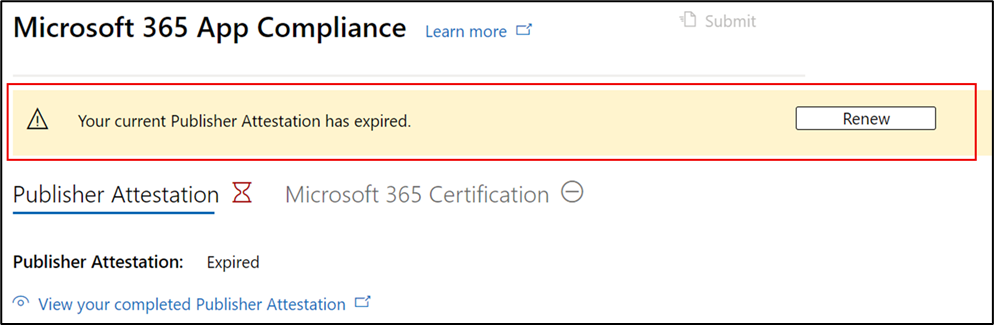

# Guia do usuário do parceiro para o Microsoft 365 de Conformidade de Aplicativos – SaaS

|Fase|Título|
|---|---|
|Fase 1| Atestado do Editor|
|Fase 2| Certificação Microsoft 365|

## 1. Visão geral 

Este documento atua como um guia do usuário passo a passo para nossos parceiros, inscritos no programa de Conformidade de Aplicativos do Microsoft 365 com o objetivo de passar por atestado e certificação de Publisher para seus aplicativos SaaS, embora o portal do Partner Center.

>[!IMPORTANT]
>Este guia só é aplicável a aplicativos SaaS que foram aprovados e na lista de permissões pela Microsoft 365 de Conformidade de Aplicativos. Se o aplicativo não estiver na lista de permissões, você não poderá continuar no Partner Center. Para obter seu SaaS na lista de permissões, entre em contato com appcert@microsoft.com.

## 2. Acrônimos & definições
|Acronym | Definição |
|----|----|
|[PC (Partner Center)](https://partner.microsoft.com/)|Um portal para todos os parceiros da Microsoft. Um parceiro faz logon no Partner Center e envia um questionário de autoavaliação. Partner Center para [conformidade Microsoft 365 aplicativo](https://partner.microsoft.com/dashboard/home)|
|ISV | Fornecedor independente de software, também conhecido como Parceiro ou Desenvolvedor |
|Origem do aplicativo | Catálogo de aplicativos |
|Exemplo |[Agora agente virtual](https://appsource.microsoft.com/product/office/WA104381816)|

## 3. Fluxo Publisher de Atestado

**Home Page**: essa é a página de aterrissagem quando um parceiro faz logon no Partner Center.

  
**Etapa 1** : Selecionar ofertas do Marketplace

  
**Etapa 2**: depois de selecionar "Ofertas do Marketplace", alterne para "Marketplace Comercial".

Selecione um aplicativo na lista e outra barra de navegação será exibida com a opção 'Conformidade do Aplicativo'.
  
**Etapa 3**: Selecionar 'Conformidade do Aplicativo'
  

  
**Etapa 4**: Preencher o questionário de autoavaliação para Publisher Atestado.

  
**OBSERVAÇÃO Se você estiver voltando para atualizar/re-enviar seu aplicativo, clique na lista suspensa 'Escolher o produto', selecione o aplicativo e clique em 'Clonar'.**

**Você também pode aproveitar o recurso Importação/Exportação para concluir o formulário offline e importá-lo depois de concluído.**

 
**Etapa 5**: depois de concluída, clique em 'Enviar', a avaliação agora será 'Em Revisão'.
 
  
  
**Aprovar/rejeitar cenários:**
  
R. Publisher atestado de certificado
- Em caso de rejeição, um parceiro pode:
     - Exibir relatório de falha
          - O parceiro será notificado por email e poderá exibir o relatório de falha no Partner Center
     - Atualize e envie novamente o questionário de autoavaliação.
        

B.  Publisher aprovação do atestado
- Após a aprovação, o parceiro pode:
     - Atualizar e reenviar atestado
     - Exibir o atestado Publisher concluído
     - Iniciar o processo Microsoft 365 certificação
        
        
  
 
  
**Post Publisher aprovação de atestado: exemplo de link no AppSource para aplicativos atestados pelo editor.**
  

   
## 4. Fluxo de Microsoft 365 de Certificação
  
Um parceiro pode iniciar o processo de certificação marcando a caixa de seleção e clicando em 'Enviar'
  
 
  
**Etapa 1**: Envio inicial do documento

Preencha todos os detalhes, carregue documentos relevantes e clique em 'Enviar'
  
 

  
Ao clicar em enviar, o envio inicial do documento estará em revisão.

  
Um analista solicita uma revisão caso os documentos iniciais não sejam suficientes ou relevantes. O analista trabalhará com o parceiro para ajudar a obter os documentos certos para aprovação.

Depois que o analista aprovar o envio inicial do documento, o parceiro precisará enviar os requisitos de controle.
  
**Etapa 2**: Controlar o envio de requisitos
  
Preencha todos os detalhes, carregue documentos relevantes e clique em 'Enviar'

  

 
Ao clicar em Enviar, o envio inicial do documento estará em revisão.

  
Um analista solicita uma revisão caso os documentos de requisito de controle não sejam suficientes ou relevantes. O analista trabalhará com o parceiro para ajudar a obter os documentos certos para aprovação.

  
 
 
Caso o envio não atenda aos padrões de aprovação, o analista rejeitará o envio.
  
O parceiro pode trabalhar com o analista para fornecer as informações e documentos relevantes.

  
Depois que todos os padrões de segurança forem atendidos, o analista aprovará o envio e o parceiro será Microsoft 365 Certificado.

  
**Aprovação pós-certificação: exemplo Microsoft 365 selo de certificação no AppSource.** 

 
## 5. Fluxo Microsoft 365 renovação:
  
**Microsoft 365Publisher fluxo de trabalho de renovação de certificação e atestado:**  

Microsoft 365 de Conformidade de Aplicativos agora oferece um processo de renovação anual. Durante esse processo, os desenvolvedores de aplicativos podem atualizar o questionário de Publisher e os documentos necessários para Microsoft 365 certificação. 
 
**Benefícios:** 

- Mantenha sua notificação de certificação no AppSource, na Office Store, na Teams Store e em vários portais de administração para diferenciar seu aplicativo de outras pessoas. 
- Aumente a confiança do cliente no uso de seu aplicativo certificado. 
- Ajude os administradores de TI a tomar decisões informadas com informações de certificação atualizadas.

O novo processo de renovação está disponível no [Partner Center](https://partner.microsoft.com/dashboard/home) para fornecer uma experiência perfeita. Um lembrete de renovação será mostrado no Partner Center a partir de 90 dias antes da data de validade. Lembretes periódicos também serão enviados por email em 90, 60 e 30 dias antes da expiração. 
 
**Fase 1: Publisher renovação do atestado:**
  
As respostas Publisher atestado do aplicativo precisarão ser reenviadas anualmente. Quando o atestado se aproximar da marca de 1 ano, um lembrete de email será enviado incentivando a reenvio do atestado. 
 
**Etapa 1**: Selecione **Renovar** para renovar o Publisher Atestado.
  

  
**Etapa 2**: Examine as respostas Publisher de atestado anteriores e atualize com as informações mais recentes, conforme necessário. 
  
Envie Publisher atestado para renovação quando estiver pronto. Ele será revisado por um analista de Conformidade de Aplicativos do M365.

  
**Publisher renovação de atestado aprovada:**
  

  
**Publisher atestado expirado:**
  
As informações do aplicativo precisam ser renovadas antes da data de validade para manter a página de Publisher atestado do aplicativo nos documentos da Microsoft. A renovação em tempo há tempo também garantirá a continuação de badging e ícones para o aplicativo em várias vitrines. 
 

**Observação**: uma vez expirado, Publisher processo de renovação de atestado pode ser iniciado a qualquer momento clicando em 'Renovar'.
 
**Fase 2: renovação Microsoft 365 certificação**
  
As informações de certificação do aplicativo precisam ser reenviadas anualmente. Isso exigirá a revalidação dos controles no escopo do ambiente atual. Quando a certificação se aproximar de um ano, uma notificação por email será enviada incentivando a reenvio dos documentos e das evidências.
 
 

**Cenários de aprovação/rejeição de renovação de certificação:**

**Cenário 1:** 

A renovação da certificação foi iniciada e está em revisão.
 
 

Cenário 1A: 

Rejeição de renovação de certificação: 
- A certificação poderá ser rejeitada se: 
     - O aplicativo não tem as ferramentas, os processos ou as configurações necessárias em vigor e não poderá implementar as alterações necessárias dentro da janela de certificação. 
     - O aplicativo tem vulnerabilidades pendentes em vigor e não pode ser corrigido dentro da janela de certificação. 
 

Cenário 1B: 

A renovação da certificação foi aprovada

**Expiração da certificação:**

As informações do aplicativo precisam ser renovadas antes da data de validade para manter a página de Certificação do aplicativo nos documentos da Microsoft. A renovação o tempo limite também garantirá a continuidade de badging e ícones para o aplicativo no AppSource e na Team Store.

  
Observação: uma vez expirado, Publisher processo de Certificação e Atestado pode ser iniciado a qualquer momento clicando em 'Renovar'. 
