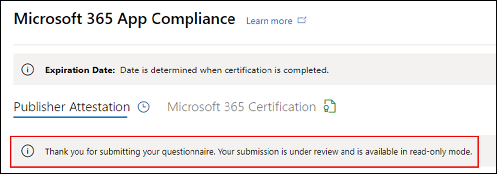

# Guia do usuário do parceiro para Microsoft 365 de conformidade de aplicativos - SaaSPartner's User Guide for Microsoft 365 App Compliance Program - SaaS

|FasePhase|TítuloTitle|
|---|---|
|Fase 1Phase 1| Atestado do EditorPublisher Attestation|
|Fase 2Phase 2| Certificação Microsoft 365Microsoft 365 Certification|

## 1. Visão geral1. Overview 

Este documento atua como um guia de usuário passo a passo para nossos parceiros, inscrito no programa de Conformidade de Aplicativos do Microsoft 365 visando Publisher atestado e certificação para seus aplicativos SaaS, embora o portal do Partner Center.This document acts as a step-by-step user guide for our partners, enrolled for Microsoft 365 App Compliance program aiming to undergo Publisher Attestation and Certification for their SaaS apps, though the Partner Center portal.

## 2. Acrônimos & Definições2. Acronyms & Definitions
|AcronymAcronym | DefiniçãoDefinition |
|----|----|
|[PC (Partner Center)PC (Partner Center)](https://partner.microsoft.com/)|Um portal para todos os parceiros da Microsoft.A portal for all Microsoft partners. Um parceiro faz login no Partner Center e envia um questionário de autoavaliação.A partner logs in to Partner Center and submits self-assessment questionnaire. Partner Center for [Microsoft 365 App Compliance](https://partner.microsoft.com/dashboard/home)Partner Center for [Microsoft 365 App Compliance](https://partner.microsoft.com/dashboard/home)|
|ISVISV | Independent Software Vendor a.k.a.Independent Software Vendor a.k.a. Parceiro ou desenvolvedorPartner or Developer |
|Fonte do aplicativoApp Source | Catálogo de aplicativosCatalog of apps |
|ExemploExample |[Agora agente virtualNow virtual agent](https://appsource.microsoft.com/product/office/WA104381816)|

## 3. Publisher Fluxo de Trabalho de Atestado3. Publisher Attestation Workflow

**Home Page**: essa é a página inicial quando um parceiro faz logo depois de entrar no Partner Center.**Home Page**: This is the landing page once a partner logs in to Partner Center.

  
**Etapa 1:** No lado esquerdo da página, na barra de navegação:**Step 1** : On the left side of the page, on the navigation bar:

- Selecionar Marketplace ComercialSelect Commercial Marketplace
- Selecionar Visão GeralSelect Overview

  
Ao selecionar 'Visão geral', o parceiro pode ver a lista de aplicativos disponíveis para iniciar o programa Microsoft 365 Conformidade.Upon selecting ‘Overview’, partner can see list of apps available to start the Microsoft 365 Compliance program.
  
**Etapa 2:** Selecione um aplicativo na lista para iniciar o processo Publisher Atestado.**Step 2**: Select an app from the list to begin the Publisher Attestation process.

Ao selecionar um aplicativo, outra barra de navegação será pop-up com a opção 'Conformidade do aplicativo'.On selecting an app, another navigation bar will pop up with option ‘App Compliance’.
  
**Etapa 3:** Selecione 'Conformidade do aplicativo'**Step 3**: Select 'App Compliance’
  

  
**Etapa 4:** preencha o questionário de autoavaliação para Publisher Atestado.**Step 4**: Fill out the self-assessment questionnaire for Publisher Attestation.

  
**OBSERVAÇÃO Se você estiver voltando para atualizar/re-enviar seu aplicativo, clique em menu suspenso para "Escolher o produto", selecione o aplicativo e clique em "Clone".****NOTE If you are coming back to update/re-submit your application, click dropdown for ‘Choose the product’, select the app and click ‘Clone’.**

**Você também pode aproveitar o recurso Importação/Exportação para concluir o formulário offline e importá-lo depois de concluído.****You can also leverage the Import/Export feature to complete the form offline and import it once completed.**

 
**Etapa 5**: depois de concluída, clique em "Enviar", a avaliação agora será "Em Revisão".**Step 5**: Once completed, click on ‘Submit’, the assessment will now be ‘Under Review’.
 
   
  
**Aprovar/rejeitar cenários:****Approve/Reject Scenarios:**
  
R.A. Publisher Rejeição de atestadoPublisher Attestation Rejection
- Em caso de rejeição, um parceiro pode:In case of rejection, a partner can:
     - Exibir relatório de falhaView failure report
          - O parceiro será notificado por email e poderá exibir o relatório de falha no Partner CenterPartner will be notified via email, and they can view the failure report in Partner Center
     - Atualize e envie um questionário de autoavaliação.Update and re-submit self-assessment questionnaire.
        

B.B.  Publisher Aprovação de AtestadoPublisher Attestation Approval
- Após a aprovação, o parceiro pode:Upon approval, the partner can:
     - Atualizar e reabrir atestadoUpdate and resubmit attestation
     - Exibir o Publisher AtestadoView completed Publisher Attestation
     - Iniciar o processo Microsoft 365 certificaçãoStart the Microsoft 365 Certification process
        
        
  
 
  
**Post Publisher Aprovação de Atestado: Exemplo de link no AppSource para aplicativos atestados pelo editor.****Post Publisher Attestation Approval: Example of link in AppSource for publisher attested apps.**
  

   
## 4. Microsoft 365 fluxo de trabalho de certificação4.   Microsoft 365 Certification Workflow
  
Um parceiro pode começar o processo de Certificação selecionando a caixa de seleção e clicando em "Enviar"A partner can begin the Certification process by selecting the checkbox and clicking ‘Submit’
  
 
  
**Etapa 1** : Envio inicial do documento**Step 1** : Initial Document Submission

Preencha todos os detalhes, carregue documentos relevantes e clique em "Enviar"Fill out all the details, upload relevant documents and click ‘Submit’
  
 
  

  
Ao clicar em enviar, o envio inicial do documento estará sob revisão.On clicking submit, the initial document submission will be under review.

  
Um analista solicita uma revisão caso os documentos iniciais não sejam suficientes ou relevantes.An analyst requests a revision in case the initial documents are not sufficient or relevant. O analista trabalhará com o parceiro para ajudar a obter os documentos certos para aprovação.The analyst will work with the partner to help get the right documents for approval.

Depois que o analista aprovar o envio inicial do documento, o parceiro precisará enviar os requisitos de controle.Once the analyst approves the initial document submission, the partner needs to submit the control requirements.
  
**Etapa 2**: Envio de Requisitos de Controle**Step 2**: Control Requirement Submission
  
Preencha todos os detalhes, carregue documentos relevantes e Clique em 'Enviar'Fill out all the details, upload relevant documents and Click ‘Submit’

  

 
Ao clicar em Enviar, o envio inicial do documento estará sob revisão.On clicking Submit, the initial document submission will be under review.

  
Um analista solicita uma revisão caso os documentos de requisitos de controle não sejam suficientes ou relevantes.An analyst requests a revision in case the control requirement documents are not sufficient or relevant. O analista trabalhará com o parceiro para ajudar a obter os documentos certos para aprovação.The analyst will work with the partner to help get the right documents for approval.

  
 
 
Caso o envio não atenda aos padrões de aprovação, o analista rejeitará o envio.In case the submission does not satisfy the approval standards, the analyst will reject the submission.
  
O parceiro pode trabalhar com o analista para fornecer as informações e documentos relevantes.The partner can work with the analyst to provide the relevant information and documents.

  
Depois que todos os padrões de segurança foram atendidos, o analista aprovará o envio e o parceiro será Microsoft 365 Certificado.Once all the security standards have been met, the analyst will approve the submission and the partner will be Microsoft 365 Certified.

  
**Aprovação pós-certificação: exemplo Microsoft 365 selo de certificação no AppSource.****Post Certification Approval: Example of Microsoft 365 certification badge in AppSource.** 

 
## 5. Microsoft 365 Fluxo de Trabalho de Renovação:5.   Microsoft 365 Renewal Workflow:
  
**Microsoft 365Publisher Fluxo de Trabalho de Renovação de Certificação e Atestado:****Microsoft 365 Publisher Attestation and Certification Renewal Workflow:**  

Microsoft 365 O programa de Conformidade de Aplicativos agora oferece um processo de renovação anual.Microsoft 365 App Compliance program now offers an annual renewal process. Durante esse processo, os desenvolvedores de aplicativos podem atualizar seus questionários de Publisher de Atestado e documentos necessários para Microsoft 365 Certificação.During this process, app developers can update their existing Publisher Attestation questionnaire and documents required for Microsoft 365 Certification. 
 
**Benefícios:****Benefits:** 

- Mantenha seu selo de certificação no AppSource, na Office Store, no Teams Store e em vários portais de administração para diferenciar seu aplicativo de outras pessoas.Maintain your certification badge in AppSource, the Office Store, the Teams Store and various admin portals to differentiate your app from others. 
- Aumente a confiança do cliente em usar seu aplicativo certificado.Increase customer confidence in using your certified app. 
- Ajude os administradores de IT a tomar decisões informadas com informações atualizadas de certificação.Help IT admins make informed decisions with updated certification information.

O novo processo de renovação está disponível no [Partner Center](https://partner.microsoft.com/dashboard/home) para proporcionar uma experiência perfeita.The new renewal process is available in [Partner Center](https://partner.microsoft.com/dashboard/home) to provide a seamless experience. Um lembrete de renovação será mostrado no Partner Center a partir de 90 dias antes da data de expiração.A renewal reminder will be shown in Partner Center starting 90 days before the expiration date. Lembretes periódicos também serão enviados por email em 90, 60 e 30 dias antes da expiração.Periodic reminders will also be sent via email at 90, 60 and 30 days before expiration. 
 
**Fase 1: Publisher Renovação de Atestado:****Phase 1: Publisher Attestation Renewal:**
  
As respostas de Publisher atestado do aplicativo precisarão ser resubmitidas anualmente.The app’s Publisher Attestation answers will need to be resubmitted on an annual basis. Quando o atestado se aproximar da marca de 1 ano, um lembrete de email será enviado incentivando uma remissão do atestado.When the attestation nears the 1-year mark, an email reminder will be sent encouraging a resubmission of the attestation. 
 
**Etapa 1:** Selecione **Renovar** para renovar o Publisher Atestado.**Step 1**: Select **Renew** to renew the Publisher Attestation.
  

  
**Etapa 2:** revise as respostas Publisher atestados anteriores e atualize com as informações mais recentes conforme necessário.**Step 2**: Review the previous Publisher Attestation answers and update with the latest information as needed. 
  
Envie Publisher Atestado para renovação quando estiver pronto.Submit Publisher Attestation for renewal when ready. Ele será revisado por um analista de Conformidade de Aplicativo do M365.It will be reviewed by an M365 App Compliance analyst.

  
**Publisher Renovação de Atestado Aprovado:****Publisher Attestation Renewal Approved:**
  

  
**Publisher Atestado expirado:****Publisher Attestation Expired:**
  
As informações do aplicativo precisam ser renovadas antes da data de expiração para manter a página Publisher atestado do aplicativo nos documentos da Microsoft. A renovação em tempo há tempo também garantirá a continuação de badging e ícones para o aplicativo em várias frentes de armazenamento.The app’s information needs to be renewed before the expiration date to maintain the app’s Publisher Attestation page on the Microsoft docs. Timely renewal will also ensure continued badging and icons for the app in various storefronts. 
 

**Observação**: uma vez expirado, Publisher processo de renovação de Atestado pode ser iniciado a qualquer momento clicando em 'Renovar'.**Note**: Once expired, Publisher Attestation renewal process can be started anytime by clicking ‘Renew’.
 
**Fase 2: renovação Microsoft 365 certificação****Phase 2: Microsoft 365 Certification Renewal**
  
As informações de certificação do aplicativo precisam ser retransmitidas anualmente.The app’s certification information needs to be resubmitted on an annual basis. Isso exigirá revalidação dos controles no escopo do seu ambiente atual.This will require revalidation of the in-scope controls of your current environment. Quando a Certificação se aproximar de um ano, uma notificação de email será enviada incentivando uma remissão dos documentos e evidências.When the Certification nears 1-year mark an email notification will be sent encouraging a resubmission of the documents and evidence.
 
 

**Cenários de Aprovação/Rejeição de Renovação de Certificação:****Certification Renewal Approve/Reject Scenarios:**

**Cenário 1:****Scenario 1:** 

A renovação de certificação foi iniciada e está sob revisão.Certification renewal has started and is under review.
 
 

Cenário 1A:Scenario 1A: 

Rejeição de renovação de certificação:Certification renewal rejection: 
- A certificação poderá ser rejeitada se:Certification may be rejected if: 
     - O aplicativo não tem as ferramentas, processos ou configurações necessárias e não poderá implementar as alterações necessárias na janela de certificação.The app does not have the required tooling, processes, or configurations in place and will not be able to implement required changes within the certification window. 
     - O aplicativo tem vulnerabilidades pendentes no local e não pode ser corrigido dentro da janela de certificação.The app has outstanding vulnerabilities in place and cannot be fixed within the certification window. 
 

Cenário 1B:Scenario 1B: 

Renovação de certificação aprovadaCertification renewal is approved

**Expiração de Certificação:****Certification Expiration:**

As informações do aplicativo precisam ser renovadas antes da data de expiração para manter a página de Certificação do aplicativo nos documentos da Microsoft. A renovação em tempo há tempo também garantirá a continuação de badging e ícones para o aplicativo no AppSource e na Loja de Equipes.The app’s information needs to be renewed before the expiration date to maintain app’s Certification page on the Microsoft docs. Timely renewal will also ensure continued badging and icons for the app in AppSource and Team Store.

  
Observação: uma vez expirado, Publisher processo de Atestado e Certificação pode ser iniciado a qualquer momento clicando em 'Renovar'.Note: Once expired, Publisher Attestation and Certification process can be started anytime by clicking ‘Renew’. 
