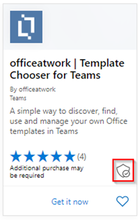
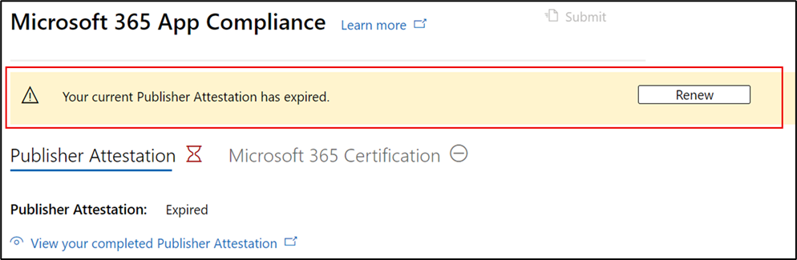

# Guia do usuário do parceiro para Microsoft 365 De conformidade de aplicativos

|Fase|Título|
|---|---|
|Fase 1| Atestado do Editor|
|Fase 2| Certificação Microsoft 365|

## 1. Visão geral
Este documento atua como um guia de usuário passo a passo para nossos parceiros inscritos no programa de Conformidade de Aplicativos do Microsoft 365 visando Publisher atestado e certificação, embora o portal do Partner Center.

## 2. Acrônimos & Definições
| Acronym |Definição |
|---|----|
|PC [(Partner Center)](https://partner.microsoft.com/)|Um portal para todos os parceiros da Microsoft. Um parceiro faz login no Partner Center e envia um questionário de autoavaliação. [Partner Center](https://partner.microsoft.com/dashboard/home) for Microsoft 365 App Compliance|
|ISV|Fornecedor de Software Independente. A.k.a. parceiro ou desenvolvedor|
|Fonte do aplicativo| [Catálogo de aplicativos](https://appsource.microsoft.com/)
|Exemplo|[Agora agente virtual](https://appsource.microsoft.com/product/office/WA104381816)|

## 3. Publisher Fluxo de Trabalho de Atestado

**Home Page** : essa é a página inicial quando um parceiro faz logo depois de entrar no Partner Center.

**Etapa 1:**   No lado esquerdo da página, na barra de navegação:
- Selecione Office store
- Selecionar Visão Geral

Ao selecionar 'Visão geral', o parceiro pode ver a lista de aplicativos enviados por meio do Partner Center e disponíveis para o programa Microsoft 365 Conformidade.

**Etapa 2:** Selecione um aplicativo na lista para iniciar o processo Publisher Atestado.

Ao selecionar um aplicativo, outra barra de navegação será pop-up com a opção 'Conformidade do aplicativo'.

**Etapa 3:** Selecione 'Conformidade do aplicativo'

**Etapa 4**: preencher o questionário de autoavaliação para Publisher Atestado

**Observação Se você estiver voltando para atualizar/re-enviar seu aplicativo, clique em menu suspenso para "Escolher o produto", selecione o aplicativo e clique em "Clone".**

Você também pode aproveitar o recurso Importação/Exportação para concluir o formulário offline e importá-lo depois de concluído.

**Etapa 5:** depois de concluída, clique em "Enviar", a avaliação agora será "Em Revisão".

### Aprovar/rejeitar cenários:

**R. Publisher atestado de rejeição**

- Em caso de rejeição neste estágio, um parceiro pode:
    - Exibir relatório de falha
         - O parceiro será notificado por email e poderá exibir o relatório de falha no Partner Center
    - Atualizar e re-enviar Publisher Atestado

**B. Publisher Aprovação de Atestado**

- Após o parceiro de aprovação, pode:
    - Atualizar e reabrir atestado
    - Exibir e compartilhar o Publisher Atestado
    - Iniciar Microsoft 365 processo de certificação

**Post Publisher Aprovação de Atestado: Exemplo de link no AppSource para aplicativos atestados pelo editor**

## 4. Microsoft 365 fluxo de trabalho de certificação

Um parceiro pode começar o processo de Certificação selecionando a caixa de seleção e clicando em "Enviar" 

**Etapa 1:** Envio inicial de documento Preencha todos os detalhes, carregue documentos relevantes e Clique em 'Enviar'

 

Ao clicar em enviar, o envio de atestado estará sob revisão. 

Um analista solicita uma revisão caso os documentos iniciais não sejam suficientes ou relevantes. O analista trabalhará com o parceiro para ajudar a obter os documentos certos para aprovação. 

Depois que o analista aprovar o envio inicial do documento, o parceiro precisará enviar os requisitos de controle. 

**Etapa 2:** Envio de Requisitos de Controle Preencha todos os detalhes, carregue documentos relevantes e Clique em 'Enviar' 

 
 

Ao clicar em Enviar, o envio de certificação estará sob revisão. 

Um analista solicita uma revisão caso os documentos de requisitos de controle não sejam suficientes ou relevantes. O analista trabalhará com o parceiro para ajudar a obter os documentos certos para aprovação. 

 
 

Caso o envio não atenda aos padrões de aprovação, o analista rejeitará o envio. O parceiro pode trabalhar com o analista para fornecer as informações e documentos relevantes. 

Depois que todos os padrões de segurança foram atendidos, o analista aprovará o envio e o parceiro será Microsoft 365 Certificado. 

**Aprovação pós-certificação: exemplo de Microsoft 365 selo de certificação no AppSource**

## 5. Microsoft 365 Fluxo de Trabalho de Renovação:
  
**Microsoft 365 Publisher Fluxo de Trabalho de** Renovação de Certificação e Atestado: Microsoft 365 Programa de Conformidade de Aplicativos agora oferece um processo de renovação anual. Durante esse processo, os desenvolvedores de aplicativos podem atualizar seus questionários de Publisher de Atestado e documentos necessários para Microsoft 365 Certificação. 
 
**Benefícios:** 

- Mantenha seu selo de certificação no AppSource, Teams Store, Office Store e outras frentes de armazenamento para diferenciar o aplicativo. 
- Aumente a confiança do cliente em usar seu aplicativo certificado. 
- Ajude os administradores de IT a tomar decisões informadas com informações atualizadas de certificação. 

O processo de renovação está disponível no [Partner Center](https://partner.microsoft.com/dashboard/home) para oferecer uma experiência perfeita. Um lembrete de renovação será mostrado no Partner Center a partir de 90 dias antes da data de expiração. Lembretes periódicos também serão enviados por email em 90, 60 e 30 dias antes da expiração.

**Fase 1: Publisher Renovação de Atestado:** 

O novo processo de renovação está disponível no [Partner Center](https://partner.microsoft.com/dashboard/home) para proporcionar uma experiência perfeita. Um lembrete de renovação será mostrado no Partner Center a partir de 90 dias antes da data de expiração. Lembretes periódicos também serão enviados por email em 90, 60 e 30 dias antes da expiração. 

**Etapa 1:** Selecione **Renovar** para renovar o Publisher Atestado. 

**Etapa 2:** revise as respostas Publisher atestados anteriores e atualize com as informações mais recentes conforme necessário. Envie Publisher Atestado para renovação quando estiver pronto. Ele será revisado por um Microsoft 365 de conformidade de aplicativos.

**Publisher Renovação de Atestado Aprovada**

**Publisher Atestado Expirado:** As informações do aplicativo precisam ser renovadas antes da data de expiração para manter a página Publisher atestado do aplicativo nos documentos da Microsoft. A renovação em tempo há tempo também garantirá a continuidade de badging e ícones para o aplicativo no AppSource, Teams Store, Office Store e outras frentes de loja.

Observação: uma vez expirado, Publisher processo de renovação de Atestado pode ser iniciado a qualquer momento clicando em 'Renovar'. 

**Fase 2: renovação Microsoft 365 certificação** 

As informações de certificação do aplicativo precisam ser retransmitidas anualmente. Isso exigirá revalidação dos controles no escopo do seu ambiente atual. Quando a Certificação se aproximar de um ano, uma notificação de email será enviada incentivando uma remissão dos documentos e evidências. 

**Cenários de Aprovação/Rejeição de Renovação de Certificação:**
 
**Cenário 1:** 

A renovação de certificação foi iniciada e está sob revisão.

**Cenário 1A:**

Rejeição de renovação de certificação: a certificação pode ser rejeitada se: 
- O aplicativo não tem as ferramentas, processos ou configurações necessárias e não poderá implementar as alterações necessárias na janela de certificação. 
- O aplicativo tem vulnerabilidades pendentes no local e não pode ser corrigido dentro da janela de certificação. 
 

    
**Cenário 1B:** 

Renovação de certificação aprovada  

**Expiração de Certificação:**
 
As informações do aplicativo precisam ser renovadas antes da data de expiração para manter a página de Certificação do aplicativo nos documentos da Microsoft. A renovação em tempo há tempo também garantirá a continuação de badging e ícones para o aplicativo no AppSource e na Loja de Equipes.

As informações do aplicativo precisam ser renovadas antes da data de expiração para manter a página de Certificação do aplicativo nos documentos da Microsoft. A renovação em tempo há tempo também garantirá a continuidade de badging e ícones para o aplicativo no AppSource, Teams Store, Office Store e outras frentes de loja. 

    
**Observação**: uma vez expirado, Publisher processo de Atestado e Certificação pode ser iniciado a qualquer momento clicando em 'Renovar'. 

