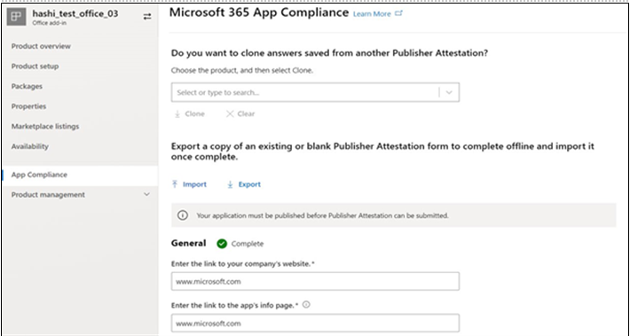

# Guia do Usuário do Parceiro para Microsoft 365 Programa de Conformidade de AplicativosPartner's User Guide for Microsoft 365 App Compliance Program

|||
|---|---|
|Camada 1Tier 1| Atestado do EditorPublisher Attestation|
|Camada 2Tier 2| Certificação Microsoft 365Microsoft 365 Certification|

## 1. Visão geral1. Overview
Este documento funciona como um guia de usuário passo a passo para nossos parceiros, inscritos para Microsoft 365 Programa de Conformidade de Aplicativos com o objetivo de se submeter a Publisher Atestado e Certificação através do portal Partner Center.This document acts as a step-by-step user guide for our Partners, enrolled for Microsoft 365 App Compliance Program aiming to undergo Publisher Attestation and Certification though Partner Center portal.

## 2. Siglas & Definições2. Acronyms & Definitions
| | |
|---|----|
|AcronymAcronym | DefiniçãoDefinition |
|PC (Centro de Parceiros)PC (Partner Center)|Um portal para todos os Parceiros Microsoft.A portal for all Microsoft Partners. Um parceiro entra na Central de Parceiros e envia Self-Assessment Questionário https://partner.microsoft.com/A Partner logs in to Partner Center and submits Self-Assessment Questionnaire https://partner.microsoft.com/|
|ISVISV|Fornecedor de software independente, também conhecido comoIndependent Software Vendor A.k.a. Parceiro ou DesenvolvedorPartner or Developer|
|Fonte do aplicativoApp Source| Catálogo de aplicativos (https://appsource.microsoft.com/)Catalog of apps (https://appsource.microsoft.com/)
||Exemplo: Agora agente virtual (https://appsource.microsoft.com/en-us/product/office/WA104381816)Example: Now virtual agent (https://appsource.microsoft.com/en-us/product/office/WA104381816)|

## 3. Publisher Fluxo de Trabalho de Atestado3.   Publisher Attestation Workflow

Home Page: Esta é a página de entrada uma vez que um parceiro faz login no Partner Center.Home Page: This is the landing page once a partner logs in to Partner Center.

**Passo 1**   : No lado esquerdo da página, na barra de navegação:**Step 1**   : On the left side of the page, in the navigation bar:
1. Selecione Office lojaSelect Office store
1. Selecione Visão geralSelect Overview

Ao selecionar 'Visão geral', o parceiro pode ver a lista de aplicativos enviados através da Central de Parceiros e disponíveis para o programa Microsoft 365 Compliance.Upon selecting ‘Overview’, partner can see list of apps submitted through Partner Center and available for the Microsoft 365 Compliance program.

**Passo 2** : Selecione um aplicativo da lista para iniciar o processo de Publisher Attestation.**Step 2** : Select an app from the list to begin the Publisher Attestation process.

Ao selecionar um aplicativo, outra barra de navegação aparecerá com a opção 'App Compliance'On selecting an app, another navigation bar will pop up with option ‘App Compliance’

**Passo 3**: Selecione 'Conformidade com aplicativos'**Step 3**: Select ‘App Compliance’

**Passo 4**: Preencher o Questionário de Self-Assessment para atestado de Publisher**Step 4**: Fill out the Self-Assessment Questionnaire for Publisher Attestation

**Nota**:Se você estiver voltando para atualizar/enviar seu aplicativo, clique em dropdown para 'Escolher o produto', selecione o aplicativo e clique em 'clone'.**Note**:If you are coming back to update/re-submit your application, click dropdown for ‘Choose the product’, select the app and click ‘clone’.

 

Você também pode aproveitar o recurso Importação/Exportação para preencher o formulário offline e importá-lo uma vez concluído.You can also leverage the Import/Export feature to complete the form offline and import it once completed. 

**Passo 5**: Uma vez concluída, clique em 'Enviar', a avaliação agora estará 'sob revisão'.**Step 5**: Once completed, click on ‘Submit’, the assessment will now be ‘under review’.

### Cenários de aprovação/rejeição:Approve/Reject Scenarios:

**Rejeição de atestado a.Publisher****A.Publisher Attestation Rejection**

Em caso de rejeição nesta fase, um parceiro pode:In case of rejection at this stage, an partner can:
-   Veja o relatório de falha.View failure report.
    - O parceiro será notificado na Central de Parceiros e por e-mail.Partner will be notified in Partner Center and via email.
-   Atualize Self-Assessment respostas.Update Self-Assessment responses.
-   Reapresentar a autoavaliação.Re-submit Self-Assessment.

**Remissão do atestado b.Publisher****B.Publisher Attestation Re-submission**

**Aprovação do atestado de C.Publisher****C.Publisher Attestation Approval**

-   Após a aprovação o parceiro pode:Upon approval partner can:
    - Atualizar e reenviar atestadoUpdate and resubmit attestation
    - Ver e compartilhar concluídos Publisher AttestationView and share completed Publisher Attestation
    - Inicie o processo de certificação M365Start M365 Certification Process

**Aprovação de verificação pós-Publisher: Exemplo de link no AppSource para aplicativos testados por editores****Post Publisher Verification Approval: Example of link in AppSource for publisher attested apps**

## 4. Fluxo de trabalho de certificação Microsoft 3654. Microsoft 365 Certification Workflow

Uma vez que o parceiro clique em 'Enviar' e envie todos os documentos e evidências para revisão:Once partner clicks on ‘Submit’ and submits all documents and evidence for review: 

### Microsoft 365 Certificação - SubmetidaMicrosoft 365 Certification - Submitted

**certificação Microsoft 365 - Rejeitado****Microsoft 365 certification - Rejected**

**Microsoft 365 Certificação - Aprovado****Microsoft 365 Certification - Approved**

**Aprovação pós-certificação: Exemplo de Microsoft 365 crachá de certificação no AppSource****Post Certification Approval: Example of Microsoft 365 certification badge in AppSource**

## 5. Fluxo de trabalho para ISVs existentes5. Workflow for Existing ISVs

Se você é um ISV existente e deseja atualizar Publisher Attestation.If you are an existing ISV and want to Update Publisher Attestation.

**Passo 1**: Clique no link 'Atualizar e re-enviar seu Publisher Atestado'.**Step 1**: Click on ‘Update and re-submit your Publisher Attestation’ link.

**Nota:**: Se você estiver voltando para atualizar/enviar seu aplicativo, clique em dropdown para 'Escolher o produto', selecione o aplicativo e clique em 'Importar'.**Note:**: If you are coming back to update/re-submit your application, click dropdown for ‘Choose the product’, select the app and click ‘Import’.

**Passo 2**: Faça atualizações no formulário e clique em Salvar/Enviar.**Step 2**: Make updates to your form and click Save/Submit.

Uma vez enviado, ele estará sob revisão.Once submitted, it will be under review.

## 6. Microsoft 365 Publisher fluxo de trabalho de renovação de atestado e certificação:6.   Microsoft 365 Publisher Attestation and Certification Renewal Workflow:

Microsoft 365 O App Compliance Program agora oferece um processo de renovação anual.Microsoft 365 App Compliance Program now offers an annual renewal process. Durante esse processo, os desenvolvedores de aplicativos podem atualizar seu questionário de atestado de Publisher existente e documentos necessários para Microsoft 365 Certificação.During this process, app developers can update their existing Publisher Attestation questionnaire and documents required for Microsoft 365 Certification. 

**Benefícios:****Benefits:**

- Mantenha seu crachá de certificação no AppSource e na Team Store para diferenciar seu aplicativo de outros.Maintain your certification badge in AppSource and Team Store to differentiate your app from others. 
- Aumente a confiança do cliente no uso do seu aplicativo certificado.Increase customer confidence in using your certified app. 
- Ajude os administradores de TI a tomar decisões informadas com informações atualizadas de certificação.Help IT admins make informed decisions with updated certification information. 

O novo processo de renovação está disponível no [Partner Center](https://partner.microsoft.com/en-us/dashboard/home) para proporcionar uma experiência perfeita.The new renewal process is available in [Partner Center](https://partner.microsoft.com/en-us/dashboard/home) to provide a seamless experience. Um lembrete de renovação será mostrado no Partner Center a partir de 90 dias antes da data de validade.A renewal reminder will be shown in Partner Center starting 90 days before the expiration date. Lembretes periódicos também serão enviados por e-mail aos 90, 60 e 30 dias antes do vencimento.Periodic reminders will also be sent via email at 90, 60 and 30 days before expiration.

**Nível 1: renovação de atestado Publisher:****Tier 1: Publisher Attestation Renewal:** 

As respostas Publisher attestation do aplicativo precisarão ser reapresentadas anualmente.The app’s Publisher Attestation answers will need to be resubmitted on an annual basis. Quando o atestado se aproxima da marca de 1 ano, um lembrete de e-mail será enviado incentivando uma reapresentação do atestado.When the attestation nears 1-year mark, an email reminder will be sent encouraging a resubmission of the attestation. 

**Passo 1**: Selecione **Renovar** para renovar o atestado de Publisher.**Step 1**: Select **Renew** to renew the Publisher Attestation. 

**Passo 2**: Revise as respostas anteriores do Publisher Attestation e atualize com as informações mais recentes conforme necessário.**Step 2**: Review the previous Publisher Attestation answers and update with the latest information as needed. Envie Publisher Atestado para renovação quando estiver pronto.Submit Publisher Attestation for renewal when ready. Ele será revisado por um Analista de Conformidade de Aplicativos M365.It will be reviewed by an M365 App Compliance Analyst.

**Publisher atestado expirado:** As informações do aplicativo precisam ser renovadas antes da data de validade para manter a página de atestado Publisher do aplicativo nos documentos da Microsoft. A renovação oportuna também garantirá a continuação do badging e ícones para o aplicativo no AppSource e na Team Store.**Publisher Attestation Expired:** The app’s information needs to be renewed before the expiration date to maintain the app’s Publisher Attestation page on the Microsoft docs. Timely renewal will also ensure continued badging and icons for the app in AppSource and Team Store.

Nota: Uma vez expirado, Publisher processo de renovação do atestado pode ser iniciado a qualquer momento clicando em 'Renovar'.Note: Once expired, Publisher Attestation renewal process can be started anytime by clicking ‘Renew’. 

**Nível 2: Renovação da Certificação Microsoft 365****Tier 2: Microsoft 365 Certification Renewal** 

As informações de certificação do aplicativo precisam ser reapresentadas anualmente.The app’s certification information needs to be resubmitted on an annual basis. Isso exigirá a revalidação dos controles no escopo do seu ambiente atual.This will require revalidation of the in-scope controls of your current environment. Quando a Certificação se aproxima de um ano marca uma notificação de e-mail será enviada incentivando uma reapresentação dos documentos e provas.When the Certification nears 1-year mark an email notification will be sent encouraging a resubmission of the documents and evidence. 

**Cenários de aprovação/rejeição da renovação da certificação:****Certification Renewal Approve/Reject Scenarios:**

**Cenário 1:****Scenario 1:** 

Publisher O atestado está completo.Publisher Attestation  is complete. A renovação da certificação começou e está sob revisão.Certification renewal has started and under review. 

**Cenário 1A:****Scenario 1A:**

Rejeição da renovação da certificação: A certificação pode ser rejeitada se:Certification renewal rejection: Certification may be rejected if: 

 - O aplicativo não tem as ferramentas, processos ou configurações necessárias e não será capaz de implementar as alterações necessárias dentro da janela de certificação.The app does not have the required tooling, processes, or configurations in place and will not be able to implement required changes within the certification window. 
 - O aplicativo tem vulnerabilidades pendentes e não pode ser corrigido dentro da janela de certificação.The app has outstanding vulnerabilities in place and cannot be fixed within the certification window. 

    
**Cenário 1B:****Scenario 1B:** 

Renovação da certificação é aprovadaCertification renewal is approved  

**Expiração da certificação:****Certification Expiration:**

As informações do aplicativo precisam ser renovadas antes da data de validade para manter a página de certificação do aplicativo nos documentos da Microsoft. A renovação oportuna também garantirá a continuação do badging e ícones para o aplicativo no AppSource e na Team Store.The app’s information needs to be renewed before the expiration date to maintain app’s Certification page on the Microsoft docs. Timely renewal will also ensure continued badging and icons for the app in AppSource and Team Store. 

    
**Nota**: Uma vez expirado, Publisher processo de atestado e certificação pode ser iniciado a qualquer momento clicando em 'Renovar'.**Note**: Once expired, Publisher Attestation and Certification process can be started anytime by clicking ‘Renew’. 

