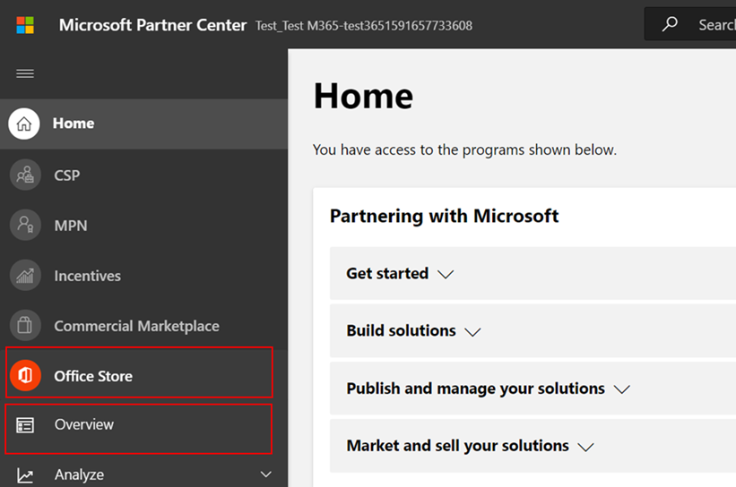

# Guia do Usuário do Parceiro para Microsoft 365 Programa de Conformidade de Aplicativos

|||
|---|---|
|Camada 1| Atestado do Editor|
|Camada 2| Certificação Microsoft 365|

## 1. Visão geral
Este documento funciona como um guia de usuário passo a passo para nossos parceiros, inscritos para Microsoft 365 Programa de Conformidade de Aplicativos com o objetivo de se submeter a Publisher Atestado e Certificação através do portal Partner Center.

## 2. Siglas & Definições
| | |
|---|----|
|Acronym | Definição |
|PC (Centro de Parceiros)|Um portal para todos os Parceiros Microsoft. Um parceiro entra na Central de Parceiros e envia Self-Assessment Questionário https://partner.microsoft.com/|
|ISV|Fornecedor de software independente, também conhecido como Parceiro ou Desenvolvedor|
|Fonte do aplicativo| Catálogo de aplicativos (https://appsource.microsoft.com/)
||Exemplo: Agora agente virtual (https://appsource.microsoft.com/en-us/product/office/WA104381816)|

## 3. Publisher Fluxo de Trabalho de Atestado

Home Page: Esta é a página de entrada uma vez que um parceiro faz login no Partner Center.

**Passo 1**   : No lado esquerdo da página, na barra de navegação:
1. Selecione Office loja
1. Selecione Visão geral

Ao selecionar 'Visão geral', o parceiro pode ver a lista de aplicativos enviados através da Central de Parceiros e disponíveis para o programa Microsoft 365 Compliance.

**Passo 2** : Selecione um aplicativo da lista para iniciar o processo de Publisher Attestation.

Ao selecionar um aplicativo, outra barra de navegação aparecerá com a opção 'App Compliance'

**Passo 3**: Selecione 'Conformidade com aplicativos'

**Passo 4**: Preencher o Questionário de Self-Assessment para atestado de Publisher

**Nota**:Se você estiver voltando para atualizar/enviar seu aplicativo, clique em dropdown para 'Escolher o produto', selecione o aplicativo e clique em 'clone'.

 

Você também pode aproveitar o recurso Importação/Exportação para preencher o formulário offline e importá-lo uma vez concluído. 

**Passo 5**: Uma vez concluída, clique em 'Enviar', a avaliação agora estará 'sob revisão'.

### Cenários de aprovação/rejeição:

**Rejeição de atestado a.Publisher**

Em caso de rejeição nesta fase, um parceiro pode:
-   Veja o relatório de falha.
    - O parceiro será notificado na Central de Parceiros e por e-mail.
-   Atualize Self-Assessment respostas.
-   Reapresentar a autoavaliação.

**Remissão do atestado b.Publisher**

**Aprovação do atestado de C.Publisher**

-   Após a aprovação o parceiro pode:
    - Atualizar e reenviar atestado
    - Ver e compartilhar concluídos Publisher Attestation
    - Inicie o processo de certificação M365

**Aprovação de verificação pós-Publisher: Exemplo de link no AppSource para aplicativos testados por editores**

## 4. Fluxo de trabalho de certificação Microsoft 365

Uma vez que o parceiro clique em 'Enviar' e envie todos os documentos e evidências para revisão: 

### Microsoft 365 Certificação - Submetida

**certificação Microsoft 365 - Rejeitado**

**Microsoft 365 Certificação - Aprovado**

**Aprovação pós-certificação: Exemplo de Microsoft 365 crachá de certificação no AppSource**

## 5. Fluxo de trabalho para ISVs existentes

Se você é um ISV existente e deseja atualizar Publisher Attestation.

**Passo 1**: Clique no link 'Atualizar e re-enviar seu Publisher Atestado'.

**Nota:**: Se você estiver voltando para atualizar/enviar seu aplicativo, clique em dropdown para 'Escolher o produto', selecione o aplicativo e clique em 'Importar'.

**Passo 2**: Faça atualizações no formulário e clique em Salvar/Enviar.

Uma vez enviado, ele estará sob revisão.

## 6. Microsoft 365 Publisher fluxo de trabalho de renovação de atestado e certificação:

Microsoft 365 O App Compliance Program agora oferece um processo de renovação anual. Durante esse processo, os desenvolvedores de aplicativos podem atualizar seu questionário de atestado de Publisher existente e documentos necessários para Microsoft 365 Certificação. 

**Benefícios:**

- Mantenha seu crachá de certificação no AppSource e na Team Store para diferenciar seu aplicativo de outros. 
- Aumente a confiança do cliente no uso do seu aplicativo certificado. 
- Ajude os administradores de TI a tomar decisões informadas com informações atualizadas de certificação. 

O novo processo de renovação está disponível no [Partner Center](https://partner.microsoft.com/en-us/dashboard/home) para proporcionar uma experiência perfeita. Um lembrete de renovação será mostrado no Partner Center a partir de 90 dias antes da data de validade. Lembretes periódicos também serão enviados por e-mail aos 90, 60 e 30 dias antes do vencimento.

**Nível 1: renovação de atestado Publisher:** 

As respostas Publisher attestation do aplicativo precisarão ser reapresentadas anualmente. Quando o atestado se aproxima da marca de 1 ano, um lembrete de e-mail será enviado incentivando uma reapresentação do atestado. 

**Passo 1**: Selecione **Renovar** para renovar o atestado de Publisher. 

**Passo 2**: Revise as respostas anteriores do Publisher Attestation e atualize com as informações mais recentes conforme necessário. Envie Publisher Atestado para renovação quando estiver pronto. Ele será revisado por um Analista de Conformidade de Aplicativos M365.

**Publisher atestado expirado:** As informações do aplicativo precisam ser renovadas antes da data de validade para manter a página de atestado Publisher do aplicativo nos documentos da Microsoft. A renovação oportuna também garantirá a continuação do badging e ícones para o aplicativo no AppSource e na Team Store.

Nota: Uma vez expirado, Publisher processo de renovação do atestado pode ser iniciado a qualquer momento clicando em 'Renovar'. 

**Nível 2: Renovação da Certificação Microsoft 365** 

As informações de certificação do aplicativo precisam ser reapresentadas anualmente. Isso exigirá a revalidação dos controles no escopo do seu ambiente atual. Quando a Certificação se aproxima de um ano marca uma notificação de e-mail será enviada incentivando uma reapresentação dos documentos e provas. 

**Cenários de aprovação/rejeição da renovação da certificação:**

**Cenário 1:** 

Publisher O atestado está completo. A renovação da certificação começou e está sob revisão. 

**Cenário 1A:**

Rejeição da renovação da certificação: A certificação pode ser rejeitada se: 

 - O aplicativo não tem as ferramentas, processos ou configurações necessárias e não será capaz de implementar as alterações necessárias dentro da janela de certificação. 
 - O aplicativo tem vulnerabilidades pendentes e não pode ser corrigido dentro da janela de certificação. 

    
**Cenário 1B:** 

Renovação da certificação é aprovada  

**Expiração da certificação:**

As informações do aplicativo precisam ser renovadas antes da data de validade para manter a página de certificação do aplicativo nos documentos da Microsoft. A renovação oportuna também garantirá a continuação do badging e ícones para o aplicativo no AppSource e na Team Store. 

    
**Nota**: Uma vez expirado, Publisher processo de atestado e certificação pode ser iniciado a qualquer momento clicando em 'Renovar'. 

