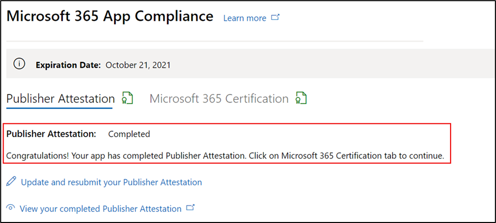

# Guia do usuário do parceiro para o Microsoft 365 de Conformidade de Aplicativos

|Fase|Cargo|
|---|---|
|Fase 1| Atestado do Editor|
|Fase 2| Certificação Microsoft 365|

## 1. Visão geral
Este documento atua como um guia do usuário passo a passo para nossos parceiros registrados no programa de Conformidade de Aplicativos do Microsoft 365 com o objetivo de passar por um atestado e certificação do Publisher por meio do portal do Partner Center.

## 2. Acrônimos & definições
| Acronym |Definição |
|---|----|
|PC [(Partner Center)](https://partner.microsoft.com/)|Um portal para todos os parceiros da Microsoft. Um parceiro faz logon no Partner Center e envia um questionário de autoavaliação. [Partner Center para](https://partner.microsoft.com/dashboard/home) conformidade Microsoft 365 aplicativo|
|ISV|Fornecedor independente de software. Aka. parceiro ou desenvolvedor|
|Origem do aplicativo| [Catálogo de aplicativos](https://appsource.microsoft.com/)
|Exemplo|[Agora agente virtual](https://appsource.microsoft.com/product/office/WA104381816)|

## 3. Fluxo Publisher de Atestado

**Home Page** : essa é a página de aterrissagem depois que um parceiro faz logon no Partner Center.

**Etapa 1** : selecionar ofertas do Marketplace. 

  
**Etapa 2**: depois de selecionar "Ofertas do Marketplace", alterne para 'Office Store'. Selecione um aplicativo na lista para iniciar o processo de Publisher atestado.

Ao selecionar um aplicativo, outra barra de navegação será exibida com a opção 'Informações de certificação adicionais' e clique em 'Conformidade do Aplicativo'.
  
**Etapa 3**: Selecionar 'Conformidade do Aplicativo'

**Etapa 4**: Preencher o questionário de autoavaliação para Publisher Atestado

**Observação Se você estiver voltando para atualizar/re-enviar seu aplicativo, clique na lista suspensa 'Escolher o produto', selecione o aplicativo e clique em 'Clonar'.**

Você também pode aproveitar o recurso Importação/Exportação para concluir o formulário offline e importá-lo depois de concluído.

**Etapa 5**: Depois de concluído, clique em 'Enviar', a avaliação agora será 'Em Revisão'.

### Aprovar/rejeitar cenários:

**A. Publisher atestado de atestado**

- No caso de rejeição neste estágio, um parceiro pode:
    - Exibir relatório de falha
         - O parceiro será notificado por email e poderá exibir o relatório de falha no Partner Center
    - Atualizar e enviar novamente Publisher Atestado

**B. Publisher aprovação do atestado**

- Após a aprovação, o parceiro pode:
    - Atualizar e reenviar atestado
    - Exibir e compartilhar concluído Publisher Atestado
    - Iniciar Microsoft 365 de Certificação

**Post Publisher aprovação de atestado: exemplo de link no AppSource para aplicativos atestados pelo editor**

## 4. Fluxo de Microsoft 365 de Certificação

Um parceiro pode iniciar o processo de certificação marcando a caixa de seleção e clicando em 'Enviar' 

**Etapa 1:** Envio inicial de documento Preencha todos os detalhes, carregue documentos relevantes e clique em 'Enviar'

Ao clicar em enviar, o envio do atestado estará em revisão. 

Um analista solicita uma revisão caso os documentos iniciais não sejam suficientes ou relevantes. O analista trabalhará com o parceiro para ajudar a obter os documentos certos para aprovação. 

Depois que o analista aprovar o envio inicial do documento, o parceiro precisará enviar os requisitos de controle. 

**Etapa 2:** Envio de Requisitos de Controle Preencha todos os detalhes, carregue documentos relevantes e clique em 'Enviar' 

Ao clicar em Enviar, o envio de certificação estará em revisão. 

Um analista solicita uma revisão caso os documentos de requisito de controle não sejam suficientes ou relevantes. O analista trabalhará com o parceiro para ajudar a obter os documentos certos para aprovação. 

Caso o envio não atenda aos padrões de aprovação, o analista rejeitará o envio. O parceiro pode trabalhar com o analista para fornecer as informações e documentos relevantes. 

Depois que todos os padrões de segurança forem atendidos, o analista aprovará o envio e o parceiro será Microsoft 365 Certificado. 

**Aprovação pós-certificação: exemplo Microsoft 365 selo de certificação no AppSource**

## 5. Fluxo Microsoft 365 renovação:
  
**Microsoft 365 Publisher fluxo de trabalho de renovação de certificação** e atestado: Microsoft 365 programa de conformidade do aplicativo agora oferece um processo de renovação anual. Durante esse processo, os desenvolvedores de aplicativos podem atualizar o questionário de Publisher e os documentos necessários para Microsoft 365 certificação. 
 
**Benefícios:** 

- Mantenha sua notificação de certificação no AppSource, na Teams Store, na Office Store e em outras vitrines para diferenciar o aplicativo. 
- Aumente a confiança do cliente no uso de seu aplicativo certificado. 
- Ajude os administradores de TI a tomar decisões informadas com informações de certificação atualizadas. 

O processo de renovação está disponível no [Partner Center](https://partner.microsoft.com/dashboard/home) para fornecer uma experiência perfeita. Um lembrete de renovação será mostrado no Partner Center a partir de 90 dias antes da data de validade. Lembretes periódicos também serão enviados por email em 90, 60 e 30 dias antes da expiração.

**Fase 1: Publisher renovação do atestado:** 

O novo processo de renovação está disponível no [Partner Center](https://partner.microsoft.com/dashboard/home) para fornecer uma experiência perfeita. Um lembrete de renovação será mostrado no Partner Center a partir de 90 dias antes da data de validade. Lembretes periódicos também serão enviados por email em 90, 60 e 30 dias antes da expiração. 

**Etapa 1**: Selecione **Renovar** para renovar o Publisher Atestado. 

**Etapa 2**: Examine as respostas Publisher de atestado anteriores e atualize com as informações mais recentes, conforme necessário. Envie Publisher atestado para renovação quando estiver pronto. Ele será revisado por um analista de conformidade Microsoft 365 aplicativo.

**Publisher renovação de atestado aprovada**

**Publisher** Atestado Expirado: as informações do aplicativo precisam ser renovadas antes da data de validade para manter a página de atestado de Publisher do aplicativo nos documentos da Microsoft. A renovação em tempo há tempo também garantirá a continuação de badging e ícones para o aplicativo no AppSource, Teams Store, Office Store e outras vitrines.

Observação: uma vez expirado, Publisher de renovação de atestado pode ser iniciado a qualquer momento clicando em 'Renovar'. 

**Fase 2: renovação Microsoft 365 certificação** 

As informações de certificação do aplicativo precisam ser reenviadas anualmente. Isso exigirá a revalidação dos controles no escopo do ambiente atual. Quando a certificação se aproximar de um ano, uma notificação por email será enviada incentivando a reenvio dos documentos e das evidências. 

**Cenários de aprovação/rejeição de renovação de certificação:**
 
**Cenário 1:** 

A renovação da certificação foi iniciada e está em revisão.

**Cenário 1A:**

Rejeição de renovação de certificação: a certificação poderá ser rejeitada se: 
- O aplicativo não tem as ferramentas, os processos ou as configurações necessárias em vigor e não poderá implementar as alterações necessárias dentro da janela de certificação. 
- O aplicativo tem vulnerabilidades pendentes em vigor e não pode ser corrigido dentro da janela de certificação. 
 

    
**Cenário 1B:** 

A renovação da certificação foi aprovada  

**Expiração da certificação:**
 
As informações do aplicativo precisam ser renovadas antes da data de validade para manter a página de Certificação do aplicativo nos documentos da Microsoft. A renovação o tempo limite também garantirá a continuidade de badging e ícones para o aplicativo no AppSource e na Team Store.

As informações do aplicativo precisam ser renovadas antes da data de validade para manter a página de Certificação do aplicativo nos documentos da Microsoft. A renovação em tempo há tempo também garantirá a continuação de badging e ícones para o aplicativo no AppSource, Teams Store, Office Store e outras vitrines. 

    
**Observação**: uma vez expirado, Publisher processo de Certificação e Atestado pode ser iniciado a qualquer momento clicando em 'Renovar'. 

