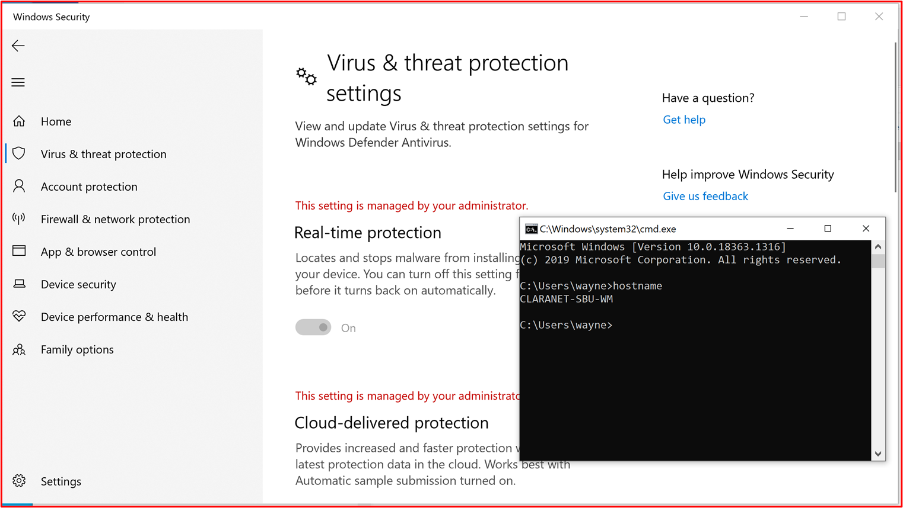
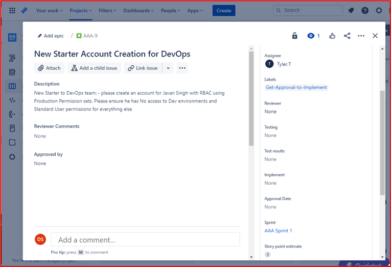
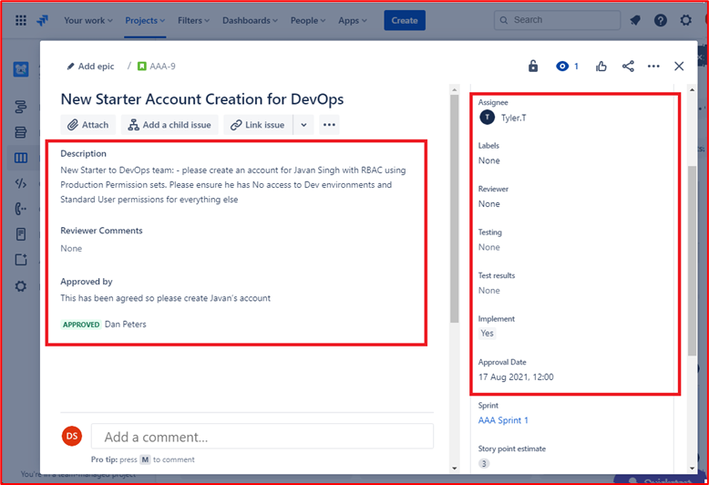
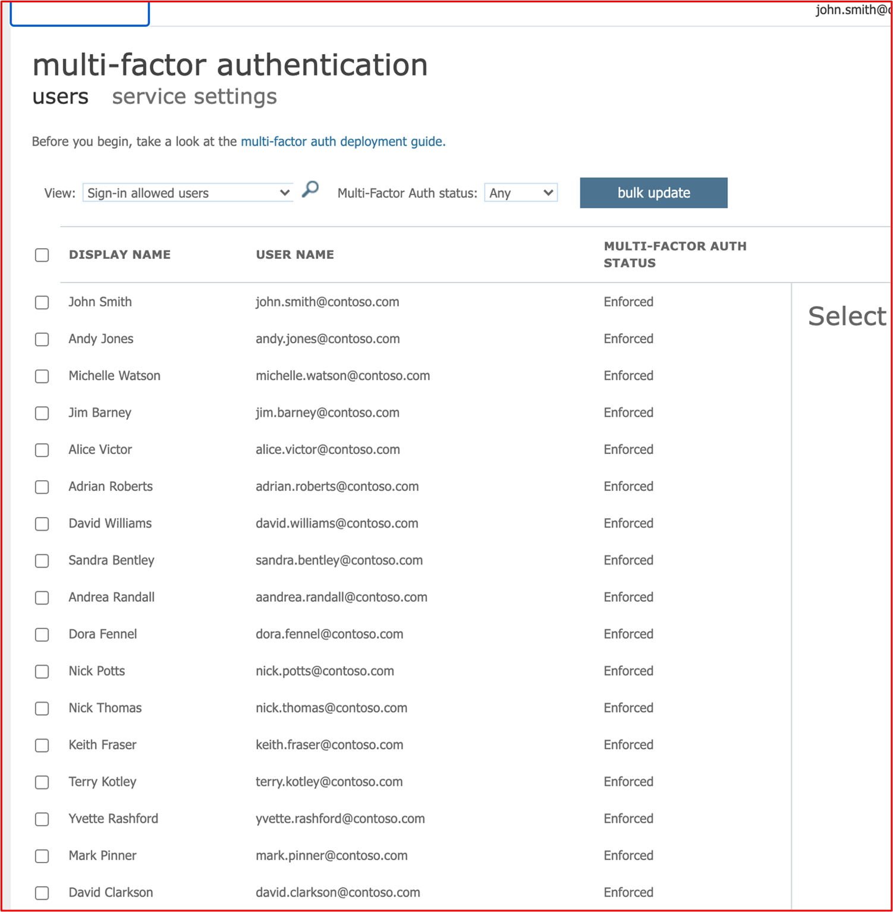
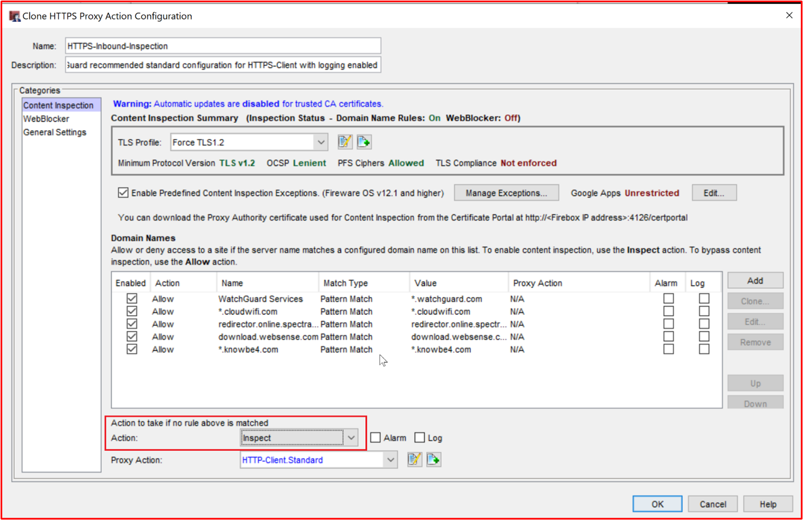
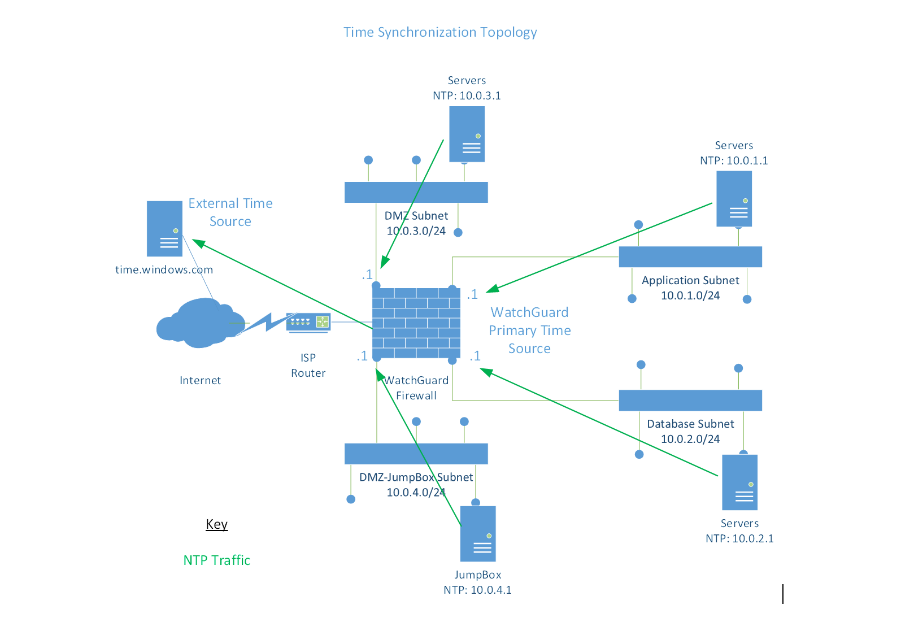
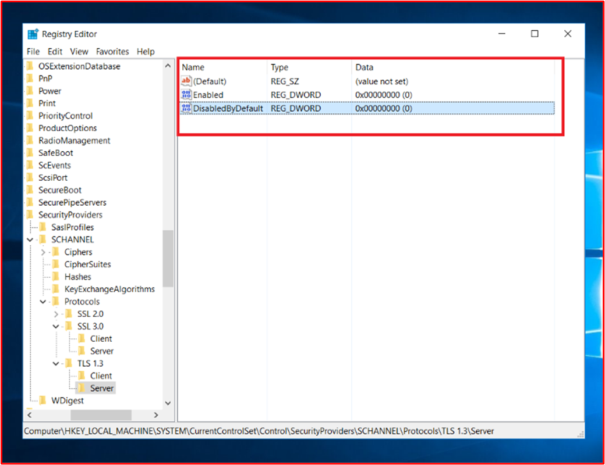
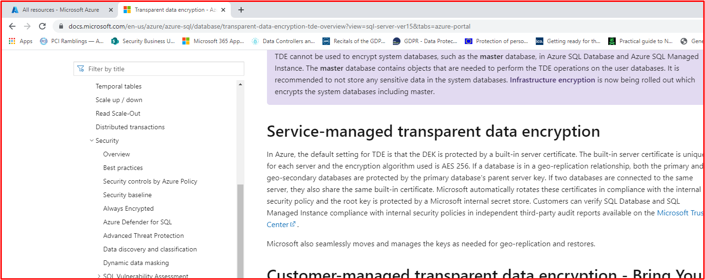

# Microsoft 365 Certificação - Guia de Evidências de Exemplo

## Visão Geral

Essa orientação foi criada para fornecer aos ISVs assistência no nível de requisitos detalhados para os controles Microsoft 365 Certificação. Além disso, ele fornece orientações sobre como estruturar o envio de evidências, juntamente com exemplos dos tipos de evidências que podem ser usados para satisfazer os controles de certificação. Quaisquer exemplos compartilhados neste documento não representam a única evidência que pode ser usada para ajudar a fornecer a garantia de que os controles estão sendo atendidos, mas atuam apenas como uma diretriz para o tipo de informação que pode ajudar a fornecer aos Analistas de Certificação as evidências necessárias para ajudá-los com essa afirmação. Observação: - As interfaces reais, capturas de tela e documentação usadas para atender aos requisitos variam dependendo do uso do produto, da instalação do sistema e dos processos internos. Além disso, observe que, quando a documentação de política ou procedimento for necessária, o ISV será necessário para enviar os documentos REAIS e não capturas de tela, como talvez mostrado em alguns dos exemplos. É recomendável que você siga essas diretrizes para evitar que sua avaliação seja adiada devido a evidências insuficientes. 

Há duas seções na certificação que exigem envios:
1. [**O Envio Inicial do Documento:**](https://docs.microsoft.com/en-us/microsoft-365-app-certification/docs/initialdocumentsubguide) um pequeno conjunto de documentos de alto nível necessários para a análise de sua avaliação.
1. **O Envio de Evidências:** o conjunto completo de evidências necessário para cada controle no escopo para sua avaliação de certificação. Exemplos de evidências para cada controle são mostrados abaixo.

## Structure 

Isso se correlaciona diretamente às categorias fornecidas no Guia de Envios Microsoft 365 certificação online. Observe que é melhor usar este guia diretamente junto com Microsoft 365 planilha de Lista de Verificação de Certificação fornecida para evitar mal-entendidos aos quais o controle defina cada um dos exemplos nesta diretriz está se referindo. As diretrizes fornecidas neste documento são detalhadas da seguinte forma:
- Domínio de Segurança: os três domínios de segurança em que todos os controles estão agrupados: Segurança do Aplicativo, Segurança Operacional e Segurança de Dados e Privacidade.
- Control(s): = Descrição da Atividade de Avaliação - Esses controles e número associado (Não)são tirados diretamente da lista de verificação de Microsoft 365 Certificação.  
- Intenção: = A intenção de por que o controle de segurança está incluído no programa e o risco específico que ele se destina a atenuar.  A esperança é que essas informações forneçam aos ISVs o raciocínio por trás do controle para entender melhor os tipos de evidências que precisam ser coletados e quais ISV devem prestar atenção e ter conhecimento e compreensão na produção de suas evidências.
- Diretrizes de evidência de exemplo: = Dado para ajudar a orientar as Tarefas de Coleta de Evidências na planilha de Verificação de Certificação do Microsoft 365, isso permite que os ISV vejam claramente exemplos do tipo de evidência que pode ser usado pelo Analista de Certificação que o usará para fazer uma determinação segura de que um controle está no local e mantido – ele não é de forma exaustiva de natureza.
- Exemplo de evidência: = Esta seção fornece exemplos de capturas de tela e imagens de evidências potenciais capturadas em cada um dos controles dentro da planilha de Verificação de Certificação do Microsoft 365, especificamente para os Domínios de Segurança Operacional e Segurança de Dados e Segurança de Privacidade (Guias na planilha). Observe que qualquer informação com setas vermelhas e caixas dentro dos exemplos é para ajudar a entender melhor os requisitos necessários para atender a qualquer controle.

## Domínio de Segurança: Segurança do Aplicativo

**Controle 1 - Controle 16**:

Os controles de domínio de Segurança de Aplicativo podem ser satisificados com um relatório de teste de penetração emitido nos últimos 12 meses mostrando que seu aplicativo não tem vulnerabilidades pendentes. O único envio necessário é um relatório limpo de uma empresa independente confiável. 

## Domínio de Segurança: Segurança Operacional / Desenvolvimento Seguro

O domínio de segurança "Segurança Operacional / Desenvolvimento Seguro" foi projetado para garantir que os ISVs implementem um conjunto forte de técnicas de mitigação de segurança contra uma miríade de ameaças enfrentadas por atores de ameaças.  Isso foi projetado para proteger o ambiente operacional e os processos de desenvolvimento de software para criar ambientes seguros.

#### Proteção contra Malware - Antivírus

**Controle nº 1:** Forneça documentação de política que rege práticas e procedimentos anti-vírus.
- Intenção: a intenção desse controle é avaliar o entendimento de um ISV sobre os problemas que enfrentam ao considerar a ameaça de vírus de computador. Estabelecendo e usando as práticas recomendadas do setor no desenvolvimento de uma política e processos antivírus, um ISV fornece um recurso personalizado para a capacidade da organização de reduzir os riscos enfrentados pelo malware, listar as práticas recomendadas na detecção e eliminação de vírus e fornece evidências de que a política documentada fornece orientações de segurança sugeridas para a organização e seus funcionários. Ao documentar uma política e um procedimento de como o ISV implanta ascenidades anti-malware, isso garante a distribuição e a manutenção consistentes dessa tecnologia na redução do risco de malware para o ambiente.

- Diretrizes de evidências de exemplo: forneça uma cópia da sua política antivírus/antimalware detalhando os processos e procedimentos implementados em sua infraestrutura para promover as práticas recomendadas de Antivírus/Malware.
Exemplo de evidência

- Exemplo de evidência:

**Observação:** Esta captura de tela mostra um documento de política/processo, a expectativa é que os ISVs compartilhem a documentação real de política/procedimento de suporte e não simplesmente forneçam uma captura de tela.

**Controle nº 2:** Forneça evidências demonstradas de que o software antivírus está sendo executado em todos os componentes do sistema amostrados.

- Intenção: é importante ter as defesas anti-vírus (AV) (ou anti-malware) em execução em seu ambiente para proteger contra riscos de segurança cibernética que você pode ou não estar ciente de como possíveis ataques prejudiciais estão aumentando, tanto na sofisticação quanto nos números. Ter a AV implantada em todos os componentes do sistema que suportam seu uso ajudará a reduzir alguns dos riscos de anti-malware que estão sendo introduzidos no ambiente. É necessário apenas um único ponto de extremidade para ser desprotegido para fornecer potencialmente um vetor de ataque para que um ator de ameaças obtenha uma posição de apoio no ambiente. Portanto, a AV deve ser usada como uma das várias camadas de defesa para proteger contra esse tipo de ameaça.

- Diretrizes de evidência de exemplo: para provar que uma instância ativa da AV está em execução no ambiente avaliado. Forneça uma captura  de tela para todos os dispositivos no exemplo que dão suporte ao uso de antivírus que mostra o processo antivírus em execução, o software antivírus está ativo ou se você tiver um console de gerenciamento centralizado para antivírus, talvez seja capaz de demonstrar a partir desse console de gerenciamento. Se estiver usando o console de gerenciamento, certifique-se de provar em uma captura de tela que os dispositivos amostrados estão conectados e funcionando.

- Exemplo de evidência 1: a captura de tela abaixo foi tirada do Centro de Segurança do Azure; ele mostra que uma extensão antimalware foi implantada na VM chamada &quot; MSPGPRODAZUR01 &quot; .

- Exemplo de evidência 2

A captura de tela abaixo foi retirada de um Windows 10, mostrando que a proteção em tempo real está ligada para o nome de &quot; &quot; host &quot; CLARANET-SBU-WM &quot; .

**Controle nº 3:** Forneça evidências demonstrativas de que as assinaturas de antivírus estão atualizadas em todos os ambientes (dentro de 1 dia).

- Intenção: centenas de milhares de novos malwares e aplicativos potencialmente indesejados (PUA) são identificados todos os dias. Para fornecer proteção adequada contra malware recém-lançado, as assinaturas av precisam ser atualizadas regularmente para contabilizar o malware recém-lançado.

- Esse controle existe para garantir que o ISV tenha levado em consideração a segurança do ambiente e o efeito que a AV desatualizada pode ter sobre a segurança.

- Diretrizes de evidência de exemplo: forneça arquivos de log antivírus de cada dispositivo amostrado, mostrando que as atualizações são aplicadas diariamente.

- Exemplo de evidência: a captura de tela a seguir mostra o Microsoft Defender atualizando pelo menos diariamente mostrando &#39;Evento 2000, Windows Defender&#39; qual é a atualização. O nome do host é mostrado, mostrando que isso foi tirado do sistema de escopo &quot; CLARANET-SBU-WM &quot; .

**Observação:** As evidências fornecidas precisariam incluir uma exportação dos logs para mostrar atualizações diárias em um período de tempo maior. Alguns produtos antivírus gerarão arquivos de log de atualização para que esses arquivos sejam fornecidos ou exportem os logs do Visualizador de Eventos.

**Controle nº 4:** Forneça evidências demonstradas de que o antivírus está configurado para executar a verificação no acesso ou a verificação periódica em todos os componentes do sistema amostrados.

**Observação:** Se a verificação ao acessar não estiver habilitada, um mínimo de verificação diária e alerting_ **DEVE** _be habilitado.

- Intenção: a intenção desse controle é garantir que o malware seja identificado rapidamente para minimizar o efeito que isso pode ter para o ambiente. Onde a verificação ao acessar é realizada e juntamente com o bloqueio automático de malware, isso ajudará a parar infecções de malware conhecidas pelo software antivírus. Onde a verificação no acesso&#39;não é desejável devido aos riscos de falsos positivos causarem paralisações de serviço, os mecanismos de verificação e alerta diários adequados (ou mais) precisam ser implementados para garantir uma resposta em tempo há tempo a infecções de malware para minimizar os danos.

- Diretrizes de evidências de exemplo: forneça uma captura de tela para cada dispositivo no exemplo que oferece suporte a antivírus, mostrando que o antivírus está em execução no dispositivo e está configurado para verificação ao acessar (verificação em tempo real), **OU** fornecer uma captura de tela mostrando que a verificação periódica está habilitada para verificação diária, o alerta é configurado e a última data de verificação para cada dispositivo no exemplo.  

- Exemplo de evidência: a captura de tela a seguir mostra que a proteção em tempo real está habilitada para o host, &quot; CLARANET-SBU-WM &quot; .

**Controle nº 5:** Forneça evidências demonstradas de que o antivírus está configurado para bloquear automaticamente malware ou quarentena e alertar todos os componentes do sistema amostrados.

- Intenção: a sofisticação do malware está evoluindo o tempo todo, juntamente com os graus variáveis de destruição que eles podem trazer. A intenção desse controle é impedir que o malware seja executado e, portanto, impedi-lo de executar sua carga potencialmente insustante, ou se o bloqueio automático não for uma opção, limitar a quantidade de tempo em que o malware pode causar danos ao alertar e responder imediatamente à possível infecção por malware.

- Diretrizes de evidência de exemplo: forneça uma captura de tela para cada dispositivo no exemplo que oferece suporte a antivírus, mostrando que o antivírus está em execução no computador e é configurado para bloquear automaticamente malware, alerta ou quarentena e alerta. 

- Exemplo de Evidência 1: A captura de tela a seguir mostra que o host &quot; CLARANET-SBU-WM é configurado com proteção em tempo real para &quot; Microsoft Defender Antivírus. Como diz a configuração, isso localiza e impede que o malware seja instalado ou executado no dispositivo.

**Controle No.6:** Forneça evidências demonstradas de que os aplicativos são aprovados antes de serem implantados.

- Intenção: com o controle do aplicativo, a organização aprovará cada aplicativo/processo que tem permissão para ser executado no sistema operacional. O objetivo desse controle é garantir que um processo de aprovação seja executado para autorizar quais aplicativos/processos podem ser executados.

- Diretrizes de evidência de exemplo: evidências podem ser fornecidas mostrando que o processo de aprovação está sendo seguido. Isso pode ser fornecido por meio de documentos assinados, controle em sistemas de controle de alterações ou usando algo como Azure DevOps ou JIRA para rastrear essas solicitações e autorização.

- Exemplo de evidência: a captura de tela a seguir demonstra uma aprovação pelo gerenciamento que cada aplicativo permitido para executar dentro do ambiente segue um processo de aprovação. Este é um processo baseado em papel na Contoso, no entanto, outros mecanismos podem ser usados.

**Controle No.7:** Forneça evidências demonstradas de que uma lista completa de aplicativos aprovados com justificativa comercial existe e é mantida.

- Intenção: é importante que as organizações mantenham uma lista de todos os aplicativos aprovados, juntamente com informações sobre por que o aplicativo/processo foi aprovado. Isso ajudará a garantir que a configuração permaneça atual e possa ser revisada em uma linha de base para garantir que aplicativos/processos não autorizados não sejam configurados.

- Diretrizes de evidência de exemplo: fornecer a lista documentada de aplicativos/processos aprovados juntamente com a justificativa comercial.

- Exemplo de evidência: a captura de tela a seguir lista os aplicativos aprovados com justificativa comercial.

**Observação:** Esta captura de tela mostra um documento, a expectativa é que os ISVs compartilhem o documento de suporte real e não simplesmente forneçam uma captura de tela.

**Controle No.8:** Forneça documentação de suporte detalhando que o software de controle de aplicativo está configurado para atender a mecanismos de controle de aplicativo específicos.

- Intenção: a configuração da tecnologia de controle de aplicativo deve ser documentada juntamente com um processo de como manter a tecnologia, ou seja, adicionar e excluir aplicativos/processos. Como parte dessa documentação, o tipo de mecanismo usado deve ser detalhado para cada aplicativo/processo. Isso será alimentado para o próximo controle para garantir que a tecnologia seja configurada como documentada.

- Diretrizes de evidência de exemplo: forneça documentação de suporte detalhando como o controle de aplicativo foi configurado e como cada aplicativo/processo foi configurado dentro da tecnologia.

- Exemplo de evidência: a captura de tela a seguir lista o mecanismo de controle usado para implementar o controle do aplicativo. Você pode ver abaixo que 1 aplicativo está usando controles de certificado e os outros usando o caminho do arquivo.

**Observação:** Esta captura de tela mostra um documento, a expectativa é que os ISVs compartilhem o documento de suporte real e não simplesmente forneçam uma captura de tela.

**Controle No. 9:** Forneça evidências demonstradas de que o controle do aplicativo está configurado como documentado de todos os componentes do sistema amostrados.

- Intenção: a intenção disso é validar que o controle do aplicativo está configurado no exemplo de acordo com a documentação.

- Diretrizes de evidência de exemplo: forneça uma captura de _tela_ para cada dispositivo no exemplo para mostrar que ele tem controles de aplicativo configurados e ativados. Isso deve mostrar nomes de máquina, os grupos aos que pertencem e as políticas de controle de aplicativos aplicadas a esses grupos e máquinas.

- Exemplo de evidência: a captura de tela a seguir mostra um objeto de Política de Grupo com Políticas de Restrição de Software habilitadas.

Esta próxima captura de tela mostra a configuração em linha com o controle acima.

Esta próxima captura de tela mostra o Ambiente M365 e os Computadores incluídos no escopo que está sendo aplicado a este objeto GPO &#39;computador de domínio Configurações&#39;.

Esta captura de tela final mostra o servidor de escopo DBServer1 dentro da &quot; &quot; UO na captura de tela acima.

### Gerenciamento de Patch – Classificação de Risco

A identificação rápida e a correção de vulnerabilidades de segurança ajudam a minimizar os riscos de um ator de ameaças comprometer o ambiente ou o aplicativo. O gerenciamento de patch é dividido em duas seções: classificação de risco e correção de correção. Esses três controles abrangem a identificação de vulnerabilidades de segurança e classificam-nas de acordo com o risco que representam.

Esse grupo de controle de segurança está no escopo para ambientes de hospedagem do Platform-as-a-Service (PaaS), já que as bibliotecas de software de terceiros de aplicativo/complemento e a base de código devem ser corrigidas com base na classificação de risco.

**Controle nº 10:** Documentação de política de fornecimento que rege como novas vulnerabilidades de segurança são identificadas e atribuídas a uma pontuação de risco.

- Intenção: a intenção desse controle é ter documentação de suporte para garantir que as vulnerabilidades de segurança sejam identificadas rapidamente para reduzir a janela de oportunidade que os atores de ameaças têm para explorar essas vulnerabilidades. Um mecanismo robusto precisa estar em vigor para identificar vulnerabilidades que abrangem todos os componentes do sistema em uso pelas organizações; por exemplo, sistemas operacionais (Windows Server, Ubuntu, etc.), aplicativos (Tomcat, MS Exchange, SolarWinds, etc.), dependências de código (AngularJS, jQuery, etc.). As organizações precisam não apenas garantir a identificação o tempo hábitrável das vulnerabilidades dentro da propriedade, mas também classificar quaisquer vulnerabilidades adequadamente para garantir que a correção seja realizada em um período de tempo adequado com base no risco que a vulnerabilidade apresenta.

**Observação** Mesmo que você esteja executando em um ambiente puramente plataforma como serviço, você ainda tem a responsabilidade de identificar vulnerabilidades em sua base de código: ou seja, bibliotecas de terceiros.

- Diretrizes de evidência de exemplo: fornecer a documentação de suporte (não capturas de tela)

- Exemplo de evidência: esta captura de tela mostra um trecho de uma política de classificação de risco.

**Observação:** Esta captura de tela mostra um documento de política/processo, a expectativa é que os ISVs compartilhem a documentação real de política/procedimento de suporte e não simplesmente forneçam um screenshot._

**Controle nº 11:** Forneça evidências de como novas vulnerabilidades de segurança são identificadas.

- Intenção: a intenção desse controle é garantir que o processo está sendo seguido e ele&#39;robusto o suficiente para identificar novas vulnerabilidades de segurança em todo o ambiente. Isso pode não ser apenas os Sistemas Operacionais; pode incluir aplicativos em execução no ambiente e quaisquer dependências de código.

- Diretrizes de evidências de exemplo: as evidências podem ser fornecidas por meio de exibição de assinaturas para listas de email, revisão manual de fontes de segurança para vulnerabilidades recém-lançadas (seria necessário ser rastreada adequadamente com datas de data/hora das atividades, ou seja, com JIRA ou Azure DevOps), ferramentas que localizam softwares fora de data (por exemplo, poderia ser Snyk ao procurar bibliotecas de software desaconsustadas,  ou pode ser o Nessus usando verificações autenticadas que identificam softwares desaproveitado.).

**Observação** Se estiver usando o Nessus, isso precisará ser executado regularmente para identificar vulnerabilidades rapidamente. Recomendamos pelo menos semanalmente.

- Exemplo de evidência: essa captura de tela demonstra que um grupo de email está sendo usado para ser notificado de vulnerabilidades de segurança.

**Controle nº 12:** Forneça evidências demonstrando que todas as vulnerabilidades são atribuídas a uma classificação de risco uma vez identificada.

- Intenção: a correção precisa se basear no risco, quanto mais risco a vulnerabilidade, mais rápido ele precisa ser remediado. A classificação de risco de vulnerabilidades identificadas é parte integrante desse processo. A intenção desse controle é garantir que haja um processo de classificação de risco documentado que está sendo seguido para garantir que todas as vulnerabilidades identificadas sejam classificadas com base no risco. As organizações geralmente utilizam a classificação CVSS (Common Vulnerability Scoring System) fornecida por fornecedores ou pesquisadores de segurança. É recomendável que, se a organização depender do CVSS, um mecanismo de reavaliação seja incluído no processo para permitir que a organização altere a classificação com base em uma avaliação de risco interna. Às vezes, a vulnerabilidade pode não ser um aplicativo devido à maneira como o aplicativo foi implantado no ambiente. Por exemplo, uma Java pode ser lançada, o que afeta uma biblioteca específica que não é usada pela organização.

- Diretrizes de evidência de exemplo: forneça evidências por meio de captura de tela ou outros meios, por exemplo, DevOps/Jira, que demonstra que as vulnerabilidades estão passando pelo processo de classificação de risco e sendo atribuída uma classificação de risco apropriada pela organização.

- Exemplo de evidência: essa captura de tela mostra a classificação de risco que ocorre na coluna D e reclasse nas colunas F e G, caso a organização realize uma avaliação de risco e determine que o risco pode ser rebaixado. Evidências de avaliações de risco de re-classificação precisariam ser fornecidas como evidências de suporte

### Gerenciamento de Patch – Patching

Os controles a seguir são para o elemento patching para Gerenciamento de Patch. Para manter um ambiente operacional seguro, aplicativos/complementos e sistemas de suporte devem ser remendados de forma adequado. Um período de tempo adequado entre a identificação (ou a versão pública) e a correção precisa ser gerenciado para reduzir a janela de oportunidade para que uma vulnerabilidade seja explorada por um ator de ameaças. A Microsoft 365 certificação não estipula um &#39;de Patching Window&#39;, no entanto, os Analistas de Certificação rejeitarão os prazos que não são razoáveis.

Esse grupo de controle de segurança está no escopo para ambientes de hospedagem do Platform-as-a-Service (PaaS), já que as bibliotecas de software de terceiros de aplicativo/complemento e a base de código devem ser corrigidas com base na classificação de risco.

**Controle nº 13:** Fornecer documentação de política para correção de componentes do sistema no escopo que inclui o período de tempo mínimo de correção adequado para vulnerabilidades críticas, de alto e médio risco; e desativação de qualquer software e sistemas operacionais sem suporte.

- Intenção: o gerenciamento de patch é exigido por muitas estruturas de conformidade de segurança, ou seja, PCI-DSS, ISO 27001, NIST (SP) 800-53. A importância de um bom gerenciamento de patch não pode ser sobressalada, pois pode corrigir problemas de segurança e funcionalidade em software, firmware e mitigar vulnerabilidades, o que ajuda na redução de oportunidades de exploração. O objetivo desse controle é minimizar a janela de oportunidade que um ator de ameaças precisa para explorar vulnerabilidades que podem existir no ambiente no escopo.

- Diretrizes de evidência de exemplo: forneça uma cópia de todas as políticas e procedimentos que detalham o processo de gerenciamento de patch. Isso deve incluir uma seção em uma janela de correção mínima e que sistemas operacionais e softwares sem suporte não devem ser usados no ambiente.

- Exemplo de evidência: abaixo está um documento de política de exemplo.

**Observação:** Esta captura de tela mostra um documento de política/processo, a expectativa é que os ISVs compartilhem a documentação real de política/procedimento de suporte e não simplesmente forneçam um screenshot._

**Controle nº 14:** Forneça evidências demonstradas de que todos os componentes do sistema amostrados estão sendo remendados.

**Observação:** Inclua quaisquer bibliotecas de software/de terceiros.

- Intenção: corrigir vulnerabilidades garante que os módulos diferentes que fazem parte da infraestrutura de tecnologia da informação (hardware, software e serviços) sejam mantidos atualizados e livres de vulnerabilidades conhecidas. A correção precisa ser executada assim que possível para minimizar o potencial de um incidente de segurança entre a liberação de detalhes de vulnerabilidade e o patch. Isso é ainda mais crítico em que a exploração de vulnerabilidades conhecidas como em natureza.

- Diretrizes de evidência de exemplo: forneça uma captura de tela para todos os dispositivos no exemplo e componentes de software de suporte mostrando que os patches são instalados em linha com o processo de correção documentado. 

- Exemplo de evidência: a captura de tela a seguir mostra que o componente do sistema de escopo CLARANET-SBU-WM está realizando Windows atualizações em linha com a política &quot; &quot; de correção.

**Observação:** A correção de todos os componentes do sistema no escopo precisa ser evidência. Isso inclui coisas como; Atualizações do sistema operacional, atualizações de aplicativos/componentes (i.e__.,_ _Apache Tomcat, OpenSSL, etc.), Dependências de Software (por exemplo, JQuery, AngularJS, etc.), etc._

**Controle nº 15:** Forneça evidências demonstradas de que quaisquer sistemas operacionais e componentes de software sem suporte não são usados no ambiente.

- Intenção: o software que não está sendo mantido pelos fornecedores sofrerá, horas extras, de vulnerabilidades conhecidas que não são corrigidas. Portanto, o uso de sistemas operacionais e componentes de software sem suporte não deve ser usado em ambientes de produção.

- Diretrizes de evidência de exemplo: forneça uma captura de tela para cada dispositivo no exemplo mostrando a versão do sistema operacional em execução (incluindo o nome do servidor&#39;na captura de tela).  Além disso, forneça evidências de que os componentes de software em execução no ambiente estão executando versões com suporte. Isso pode ser feito fornecendo a saída de relatórios de verificação de vulnerabilidade interna (fornecendo verificação autenticada incluída) e/ou a saída de ferramentas que verificam bibliotecas de terceiros, como [Snyk,](https://snyk.io/) [Trivy](https://github.com/aquasecurity/trivy) ou [NPM Audit](https://docs.npmjs.com/cli/v7/commands/npm-audit). Se estiver sendo executado somente no PaaS, somente a correção de biblioteca de terceiros precisará ser coberta pelos grupos de controle de correção.

- Exemplo de evidência: as evidências a seguir mostram que o componente do sistema no escopo, o THOR, está executando um software com suporte do fornecedor, já que o Nessus não&#39;sinalização de problemas.

**Observação:** O relatório completo deve ser compartilhado com os Analistas de Certificação.

- Exemplo de evidência 2

Esta captura de tela mostra que o componente do sistema no escopo &quot; CLARANET-SBU-WM está sendo executado em uma &quot; versão Windows suporte.

- Exemplo de evidência 3

A captura de tela a seguir é da saída [Trivy,](https://github.com/aquasecurity/trivy) que o relatório completo não&#39;listar nenhum aplicativo sem suporte.

**Observação:** O relatório completo deve ser compartilhado com os Analistas de Certificação.

### Verificação de vulnerabilidade

Ao introduzir avaliações regulares de vulnerabilidade, as organizações podem detectar deficiências e in seguranças em seus ambientes, o que pode fornecer um ponto de entrada para um ator mal-intencionado comprometer o ambiente. A verificação de vulnerabilidades pode ajudar a identificar patches ausentes ou configurações in-loco no ambiente. Ao realizar regularmente essas verificações, uma organização pode fornecer uma correção apropriada para minimizar o risco de um comprometimento devido a problemas que são comumente abordados por essas ferramentas de verificação de vulnerabilidade.

**Controle nº 16:** Forneça os relatórios de verificação de vulnerabilidade de aplicativo Web e infraestrutura trimestral. A verificação precisa ser realizada em todo o espaço público (endereços IP e URLs) e intervalos IP internos.

**Observação:** Isso **DEVE** incluir o escopo completo do ambiente.

- Intenção: a verificação de vulnerabilidade procura possíveis pontos fracos em um sistema de computador, redes e aplicativos Web de organizações para identificar falhas que podem levar a violações de segurança e à exposição de dados confidenciais. A verificação de vulnerabilidade geralmente é necessária por padrões do setor e regulamentos governamentais, por exemplo, o PCI DSS (Payment Card Industry Data Security Standard).

- Um relatório da Métrica de Segurança intitulado Guia de Métricas de Segurança &quot; [2020](https://info.securitymetrics.com/pci-guide-2020) para Conformidade com PCI DSS afirma que o &#39;em média levou 166 dias a partir do momento em que uma organização foi vista com vulnerabilidades para um invasor comprometer o &quot; sistema. Depois de comprometidos, os invasores tiveram acesso a dados confidenciais por uma média de 127 dias&#39;, portanto, esse controle tem como objetivo identificar possíveis deficiências de segurança no ambiente no escopo.

- Diretrizes de evidência de exemplo: forneça o(s) relatório(s) de verificação completo para cada trimestre&#39;verificações de vulnerabilidade que foram realizadas nos últimos 12 meses. Os relatórios devem dizer claramente os destinos para validar se o espaço público completo está incluído e, quando aplicável, cada sub-rede interna. Forneça **relatórios de** verificação ALL para **cada** trimestre.

- Exemplo de evidência: Exemplo de evidência seria fornecer os relatórios de verificação da ferramenta de verificação que está sendo usada. Cada trimestre&#39;relatórios de verificação devem ser fornecidos para revisão. A verificação precisa incluir todos os componentes do sistema de ambientes; cada sub-rede interna e cada ENDEREÇO IP público/URL que está disponível para o ambiente.

**Controle nº 17:** Forneça evidências demonstrativas de que a correção de vulnerabilidades identificadas durante a verificação de vulnerabilidades são corrigidas em linha com seu período de tempo de correção documentado.

- Intenção: falha na identificação, gerenciamento e correção de vulnerabilidades e configurações in-loco rapidamente pode aumentar o risco&#39;organização de um comprometimento que leva a possíveis violações de dados. A identificação correta e correção de problemas é vista como importante para uma organização&#39;a postura geral de segurança e o ambiente que está em linha com as práticas recomendadas de várias estruturas de segurança; exemplo, ISO 27001 e PCI DSS.

- Diretrizes de evidência de exemplo: forneça artefatos adequados (ou seja, capturas de tela) mostrando que uma amostra de vulnerabilidades descobertas da verificação de vulnerabilidades são corrigidas em linha com as janelas de correção já fornecidas no Controle 13 acima.

- Exemplo de evidência: a captura de tela a seguir mostra uma verificação do Nessus do ambiente no escopo (um único computador neste exemplo chamado THOR ) mostrando vulnerabilidades no 2º de agosto de &quot; &quot; 2021.

A captura de tela a seguir mostra que os problemas foram resolvidos, dois dias depois, que está dentro da janela de correção definida na política de correção.

**Observação:** Para esse controle, os Analistas de Certificação precisam ver relatórios de verificação de vulnerabilidade e correção para cada trimestre nos últimos doze meses.

### Firewalls

Firewalls geralmente fornecem um limite de segurança entre ambientes confiáveis (rede interna), não confiáveis (Internet) e semi-confiáveis (DMZ). Geralmente, será a primeira linha de defesa em uma estratégia de segurança de defesa aprofundada das organizações, projetada para controlar fluxos de tráfego para serviços de entrada e saída e para bloquear o tráfego indesejado. Esses dispositivos devem ser fortemente controlados para garantir que funcionem efetivamente e estão livres de erros de configuração que podem colocar o ambiente em risco.

**Controle nº 18:** Forneça documentação de política que rege práticas e procedimentos de gerenciamento de firewall.

- Intenção: firewalls são uma primeira linha de defesa importante em uma estratégia de segurança em camadas (defesa em profundidade), protegendo ambientes contra zonas de rede menos confiáveis. Os firewalls normalmente controlarão fluxos de tráfego com base em Endereços IP e protocolos/portas, mais firewalls ricos em recursos também podem fornecer defesas adicionais de camada de aplicativo inspecionando o tráfego de aplicativos para proteger contra uso indevido, vulnerabilidades e ameaças com base nos aplicativos que estão sendo &quot; &quot; acessados. Essas proteções são tão boas quanto a configuração do firewall, portanto, políticas de firewall fortes e procedimentos de suporte precisam estar em uso para garantir que eles sejam configurados para fornecer proteção adequada de ativos internos. Por exemplo, um firewall com uma regra para permitir todo o tráfego de QUALQUER origem para QUALQUER destino está apenas atuando como um roteador.

- Diretrizes de evidência de exemplo: fornecer sua documentação de suporte de política/procedimento de firewall completo. Este documento deve abranger todos os pontos abaixo e quaisquer práticas recomendadas adicionais aplicáveis ao seu ambiente.

- Exemplo de evidência: a seguir está um exemplo do tipo de documento de política de firewall necessário (isso é uma demonstração e pode não estar completo).

**Controle nº 19:** Forneça evidências demonstrativas de que quaisquer credenciais administrativas padrão são alteradas antes da instalação em ambientes de produção.

- Intenção: as organizações precisam estar atentas às credenciais administrativas padrão fornecidas pelo fornecedor que são configuradas durante a configuração do dispositivo ou do software. As credenciais padrão geralmente estão disponíveis publicamente pelos fornecedores e podem oferecer a um ator de ameaças externas uma oportunidade de comprometer um ambiente. Por exemplo, uma pesquisa simples na Internet para as credenciais padrão do iDrac (Controlador de Acesso Remoto Integrado da Dell) destacará _root::calvin_ como o nome de usuário padrão e a senha. Isso dará a alguém acesso remoto ao gerenciamento de servidor remoto. O objetivo desse controle é garantir que os ambientes não sejam suscetíveis a ataques por meio de credenciais de fornecedor padrão que não foram alteradas durante o hardening de dispositivo/aplicativo.

- Diretrizes de evidências de exemplo

- Isso pode ser exibido em uma sessão de compartilhamento de tela em que o Analista de Certificação pode tentar autenticar os dispositivos no escopo usando credenciais padrão.

- Exemplo de evidência

A captura de tela abaixo mostra o que o Analista de Certificação verá de um nome de usuário/senha inválido de um Firewall WatchGuard.

**Controle No. 20:** Forneça evidências demonstrativas de que os firewalls estão instalados no limite do ambiente no escopo e instalados entre a rede de perímetro (também conhecida como DMZ, zona desmilitarizada e sub-rede de tela) e redes confiáveis internas.

- Intenção: os firewalls fornecem a capacidade de controlar o tráfego entre diferentes zonas de rede de diferentes níveis de segurança. Como todos os ambientes estão conectados à Internet, os firewalls precisam ser instalados no limite, ou seja, entre a Internet e o ambiente no escopo. Além disso, os firewalls precisam ser instalados entre as redes de DMZ (Zona Desmilidada) menos confiáveis e redes confiáveis internas. Os DMZs geralmente são usados para atender o tráfego da Internet e, portanto, é um alvo de ataque. Ao implementar um DMZ e usar um firewall para controlar fluxos de tráfego, um comprometimento do DMZ não&#39;necessariamente significar um comprometimento das redes confiáveis internas e dados corporativos/clientes. O registro em log e alerta adequados devem estar em uso para ajudar as organizações a identificar rapidamente um compromisso para minimizar a oportunidade do ator de ameaças comprometer ainda mais as redes confiáveis internas. A intenção desse controle é garantir que haja controle adequado entre redes confiáveis e menos confiáveis.

- Diretrizes de evidência de exemplo: as evidências devem ser fornecidas por meio de arquivos de configuração de firewall ou capturas de tela demonstrando que um DMZ está no local. Isso deve corresponder aos diagramas de arquitetura fornecidos que demonstram as diferentes redes que suportam o ambiente. Uma captura de tela das interfaces de rede no firewall, juntamente com o diagrama de rede já fornecido como parte do Envio Inicial de Documento deve fornecer essa evidência.

- Exemplo de evidência: abaixo está uma captura de tela de um firewall WatchGuard que demonstra dois DMZs, um é para os serviços de entrada (chamado DMZ), o outro está servindo a caixa de salto (Host Bastian).

**Controle nº 21:** Forneça evidências demonstrativas de que todo o acesso público termina na zona desmilitarizada (DMZ).

- Intenção: os recursos que são publicamente acessíveis estão abertos a uma infinidade de ataques. Como já discutido acima, a intenção de um DMZ é segmentar redes menos confiáveis de redes internas confiáveis que podem conter dados confidenciais. Um DMZ é considerado menos confiável, pois há um risco muito grande de hosts que podem ser acessados publicamente por agentes de ameaças externos. O acesso público sempre deve ser encerrado nessas redes menos confiáveis que são segmentadas adequadamente pelo firewall para ajudar a proteger recursos e dados internos. O objetivo desse controle é garantir que todo o acesso público seja encerrado dentro desses DMZs menos confiáveis como se os recursos nas redes internas confiáveis fossem públicos, um comprometimento desses recursos fornece a um ator de ameaças uma posição de apoio na rede onde os dados confidenciais estão sendo mantidos.

- Diretrizes de evidências de exemplo

- As evidências fornecidas para isso podem ser configurações de firewall que mostram as regras de entrada e onde essas regras estão terminando, roteando endereços IP públicos para os recursos ou fornecendo a NAT (Conversão de Endereço de Rede) do tráfego de entrada.

- Exemplo de evidência

Na captura de tela abaixo, há três regras de entrada, cada uma mostrando o NAT para as sub-redes 10.0.3.x e 10.0.4.x, que são as sub-redes DMZ

**Controle No. 22:** Forneça evidências demonstraveis de que todo o tráfego permitido pelo firewall passa por um processo de aprovação.

- Intenção: como os firewalls são uma barreira defensiva entre o tráfego não confiável e os recursos internos e entre redes de diferentes níveis de confiança, os firewalls precisam ser configurados com segurança e garantir que apenas o tráfego necessário para operações comerciais seja habilitado. Ao permitir um fluxo de tráfego desnecessário ou um fluxo de tráfego muito permissivo, isso pode introduzir pontos fracos dentro da defesa no limite dessas várias zonas de rede. Ao estabelecer um processo de aprovação robusto para todas as alterações de firewall, o risco de introduzir uma regra que introduz um risco significativo ao ambiente é reduzido. O Relatório de Investigação de Violação de Dados do Verizon&#39;[2020](https://enterprise.verizon.com/en-gb/resources/reports/dbir/) destaca que o Erro&#39;s , que inclui configurações incorretamente, é o único tipo de ação que está aumentando consistentemente ano &quot; a &quot; ano.

- Diretrizes de evidência de exemplo: as evidências podem estar na forma de documentação mostrando uma solicitação de alteração de firewall sendo autorizada, que pode estar a minutos de uma reunião cab (Change Advisor Board) ou por um sistema de controle de alteração que controla todas as alterações.

- Exemplo de evidência: a captura de tela a seguir mostra uma alteração de regra de firewall sendo solicitada e autorizada usando um processo baseado em papel. Isso pode ser feito por meio de algo como DevOps ou Jira, por exemplo.

**Controle No. 23:** Forneça evidências demonstraveis de que a base de regras de firewall está configurada para soltar o tráfego não definido explicitamente.

- Intenção: a maioria dos firewalls processará as regras em uma abordagem de cima para baixo para tentar encontrar uma regra correspondente. Se uma regra for igual, a ação dessa regra será aplicada e todo o processamento das regras será parado. Se nenhuma regra correspondente for encontrada, por padrão, o tráfego será negado. A intenção desse controle é que, se o firewall não&#39;padrão para soltar o tráfego se nenhuma regra de correspondência for encontrada, a base de regras deverá incluir uma regra Negar Tudo no final de todas as listas de &quot; &quot; firewall.  Isso é para garantir que o firewall&#39;padrão em um estado de permissão padrão ao processar as regras, permitindo assim que o tráfego que&#39;tenha sido definido explicitamente.

- Diretrizes de evidência de exemplo: as evidências podem ser fornecidas por meio da configuração do firewall, ou por capturas de tela mostrando todas as regras de firewall mostrando uma regra Negar Tudo no final, ou se o firewall descartar o tráfego que&#39;não corresponder a uma regra por padrão, então fornecerá uma captura de tela de todas as regras de firewall e um link para guias administrativos do fornecedor destacando que, por padrão, o firewall soltará todo o tráfego não &quot; &quot; corresponder.

- Exemplo de evidência: abaixo está uma captura de tela da base de regras de firewall watchGuard que demonstra que nenhuma regra está configurada para permitir todo o tráfego. Não há regra de negação no final porque o WatchGuard soltará o tráfego que não&#39;corresponder por padrão.

O seguinte link da Central de Ajuda do WatchGuard; [https://www.watchguard.com/help/docs/help-center/en-US/Content/en-US/Fireware/policies/policies\_about\_c.html](https://www.watchguard.com/help/docs/help-center/en-US/Content/en-US/Fireware/policies/policies_about_c.html) inclui as seguintes informações:

**Controle nº 24:** Forneça evidências demonstrativas de que o firewall oferece suporte apenas a criptografia forte em todas as interfaces administrativas que não são do console.

- Intenção: para atenuar ataques de tráfego administrativo man-in-the-middle, todas as interfaces administrativas que não são do console devem suportar apenas criptografia forte. A principal intenção desse controle é proteger as credenciais administrativas, pois a conexão não console é configuração. Além disso, isso também pode ajudar a proteger contra escutas na conexão, tentando repetir funções administrativas para reconfigurar o dispositivo ou como parte do reconhecimento.

- Diretrizes de evidência de exemplo: forneça a configuração do firewall, se a configuração fornecer a configuração criptográfica das interfaces administrativas não console (nem todos os dispositivos incluirão isso como opções configuráveis). Se isso não&#39;dentro da configuração, você poderá emitir comandos para o dispositivo para exibir o que está configurado para essas conexões. Alguns fornecedores podem publicar essas informações em artigos, portanto, isso também pode ser uma maneira de evidências dessa informação. Por fim, talvez seja necessário executar ferramentas para dar suporte à criptografia.

- Exemplo de evidência: a captura de tela abaixo mostra a saída [do SSLScan](https://github.com/rbsec/sslscan) na interface do Administrador da Web do firewall WatchGuard na porta TCP 8080. Isso mostra o TLS 1.2 ou superior com uma codificação de criptografia mínima do AES-128bit.

**Observação**: os firewalls watchGuard também suportam funções administrativas usando SSH (Porta TCP 4118) e Gerenciador de Sistema WatchGuard (Portas TCP 4105 &amp; 4117). As evidências dessas interfaces administrativas que não são do console também precisam ser fornecidas.

**Controle nº 25:** Forneça evidências demonstrativas de que você está executando avaliações de regras de firewall pelo menos a cada 6 meses.

- Intenção: com o passar do tempo, há um risco de ressução de configuração nos componentes do sistema com o ambiente no escopo. Isso geralmente pode introduzir inconfigurações ou inconfigurações que podem aumentar o risco de comprometimento com o ambiente. O sistema de configuração pode ser introduzido por vários motivos, como alterações temporárias para ajudar na solução de problemas, alterações temporárias para alterações funcionais ad hoc, para introduzir correções rápidas a problemas que às vezes podem ser muito permissivos devido às pressões de introduzir uma correção rápida. Como exemplo, você pode introduzir uma regra de firewall temporária Permitir que &quot; Todos &quot; superem um problema urgente. A intenção desse controle é dupla, primeiro para identificar onde há equívocos que podem introduzir inconfigurações e, em segundo lugar, ajudar a identificar regras de firewall que não são mais necessárias e, portanto, podem ser removidas, ou seja, se um serviço tiver sido removido, mas a regra de firewall tiver sido deixada para trás.

- Diretrizes de evidências de exemplo: as evidências precisam ser capazes de demonstrar que as reuniões de revisão estão ocorrendo. Isso pode ser feito compartilhando minutos de reunião da revisão do firewall e qualquer evidência de controle de alteração adicional que mostre todas as ações tomadas na revisão. Verifique se as datas estão presentes&#39;precisamos ver no mínimo duas dessas reuniões (ou seja, a cada seis meses)

- Exemplo de evidência: a captura de tela a seguir mostra evidências de uma revisão do Firewall que ocorre em janeiro de 2021.

A captura de tela a seguir mostra evidências de uma revisão do Firewall que ocorre em julho de 2021.

### Firewalls – WAFs

É opcional implantar um WaF (Firewall de Aplicativo Web) na solução. Se um WAF for usado, isso contará como créditos extras para a matriz de pontuação dentro do &#39;segurança operacional&#39; domínio de segurança. OS WAFs podem inspecionar o tráfego da Web para filtrar e monitorar o tráfego da Web entre a Internet e os aplicativos Web publicados para identificar ataques específicos do aplicativo Web. Os aplicativos Web podem sofrer muitos ataques específicos de aplicativos Web, como injeção de SQL (SQLi), XSS (Cross Site Scripting), Falsificação de Solicitação de Site Cruzado (CSRF/XSRF), etc. e WAFs são projetados para proteger contra esses tipos de cargas mal-intencionadas para ajudar a proteger aplicativos Web contra ataques e possíveis comprometimentos.

**Controle nº 26:** Forneça evidências demonstradas de que o WaF (Web Application Firewall) está configurado para monitorar, alertar e bloquear ativamente o tráfego mal-intencionado.

- Intenção: esse controle está no local para confirmar se o WAF está no local para todas as conexões web de entrada e que ele está configurado para bloquear ou alertar para o tráfego mal-intencionado. Para fornecer uma camada adicional de defesa para o tráfego web, os WAFs precisam ser configurados para todas as conexões web de entrada, caso contrário, os atores de ameaças externos poderiam ignorar os WAFs projetados para fornecer essa camada adicional de proteção. Se o WAF não&#39;configurado para bloquear ativamente o tráfego mal-intencionado, o WAF precisará ser capaz de fornecer um alerta imediato para a equipe que possa reagir rapidamente ao tráfego potencial mal-intencionado para ajudar a manter a segurança do ambiente e parar os ataques.

- Diretrizes de evidência de exemplo: forneça a saída de configuração do WAF que realça as conexões da Web de entrada que estão sendo atendidas e que a configuração bloqueia ativamente o tráfego mal-intencionado ou está monitorando e alertando. Como alternativa, capturas de tela das configurações específicas podem ser compartilhadas para demonstrar que uma organização está a atender a esse controle.

- Exemplo de evidência: as capturas de tela a seguir mostram que a política WAF do Gateway de Aplicativos da Contoso Production Azure está habilitada e configurada para o modo&#39; de Prevenção &#39;, que soltará ativamente o tráfego mal-intencionado.

A captura de tela abaixo mostra a configuração de IP frontend

**Observação:** As evidências devem demonstrar todos os IPs públicos usados pelo ambiente para garantir que todos os pontos de entrada sejam cobertos, e é por isso que essa captura de tela também está incluída.

A captura de tela abaixo mostra as conexões da Web de entrada usando este WAF.

A captura de tela a seguir mostra o CoreRules da Contoso AppGW mostrando que isso é \_ \_ para o serviço api.contoso.com.

**Controle nº 27:** Forneça evidências demonstrativas de que o WAF dá suporte ao descarregamento SSL.

- Intenção: a capacidade do WAF ser configurado para dar suporte ao Descarregamento SSL é importante, caso contrário, o WAF não poderá inspecionar o tráfego HTTPS. Como esses ambientes precisam dar suporte ao tráfego HTTPS, essa é uma função crítica para o WAF para garantir que cargas mal-intencionadas no tráfego HTTPS possam ser identificadas e interrompidas.

- Diretrizes de evidência de exemplo: forneça evidências de configuração por meio de uma exportação de configuração ou capturas de tela que mostram que o Descarregamento SSL é suportado e configurado.

- Exemplo de evidência: no Gateway de Aplicativo do Azure, a configuração de um Descarregamento de SSL habilitado para SSL, consulte a página Visão geral do término [do TLS e TLS](https://docs.microsoft.com/en-us/azure/application-gateway/ssl-overview) de ponta a ponta com documentos do Gateway de Aplicativo da Microsoft. A captura de tela a seguir mostra isso configurado para o Gateway de Aplicativo do Azure de Produção contoso.

**Controle nº 28:** "Forneça evidências demonstrativas de que o WAF está protegido contra algumas ou todas as classes de vulnerabilidades a seguir, de acordo com o Conjunto de Regras Principais OWASP (3.0 ou 3.1):
- problemas de protocolo e codificação,
- injeção de header, roubo de solicitação e divisão de resposta,
- ataques atravessados de arquivo e caminho,
- ataques de inclusão de arquivo remoto (RFI),
- ataques de execução de código remoto,
- Ataques de injeção PHP,
- ataques de script entre sites,
- SQL de injeção,
- ataques de fixação de sessão.

- Intenção: os WAFs precisam ser configurados para identificar cargas de ataque para classes comuns de vulnerabilidades. Esse controle pretende garantir que a detecção adequada de classes de vulnerabilidade seja abordada aproveitando o Conjunto de Regras Principais OWASP.

- Diretrizes de evidência de exemplo: forneça evidências de configuração por meio de uma exportação de configuração ou capturas de tela demonstram que a maioria das classes de vulnerabilidade identificadas acima estão sendo cobertas pela verificação.

- Exemplo de evidência: a captura de tela abaixo mostra que a política WAF do Gateway de Aplicativo do Azure de Produção da Contoso está configurada para verificar o conjunto de regras principal do OWASP Versão 3.2.

### Alterar Controle

Um processo de controle de alteração estabelecido e compreendido é essencial para garantir que todas as alterações passam por um processo estruturado que é repetido. Ao garantir que todas as alterações passam por um processo estruturado, as organizações podem garantir que as alterações sejam gerenciadas efetivamente, analisadas por pares e testadas adequadamente antes de serem assinadas. Isso não só ajuda a minimizar o risco de paralisações do sistema, como também ajuda a minimizar o risco de possíveis incidentes de segurança por meio de alterações incorretas que estão sendo introduzidas.

**Controle No. 29:** Forneça documentação de política que rege processos de controle de alteração.

- Intenção: para manter um ambiente seguro e um aplicativo seguro, um processo robusto de controle de alterações deve ser estabelecido para garantir que todas as alterações de infraestrutura e código sejam executadas com supervisão forte e processos definidos. Isso garante que as alterações sejam documentadas, que as implicações de segurança sejam consideradas, se tenha pensado no impacto de segurança que a alteração terá, etc. A intenção é garantir que o processo de controle de alteração seja documentado para garantir que uma abordagem segura e consistente seja tomada para todas as alterações no ambiente e nas práticas de desenvolvimento de aplicativos.

- Diretrizes de evidência de exemplo: as políticas/procedimentos de controle de alterações documentadas devem ser compartilhadas com os Analistas de Certificação.

- Exemplo de evidência: a seguir mostra o início de uma política de gerenciamento de alterações de exemplo. Fornece suas políticas e procedimentos completos como parte da avaliação.

**Observação:** Esta captura de tela mostra um documento de política/processo, a expectativa é que os ISVs compartilhem a documentação real de política/procedimento de suporte e não simplesmente forneçam uma captura de tela.

**Controle No. 30:** Forneça evidências demonstrativas de que ambientes de desenvolvimento e teste impõem a separação de funções do ambiente de produção.

- Intenção: a maioria&#39;ambientes de desenvolvimento/teste não estão configurados com o mesmo vigor que os ambientes de produção e, portanto, são menos seguros. Além disso, os testes não devem ser realizados no ambiente de produção, pois isso pode introduzir problemas de segurança ou pode ser prejudicial à entrega do serviço para os clientes. Ao manter ambientes separados que impõem uma separação de funções, as organizações podem garantir que as alterações sejam aplicadas aos ambientes corretos, reduzindo o risco de erros implementando alterações nos ambientes de produção quando se destina ao ambiente de desenvolvimento/teste.

- Diretrizes de evidências de exemplo: capturas de tela podem ser fornecidas que demonstram ambientes diferentes sendo usados para ambientes de desenvolvimento/teste e ambientes de produção. Normalmente, você teria pessoas/equipes diferentes com acesso a cada ambiente, ou onde isso não é possível, os ambientes utilizariam diferentes serviços de autorização para garantir que os usuários não podem fazer logoff no ambiente errado para aplicar alterações.

- Exemplo de evidência: a captura de tela a seguir mostra uma assinatura do Azure para o ambiente&#39;TEST da Contoso.

Esta próxima captura de tela mostra uma assinatura separada do Azure para o ambiente &#39;PRODUCTION&#39; Contos&#39;o.

**Controle nº 31:** Forneça evidências demonstrativas de que dados de produção confidenciais não são usados nos ambientes de desenvolvimento ou teste.

- Intenção: conforme já discutido acima, as organizações não implementarão medidas de segurança de um ambiente de desenvolvimento/teste com o mesmo vigor do ambiente de produção. Portanto, ao utilizar dados de produção confidenciais nesses ambientes de desenvolvimento/teste, você está aumentando o risco de um comprometimento e deve evitar o uso de dados vivos/confidenciais nesses ambientes de desenvolvimento/teste.

**Observação:** Você pode usar dados ao vivo em ambientes de desenvolvimento/teste, desde que o desenvolvimento/teste seja incluído no escopo da avaliação para que a segurança possa ser avaliada em relação aos controles de certificação Microsoft 365.

- Diretrizes de evidência de exemplo: as evidências podem ser fornecidas compartilhando capturas de tela da saída da mesma consulta SQL em um banco de dados de produção (rediscar qualquer informação confidenciais) e o banco de dados de desenvolvimento/teste. A saída dos mesmos comandos deve produzir conjuntos de dados diferentes. Onde os arquivos estão sendo armazenados, a exibição do conteúdo das pastas em ambos os ambientes também deve demonstrar conjuntos de dados diferentes.

- Exemplo de evidência: a captura de tela a seguir mostra os três principais registros (para envio de evidências, forneça os 20 principais) do Banco de Dados de Produção.

A próxima captura de tela mostra a mesma consulta do Banco de Dados de Desenvolvimento, mostrando registros diferentes.

Isso demonstra que os conjuntos de dados são diferentes.

**Controle nº 32:** Forneça evidências demonstradas de que as solicitações de alteração documentadas contêm impacto da alteração, detalhes dos procedimentos de back-out e dos testes a serem executados.

- Intenção: a intenção desse controle é garantir que o pensamento tenha passado para a alteração que está sendo solicitada. O impacto que a alteração tem para a segurança do sistema/ambiente precisa ser considerado e claramente documentado, todos os procedimentos de back-out precisam ser documentados para ajudar na recuperação caso algo saia errado e, finalmente, os detalhes dos testes necessários para validar a alteração foram bem-sucedidos também precisam ser pensados e documentados.

- Diretrizes de evidência de exemplo: as evidências podem ser fornecidas exportando um exemplo de solicitações de alteração, fornecendo solicitações de alteração de papel ou fornecendo capturas de tela das solicitações de alteração mostrando esses três detalhes mantidos dentro da solicitação de alteração.

- Exemplo de evidência: a imagem abaixo mostra uma nova Vulnerabilidade de Script de Site Cruzado (XSS) sendo atribuída e documento para solicitação de alteração.

Os tíquetes a seguir mostram as informações que foram definidas ou adicionadas ao tíquete em sua jornada para serem resolvidas.

 

Os dois tíquetes abaixo mostram o impacto da alteração no sistema e os procedimentos de back-out que podem ser necessários em caso de um problema. Você pode ver o impacto das alterações e dos procedimentos de back-out que passaram por um processo de aprovação e foram aprovados para testes.

À esquerda da tela, você pode ver que o teste das alterações foi aprovado, à direita você vê que as alterações foram aprovadas e testadas.

Durante todo o processo, observe que a pessoa que está fazendo o trabalho, a pessoa que está relatando sobre ele e a pessoa que aprova o trabalho a ser feito são pessoas diferentes.

 

O tíquete acima mostra que as alterações foram aprovadas para implementação no ambiente de produção. A caixa à direita mostra que o teste funcionou e foi bem-sucedido e que as alterações agora foram implementadas no Ambiente Prod.

**Controle nº 33:** Forneça evidências demonstradas de que as solicitações de alteração passam por um processo de autorização e aprovação.

- Intenção: o processo deve ser implementado, o que proíbe que as alterações sejam realizadas sem a autorização adequada e a aprovação. A alteração precisa ser autorizada antes de ser implementada e a alteração precisa ser assinada uma vez concluída. Isso garante que as solicitações de alteração tenham sido corretamente revisadas e que alguém em autoridade tenha assinado a alteração.

- Diretrizes de evidência de exemplo: as evidências podem ser fornecidas exportando um exemplo de solicitações de alteração, fornecendo solicitações de alteração de papel ou fornecendo capturas de tela das solicitações de alteração mostrando que a alteração foi autorizada, antes da implementação, e que a alteração foi assinada após a conclusão.

- Exemplo de evidência: a captura de tela abaixo mostra um exemplo de Tíquete Jira mostrando que a alteração precisa ser autorizada antes de ser implementada e aprovada por alguém diferente do desenvolvedor/solicitante. Você pode ver que as alterações aqui são aprovadas por alguém com autoridade. À direita foi assinado por DP uma vez concluído.

No tíquete abaixo, você pode ver que a alteração foi assinada depois de concluída e mostra o trabalho concluído e fechado.

### Desenvolvimento/implantação de software seguro

As organizações envolvidas em atividades de desenvolvimento de software geralmente enfrentam prioridades concorrentes entre as pressões de segurança e TTM (Time to Market), no entanto, implementar atividades relacionadas à segurança em todo o ciclo de vida do desenvolvimento de software (SDLC) pode não apenas economizar dinheiro, mas também economizar tempo. Quando a segurança é deixada como um resultado final, os problemas geralmente são identificados apenas durante a fase de teste do (DSLC), que geralmente pode ser mais demorado e caro para corrigir. A intenção desta seção de segurança é garantir que práticas seguras de desenvolvimento de software sejam seguidas para reduzir o risco de falhas de codificação serem introduzidas no software desenvolvido. Além disso, esta seção procura incluir alguns controles para ajudar na implantação segura de software.

**Controle nº 34:** Forneça políticas e procedimentos que oferecem suporte a desenvolvimento e implantação de software seguro, incluindo diretrizes de práticas práticas de codificação seguras contra classes comuns de vulnerabilidade, como, OWASP Top 10 ou SANS Top 25 CWE.

- Intenção: as organizações precisam fazer tudo ao seu alcance para garantir que o software seja desenvolvido com segurança e livre de vulnerabilidades. Para conseguir isso, um ciclo de vida de desenvolvimento de software seguro robusto (SDLC) e práticas recomendadas de codificação seguras devem ser estabelecidas para promover técnicas de codificação seguras e garantir o desenvolvimento em todo o processo de desenvolvimento de software. A intenção é reduzir o número e a gravidade das vulnerabilidades no software.

- Diretrizes de evidência de exemplo: fornecer a documentação de suporte e/ou SDLC documentada que demonstra que um ciclo de vida de desenvolvimento seguro está em uso e que as diretrizes são fornecidas para todos os desenvolvedores promoverem a prática de melhor codificação segura. Confira o [OWASP no SDLC](https://owasp.org/www-project-integration-standards/writeups/owasp_in_sdlc/) e o Modelo de Maturidade de Garantia de [Software OWASP](https://owaspsamm.org/model/) (SAMM).

- Exemplo de evidência: a seguir está um extrato do Procedimento de Desenvolvimento de Software Seguro da Contoso&#39;, que demonstra práticas seguras de desenvolvimento e codificação.

**Observação:** Essas capturas de tela mostram o documento de desenvolvimento de software seguro, a expectativa é que os ISVs compartilhem a documentação de suporte real e não simplesmente forneçam uma captura de tela.

**Controle No. 35:** Forneça evidências demonstrativas de que as alterações de código passam por um processo de revisão e autorização por um segundo revistor.

- Intenção: a intenção com esse controle é executar uma revisão de código por outro desenvolvedor para ajudar a identificar quaisquer erros de codificação que poderiam introduzir uma vulnerabilidade no software. A autorização deve ser estabelecida para garantir que as revisões de código sejam realizadas, o teste seja feito, etc. antes da implantação. A etapa de autorização pode validar se os processos corretos foram seguidos, o que sublhia o SDLC definido acima.

- Diretrizes de evidência de exemplo: forneça evidências de que o código passa por uma revisão por pares e deve ser autorizado antes que ele possa ser aplicado ao ambiente de produção. Essas evidências podem ser por meio de uma exportação de tíquetes de alteração, demonstrando que as análises de código foram realizadas e as alterações autorizadas, ou pode ser por meio de software de revisão de código, como Crucible ( [https://www.atlassian.com/software/crucible](https://www.atlassian.com/software/crucible) ).

- Exemplo de evidência

Abaixo está um tíquete que mostra que as alterações de código passam por um processo de revisão e autorização por alguém que não seja o desenvolvedor original. Ele mostra que uma revisão de código foi solicitada pelo destinatário e será atribuída a outra pessoa para a revisão de código.

A imagem abaixo mostra que a revisão de código foi atribuída a alguém diferente do desenvolvedor original, conforme mostrado pela seção realçada no lado direito da imagem abaixo. No lado esquerdo, você pode ver que o código foi revisado e recebeu um status &#39;REVISÃO DE CÓDIGO PASSADO&#39; status pelo revistor de código.

O tíquete agora deve obter aprovação de um gerente antes que as alterações possam ser colocadas em sistemas de produção em tempo há tempo.

 A imagem acima mostra que o código revisado recebeu aprovação para ser implementado nos sistemas de produção ao vivo.

 Depois que as alterações de código foram feitas, o trabalho final é desligado, conforme mostrado na imagem acima.

Observe que em todo o processo há três pessoas envolvidas, o desenvolvedor original do código, o revistor de código e um gerente para dar aprovação e aprovação. Para atender aos critérios desse controle, seria uma expectativa que seus tíquetes seguiam esse processo. De no mínimo três pessoas envolvidas no processo de controle de alteração para suas análises de código.

**Controle No. 36:** Forneça evidências demonstraáveis de que os desenvolvedores passam por treinamento de desenvolvimento de software seguro anualmente.

- Intenção: Existem práticas recomendadas e técnicas de codificação para todas as linguagens de programação para garantir que o código seja desenvolvido com segurança. Há cursos de treinamento externos projetados para ensinar aos desenvolvedores os diferentes tipos de classes de vulnerabilidades de software e as técnicas de codificação que podem ser usadas para parar de introduzir essas vulnerabilidades no software. A intenção desse controle é ensinar essas técnicas a todos os desenvolvedores e garantir que essas técnicas não sejam esquecidas, ou que técnicas mais novas sejam aprendidas realizando isso anualmente.

- Diretrizes de evidência de exemplo: forneça evidências por meio de certificados, se realizadas por uma empresa de treinamento externo, ou fornecendo capturas de tela dos diários de treinamento ou outros artefatos que demonstram que os desenvolvedores participaram do treinamento. Se esse treinamento for realizado por meio de recursos internos, forneça evidências do material de treinamento também.

- Exemplo de evidência: a seguir está o email solicitando que a equipe da DevOps seja inscrita no Treinamento Anual dos Dez Primeiros Treinamentos da OWASP

A seguir, mostra que o treinamento foi solicitado com justificativa e aprovação de negócios. Isso é seguido por capturas de tela tiradas do treinamento e um registro de conclusão mostrando que a pessoa concluiu o treinamento anual.

**Controle nº 37:** Forneça evidências demonstrativas de que repositórios de código são protegidos com autenticação multifator (MFA).

- Intenção: se um ator de ameaças puder acessar e modificar um software&#39;base de código, ele poderá introduzir vulnerabilidades, backdoors ou código mal-intencionado na base de código e, portanto, no aplicativo. Já houve várias instâncias disso, com provavelmente o mais divulgado sendo o ataque do NotPetya Ransomware que está infectado por meio de uma atualização comprometida para o software fiscal ucraniano chamado M.E.Doc (consulte O que é [NotPetya](https://www.itpro.co.uk/malware/34381/what-is-notpetya)).

- Diretrizes de evidência de exemplo: forneça evidências por meio de capturas de tela do repositório de código que **todos** os usuários têm MFA habilitado.

- Exemplo de evidência: a captura de tela a seguir mostra que o MFA está habilitado em todos os 8 usuários do GitLab.

**Controle nº 38:** Forneça evidências demonstrativas de que os controles de acesso estão no local para proteger repositórios de código.

- Intenção: a partir do controle anterior, os controles de acesso devem ser implementados para limitar o acesso apenas a usuários individuais que estão trabalhando em projetos específicos. Ao limitar o acesso, você está limitando o risco de alterações não autorizadas sendo realizadas e, assim, introduzindo alterações de código inseguras. Uma abordagem com privilégios mínimos deve ser tomada para proteger o repositório de código.

- Diretrizes de evidência de exemplo: forneça evidências por meio de capturas de tela do repositório de código que o acesso é restrito a indivíduos necessários, incluindo privilégios diferentes.

- Exemplo de evidência: a captura de tela a seguir mostra membros do projeto Clientes no &quot; &quot; GitLab, que é o &quot; Portal do Cliente &quot; contoso. Como pode ser visto na captura de tela, os usuários têm funções diferentes &quot; para limitar o acesso ao &quot; projeto.

### Gerenciamento de contas

As práticas de gerenciamento de contas seguras são importantes, pois as contas de usuário formam a base de permitir o acesso a sistemas de informações, ambientes do sistema e dados. As contas de usuário precisam ser protegidas corretamente como um comprometimento das credenciais do usuário&#39;podem fornecer não apenas uma base para o ambiente e acesso a dados confidenciais, mas também podem fornecer controle administrativo sobre todo o ambiente ou sistemas chave se as credenciais do usuário&#39;têm privilégios administrativos.

**Controle No. 39:** Forneça a documentação de política que rege as práticas e os procedimentos de gerenciamento de contas.

- Intenção: as contas de usuário continuam a ser direcionadas por agentes de ameaças e, muitas vezes, serão a fonte de um comprometimento de dados. Ao configurar contas excessivamente permissivas, as organizações não só aumentarão o pool de contas&#39; privilegiadas do &#39;que podem ser aproveitadas por um ator de ameaças para executar uma violação de dados, mas também podem aumentar o risco de exploração bem-sucedida de uma vulnerabilidade que exigiria privilégios específicos para ter êxito.

-  A BeyondTrust produz um Relatório de Vulnerabilidades da Microsoft a cada ano que analisa as vulnerabilidades de segurança da Microsoft para o ano anterior e detalha porcentagens dessas vulnerabilidades que dependem da conta de usuário que tem direitos &quot; &quot; de administrador. Em uma postagem recente do blog Novo Relatório de Vulnerabilidades da Microsoft revela um aumento de 48% em vulnerabilidades como eles poderiam ser atenuados com o mínimo privilégio , 90% das vulnerabilidades críticas no &quot; Internet Explorer, 85% das [vulnerabilidades críticas &amp; ](https://www.beyondtrust.com/blog/entry/microsoft-vulnerabilities-report)no Microsoft Edge e 100% das vulnerabilidades críticas no Microsoft Outlook teriam sido atenuadas removendo direitos de &quot; administrador. Para oferecer suporte ao gerenciamento seguro de contas, as organizações precisam garantir políticas e procedimentos de suporte que promovam as práticas recomendadas de segurança e sejam seguidos para atenuar essas ameaças.

- Diretrizes de evidência de exemplo: fornecer as políticas e documentos de procedimento documentados que abrangem as práticas de gerenciamento de sua conta. No mínimo, os tópicos abordados devem se alinhar aos controles dentro do Microsoft 365 Certificação.

- Exemplo de evidência: a captura de tela a seguir mostra um exemplo de Política de Gerenciamento de Conta para Contoso.

**Observação:** Esta captura de tela mostra um documento de política/processo, a expectativa é que os ISVs compartilhem a documentação real de política/procedimento de suporte e não simplesmente forneçam uma captura de tela.

**Controle nº 40:** Forneça evidências demonstrativas de que as credenciais padrão estão desabilitadas, removidas ou alteradas nos componentes do sistema amostrados.

- Intenção: embora isso esteja se tornando menos popular, ainda há instâncias em que os atores de ameaças podem aproveitar credenciais de usuário padrão e bem documentadas para comprometer componentes do sistema de produção. Um exemplo popular disso é com o Dell iDRAC (Controlador de Acesso Remoto Integrado da Dell). Esse sistema pode ser usado para gerenciar remotamente um Dell Server, que pode ser aproveitado por um ator de ameaças para obter controle sobre o sistema operacional&#39;Server. A credencial padrão de root::calvin é documentada e geralmente pode ser aproveitada por atores de ameaças para obter acesso aos sistemas usados pelas organizações. A intenção desse controle é garantir que essas credenciais padrão sejam desabilitadas ou removidas

- Diretrizes de evidências de exemplo: há várias maneiras nas quais as evidências podem ser coletadas para dar suporte a esse controle. Capturas de tela de usuários configurados em todos os componentes do sistema podem ajudar, ou seja, capturas de tela dos arquivos Linux /etc/shadow e /etc/passwd ajudarão a demonstrar se as contas foram desabilitadas. Observe que o arquivo /etc/shadow seria necessário para demonstrar que as contas estão realmente desabilitadas, observando que o hash de senha começa com um caractere inválido, como &#39;!&#39; indicando que a senha não é usada. O conselho seria desabilitar apenas alguns caracteres da senha e redactar o restante. Outras opções seriam para sessões de compartilhamento de tela em que o avaliador era capaz de experimentar manualmente as credenciais padrão, por exemplo, na discussão acima sobre o Dell iDRAC, o assessor precisa tentar se autenticar em todas as interfaces iDRAC da Dell usando as credenciais padrão.

- Exemplo de evidência: a captura de tela a seguir mostra as contas de usuário configuradas para o componente do sistema no escopo &quot; CLARANET-SBU-WM &quot; . O mostra várias contas padrão; Administrador, DefaultAccount e Convidado, no entanto, as capturas de tela a seguir mostram que essas contas estão desabilitadas.

Esta próxima captura de tela mostra que a conta de administrador está desabilitada no componente do sistema no escopo &quot; CLARANET-SBU-WM &quot; .

Esta próxima captura de tela mostra que a conta de convidado está desabilitada no componente do sistema no escopo &quot; CLARANET-SBU-WM &quot; .

Esta próxima captura de tela mostra que DefaultAccount está desabilitado no componente do sistema no escopo &quot; CLARANET-SBU-WM &quot; .

**Controle nº 41:** Forneça evidências demonstradas de que a criação, modificação e exclusão da conta passa por um processo de aprovação estabelecido.

- Intenção: a intenção é ter um processo estabelecido para garantir que todas as atividades de gerenciamento de contas sejam aprovadas, garantindo que os privilégios de conta mantenham os princípios de privilégios mínimos e que as atividades de gerenciamento de contas possam ser corretamente revisadas e controladas.

- Diretrizes de evidência de exemplo: as evidências normalmente estariam na forma de tíquetes de solicitação de alteração, solicitações ITSM (Gerenciamento de Serviços de TI) ou documentação mostrando solicitações de contas a serem criadas, modificadas ou excluídas passaram por um processo de aprovação.

- Exemplo de evidência: as imagens abaixo mostram a criação de conta para um novo início para a equipe DevOps que é necessária para ter a configuração do RBAC com base nas permissões do ambiente de produção sem acesso ao ambiente de dev e acesso padrão não privilegiado a todo o resto.

A criação da conta passou pelo processo de aprovação e pelo processo de aprovação depois que a conta foi criada e o tíquete foi fechado.

**Controle nº 42:** Forneça evidências demonstrativas de que um processo está em uso para desabilitar ou excluir contas não usadas dentro de 3 meses.

- Intenção: as contas inativas às vezes podem ficar comprometidas porque são direcionadas a ataques de força bruta que podem não ser sinalizados, pois o usuário não está tentando fazer logon nas contas ou por meio de uma violação de banco de dados de senha em que a senha do usuário&#39;foi reutilizável e está disponível em um despejo de nome de usuário/senha na Internet. Contas não usadas devem ser desabilitadas/removidas para reduzir a superfície de ataque que um ator de ameaças precisa realizar atividades de comprometimento da conta. Essas contas podem ser devido a um processo de licenças que não está sendo executado corretamente, um membro da equipe que está com problemas de longo prazo ou um membro da equipe que está em licença de licença/licença de paternidade. Implementando um processo trimestral para identificar essas contas, as organizações podem minimizar a superfície de ataque.

- Diretrizes de evidência de exemplo: as evidências devem ser duas vezes. Em primeiro lugar, uma captura de tela ou exportação de arquivo mostrando o último logon de todas as contas de usuário &quot; &quot; no ambiente no escopo. Isso pode ser contas locais, bem como contas em um serviço de diretório centralizado, como AAD (Azure Active Directory). Isso demonstrará que nenhuma conta com mais de 3 meses está habilitada. Em segundo lugar, evidência do processo de revisão trimestral que pode ser uma evidência documental da tarefa que está sendo concluída em Tíquetes do ADO (Azure DevOps) ou JIRA ou por meio de registros em papel que devem ser assinados.

- Exemplo de evidência: esta primeira captura de tela mostra a saída do script que é executado trimestralmente para exibir o último atributo de logon para usuários dentro AAD.

Como pode ser visto na captura de tela acima, dois usuários estão mostrando como não estão conectados há algum tempo. As duas capturas de tela a seguir mostram que esses dois usuários estão desabilitados.

**Controle nº 43:** Forneça evidências demonstrativas de que uma política de senha forte ou outras mitigações adequadas para proteger as credenciais do usuário estão em uso.  O seguinte deve ser usado como uma diretriz mínima:
- Comprimento mínimo de senha de 8 caracteres
- Limite de bloqueio de conta de no máximo 10 tentativas
- Histórico de senhas de no mínimo 5 senhas
- Imposição do uso de senha forte

- Intenção: como já discutido, as credenciais do usuário geralmente são alvo de ataques por atores de ameaças que tentam obter acesso a uma organização&#39;ambiente. A intenção de uma política de senha forte é tentar forçar os usuários a escolher senhas fortes para reduzir as chances de os atores de ameaças serem capazes de forçá-los brutamente. A intenção de adicionar as ou outras mitigações adequadas é reconhecer que as organizações podem implementar outras medidas de segurança para ajudar a proteger as credenciais do usuário com base em desenvolvimentos do setor, como a &quot; &quot; Publicação Especial do &quot; [NIST 800-63B](https://pages.nist.gov/800-63-3/sp800-63b.html) &quot; .

- Diretrizes de evidência de exemplo: evidências para demonstrar uma política de senha forte podem estar na forma de uma captura de tela de um objeto de política de grupo de organizações ou políticas de conta de política de segurança local à política de senha e políticas de conta à política de bloqueio de &quot; &quot; &quot; &quot; conta. As evidências dependem das tecnologias que estão sendo usadas; Ou seja, para Linux, pode ser o arquivo de config /etc/pam.d/common-password, para BitBucket, a seção Políticas de Autenticação no Portal de &quot; &quot; Administração ( ), [https://support.atlassian.com/security-and-access-policies/docs/manage-your-password-policy/](https://support.atlassian.com/security-and-access-policies/docs/manage-your-password-policy/) etc.

- Exemplo de evidência: as evidências a seguir mostram a política de senha configurada dentro da Política de Segurança Local do componente do sistema no escopo &quot; &quot; &quot; CLARANET-SBU-WM &quot; .

A captura de tela abaixo mostra as configurações de Bloqueio de Conta para um Firewall WatchGuard.

Veja a seguir um exemplo de um comprimento mínimo de frases de passagem para o Firewall WatchGaurd.

**Controle nº 44:** Forneça evidências demonstrativas de que contas de usuário exclusivas são emitidas para todos os usuários.

- Intenção: a intenção desse controle é a responsabilidade. Ao emissão de usuários com suas próprias contas de usuário exclusivas, os usuários serão responsáveis por suas ações, pois a atividade do usuário pode ser rastreada para um usuário individual.

- Diretrizes de evidência de exemplo: a evidência seria por meio de capturas de tela mostrando contas de usuário configuradas nos componentes do sistema no escopo, que podem incluir servidores, repositórios de código, plataformas de gerenciamento de nuvem, Active Directory, Firewalls, etc.

- Exemplo de evidência: a captura de tela a seguir mostra as contas de usuário configuradas para o componente do sistema no escopo &quot; CLARANET-SBU-WM &quot; .

Esta próxima captura de tela mostra que a conta de administrador está desabilitada no componente do sistema no escopo &quot; CLARANET-SBU-WM &quot; .

Esta próxima captura de tela mostra que a conta de convidado está desabilitada no componente do sistema no escopo &quot; CLARANET-SBU-WM &quot; .

Esta próxima captura de tela mostra que DefaultAccount está desabilitado no componente do sistema no escopo &quot; CLARANET-SBU-WM &quot; .

**Controle nº 45:** Forneça evidências demonstrativas de que os princípios de privilégios mínimos estão sendo seguidos no ambiente.

- Intenção: os usuários só devem ser fornecidos com os privilégios necessários para cumprir sua função de trabalho. Isso é para limitar o risco de um usuário acessar intencionalmente ou não os dados que&#39;ou realizar um ato mal-intencionado. Seguindo esse princípio, ele também reduz a superfície de ataque potencial (ou seja, contas privilegiadas) que pode ser direcionada por um ator de ameaças mal-intencionados.

- Diretrizes de evidências de exemplo: a maioria das organizações utilizará grupos para atribuir privilégios com base em equipes dentro da organização. As evidências podem ser capturas de tela mostrando os vários grupos privilegiados e somente contas de usuário das equipes que exigem esses privilégios. Normalmente, isso seria feito com suporte a políticas/processos que definem cada grupo definido com os privilégios exigidos e a justificativa de negócios e uma hierarquia de membros da equipe para validar a associação ao grupo está configurada corretamente.

- Por exemplo: no Azure, o grupo Proprietários deve ser muito limitado, portanto, isso deve ser documentado e deve ter um número limitado de pessoas atribuídas a esse grupo. Outro exemplo pode ser um número limitado de funcionários com a capacidade de fazer alterações de código, um grupo pode ser configurado com esse privilégio com os membros da equipe considerados que precisam dessa permissão configurada. Isso deve ser documentado para que o analista de certificação possa fazer referência cruzada ao documento com os grupos configurados, etc.

- Exemplo de evidência: a captura de tela a seguir mostra que o ambiente está configurado com grupos atribuídos de acordo com a função de trabalho.

A captura de tela a seguir mostra que os usuários são alocados a grupos com base em sua função de trabalho.

**Controle nº 46:** Forneça evidências demonstrativas de que um processo está em uso para proteger ou proteger contas de serviço e o processo está sendo seguido.

- Intenção: as contas de serviço geralmente serão direcionadas por agentes de ameaças, pois geralmente são configuradas com privilégios elevados. Essas contas podem não seguir as políticas de senha padrão porque a expiração de senhas de conta de serviço geralmente quebra a funcionalidade. Portanto, eles podem ser configurados com senhas fracas ou senhas que são reutilizadas dentro da organização. Outro problema em potencial, especialmente em um ambiente Windows, pode ser que o sistema operacional armazena em cache o hash de senha. Isso pode ser um grande problema se: a conta de serviço é configurada em um serviço de diretório, pois essa conta pode ser usada para acessar vários sistemas com o nível de privilégios configurado ou a conta de serviço é local, a probabilidade é que a mesma conta/senha seja usada em vários sistemas dentro do ambiente. Os problemas acima podem levar um ator de ameaças a obter acesso a mais sistemas dentro do ambiente e pode levar a uma elevação de privilégio e/ou movimento lateral. A intenção, portanto, é garantir que as contas de serviço sejam adequadamente protegidas e protegidas para ajudar a protegê-las de serem tomadas por um ator de ameaças ou limitando o risco caso uma dessas contas de serviço seja comprometida.

- Diretrizes de evidências de exemplo: há muitos guias na Internet para ajudar a proteger as contas de serviço. As evidências podem estar na forma de capturas de tela que demonstram como a organização implementou o fortalecimento seguro da conta. Alguns exemplos (a expectativa é que várias técnicas sejam usadas) incluem:
- Restringir as contas a um conjunto de computadores no Active Directory,
- Definir a conta para que o logon interativo&#39;permitido,
- Definindo uma senha extremamente complexa,
- Para o Active Directory, habilita &quot; a Conta é sensível e não pode ser &quot; delegada. Essas técnicas são discutidas no artigo a seguir Segmentação e Active Directory Compartilhado &quot; [para um Ambiente de Dados de Titular de Cartão.](https://pciramblings.com/2019/12/13/segmentation-and-shared-active-directory-of-a-cardholder-data-environment/) &quot;

- Exemplo de evidência: há várias maneiras de proteger uma conta de serviço, que dependerá de cada ambiente individual. Os mecanismos adequados ao seu ambiente, que são usados, seriam documentados no documento de política/procedimento de Gerenciamento de Conta anteriormente, o que ajudará a revisar essas evidências. Abaixo estão alguns dos mecanismos que podem ser empregados:

A captura de tela a seguir mostra &#39;Conta é sensível e a opção conectar-se&#39; está selecionada na conta de serviço &quot; \_ Prod SQL Conta de Serviço &quot; .

Esta próxima captura de tela mostra que a conta de serviço Prod SQL Conta de Serviço está bloqueada no SQL Server e só pode &quot; \_ &quot; fazer logoff nesse servidor.

Esta próxima captura de tela mostra que a conta de serviço Prod SQL Conta de Serviço só tem permissão para &quot; \_ &quot; fazer logon como um serviço.

**Controle nº 47:** Forneça evidências demonstrativas de que o MFA está configurado para todas as conexões de acesso remoto e todas as interfaces administrativas não console.

Termos definidos como:
- **Acesso Remoto** – Normalmente, isso se refere às tecnologias usadas para acessar o ambiente de suporte. Por exemplo, VPN IPSec de Acesso Remoto, VPN SSL ou Jumpbox/Host Bastian.
- **Interfaces Administrativas não console** – Normalmente, isso se refere às conexões administrativas de rede aos componentes do sistema. Isso pode ser feito pela Área de Trabalho Remota, SSH ou uma interface da Web.

- Intenção: a intenção desse controle é fornecer mitigações contra a força bruta de contas e contas privilegiadas com acesso seguro ao ambiente. Ao fornecer a autenticação multifator (MFA), uma senha comprometida ainda deve ser protegida contra um logon bem-sucedido, pois o mecanismo MFA ainda deve ser protegido. Isso ajuda a garantir que todas as ações administrativas e de acesso sejam realizadas somente por membros autorizados e confiáveis.

- Diretrizes de evidência de exemplo: as evidências precisam mostrar que a MFA está habilitada em todas as tecnologias que se ajustam às categorias acima. Isso pode ser feito por meio de uma captura de tela mostrando que o MFA está habilitado no nível do sistema. Por nível do sistema, precisamos de evidências de que ela está habilitada para todos os usuários e não apenas um exemplo de uma conta com mFA habilitada. Onde a tecnologia é respaldada para uma solução MFA, precisamos das evidências para demonstrar que ela está habilitada e em uso. O que significa isso é; onde a tecnologia é configurada para a Autenticação Radius, que aponta para um provedor MFA, você também precisa evidências de que o Radius Server para o qual ele está apontando é uma solução MFA e que as contas estão configuradas para utilizá-lo.

- Exemplo Evidência 1: As capturas de tela a seguir mostram os domínios de autenticação configurados no Pulse Secure, que é usado para acesso remoto ao ambiente. A autenticação é respaldada pelo Serviço SaaS Duo para Suporte MFA.

Esta captura de tela demonstra que um servidor de autenticação adicional está habilitado apontando para Duo-LDAP para o &#39;Duo - Domínio de autenticação &quot; &quot; padrão&#39; rota.

Esta captura de tela final mostra a configuração do servidor de autenticação Duo-LDAP que demonstra que isso está apontando para o serviço SaaS Duo para MFA.

Exemplo evidência 2: As capturas de tela a seguir mostram que todos os usuários do Azure têm MFA habilitado.

**Observação:** Você precisará fornecer evidências para todas as conexões que não são do console para demonstrar que o MFA está habilitado para elas. Portanto, por exemplo, se você RDP ou SSH para servidores ou outros componentes do sistema (ou seja, Firewalls).

**Controle nº 48:** Forneça evidências demonstrativas de que a criptografia forte está configurada para todas as conexões de acesso remoto e todas as interfaces administrativas que não são do console, incluindo o acesso a quaisquer repositórios de código e interfaces de gerenciamento de nuvem.

Termos definidos como:
- **Repositórios de código** – A base de código do aplicativo precisa ser protegida contra modificações mal-intencionadas que podem introduzir malware no aplicativo. O MFA precisa ser configurado no repositório de código.
- **Interfaces de Gerenciamento** de Nuvem – Onde parte ou todo o ambiente está hospedado no Provedor de Serviços de Nuvem (CSP), a interface administrativa para gerenciamento de nuvem está incluída aqui.

- Intenção: a intenção desse controle é garantir que todo o tráfego administrativo seja criptografado de forma a proteger contra ataques de homem no meio.

- Diretrizes de evidência de exemplo: as evidências podem ser fornecidas por capturas de tela mostrando configurações de criptografia para tecnologias de acesso remoto, RDP, SSH e interfaces de Administrador da Web. Para interfaces de Administrador da Web, o scanner do Qualys SSL Labs (se acessível publicamente, ou seja, interfaces de gerenciamento de nuvem, repositórios de código SaaS ou conexões VPN SSL) podem ser usados.

- Exemplo de evidência: a evidência abaixo mostra o nível de criptografia RDP no Webserver01 sendo configurado com uma configuração de &#39;&quot; &quot; Alto Nível &quot; . Como mostra o texto da ajuda, isso está usando criptografia forte de 128 bits (que é o nível mais alto para o Microsoft Windows RDP.

As evidências a seguir também mostram que a segurança de transporte RDP está configurada para usar o TLS 1.0 no &quot; Webserver01 (que é o mais alto para &quot; o Windows Server).

**Controle nº 49:** Forneça evidências demonstraíveis de que o MFA é usado para proteger o portal de administração que você usa para gerenciar e manter todos os registros DNS (serviço de nome de domínio público).

- Intenção: se um ator de ameaças mal-intencionadas pode obter acesso a registros DNS públicos, há o risco de que eles sejam capazes de modificar URLs usadas pelo aplicativo ou onde o arquivo de manifesto está apontando para introduzir código mal-intencionado ou para direcionar o tráfego do usuário para um ponto de extremidade sob o controle de atores. Isso pode resultar em uma perda de dados do usuário ou em infecções por malware/ransomware na base de usuários do aplicativo.

- Diretrizes de evidências de exemplo: forneça evidências que demonstram que os portais administrativos dns públicos são protegidos pelo MFA. Mesmo que o DNS Público esteja hospedado em servidores dentro do ambiente no escopo (ou seja, controle e operado pela organização), ainda pode haver um Portal de Administração em algum lugar onde o Nome de Domínio foi registrado e os Registros DNS foram &#39;Managed&#39; para apontar os Servidores DNS para sua própria infraestrutura. Nesse caso, o MFA deverá ser habilitado na interface administrativa do registrador de domínios se os registros DNS de domínios puderem ser modificados. Uma captura de tela deve ser fornecida mostrando que a interface administrativa está habilitada para MFA no nível do sistema (ou seja, todas as contas privilegiadas).

- Exemplo de evidência: a captura de tela a seguir mostra contoso.com DNS é gerenciado no Microsoft Azure da Contoso Corporation.

**Observação:** Os endereços IP são endereços RFC 1918 privados e não roteados publicamente. Isso é apenas para fins de demonstração.

As capturas de tela a seguir mostram que todos os usuários do Azure têm o MFA habilitado.

### Detecção e prevenção contra intrusões (opcional)

Os Sistemas de Detecção e Prevenção de Intrusão (IDPS) no gateway podem fornecer uma camada adicional de proteção contra uma infinidade de ameaças internas e baseadas na Internet. Esses sistemas podem ajudar a evitar que essas ameaças possam ser bem-sucedidas e podem fornecer recursos de alerta cruciais para alertar as organizações para que vivam tentativas de comprometimento para permitir que as organizações implementem estratégias defensivas adicionais para proteger ainda mais o ambiente contra essas ameaças ativas.

**Esta seção é para crédito extra e, portanto, opcional. Não é um requisito, no entanto, se você conclui-la, sua avaliação mostrará uma imagem mais completa do seu ambiente e os controles e padrões que você colocou no lugar.**

**Controle No. 50:** Forneça evidências demonstrativas de que os Sistemas de Detecção e Prevenção de Intrusões (IDPS) são implantados no perímetro dos ambientes no escopo.

- Intenção: Embora algumas fontes descrevam as ameaças internas como agora superando ameaças de atores de ameaças externas, as ameaças internas também incluem negligência, com o erro humano aumentando em percentual ano a ano. A intenção de instalar IDPS no perímetro dos ambientes no escopo é que ameaças externas podem ser detectadas por meio de mecanismos IDPS devido à natureza e às técnicas usadas por esses tipos de ameaças.

- Diretrizes de evidências de exemplo: as evidências devem ser fornecidas que demonstrem que o IDPS está instalado no perímetro, isso pode estar diretamente no Firewall se estiver executando um Firewall NextGen ou podendo ser por sensores IDPS de implantação configurados em portas de alternados espelho para garantir que todo o tráfego seja visto pelos sensores implantados. Se os sensores IDPS estão sendo usados, evidências adicionais podem precisar ser fornecidas para demonstrar que os sensores são capazes de ver todos os fluxos de tráfego externos.

- Exemplo de evidência: a captura de tela abaixo mostra que a funcionalidade IDPS está habilitada no Firewall WatchGuard.

A captura de tela adicional abaixo demonstra que o IDPS está habilitado em todas as regras do Firewall watchGuard&#39;configuração.

**Controle nº 51:** Forneça evidências demonstrativas de que as assinaturas IDPS são mantidas atuais (dentro de 24 horas).

- Intenção: Há vários modos de operação para IDPS, o mais comum é usar assinaturas para identificar o tráfego de ataque. À medida que os ataques evoluem e as vulnerabilidades mais recentes são identificadas, é importante que as assinaturas IDPS sejam atualizadas para fornecer proteção adequada. A intenção desse controle é garantir que o IDPS está sendo mantido.

- Diretrizes de evidência de exemplo: a evidência provavelmente será por meio de uma captura de tela mostrando que o IDPS está configurado para atualizar assinaturas pelo menos diariamente e mostrando a última atualização.

- Exemplo de evidência&#39;: embora essa captura de tela não mostre que as assinaturas IDPS foram atualizadas nas últimas 24 horas, ela demonstra que a versão mais recente está instalada, que foi de uma semana _atrás_ ( Evidências coletadas no 18__th _maio_). Isso, combinado com a captura de tela a seguir, mostra que as assinaturas estarão atualizadas dentro de um período de 24 horas.

**Controle nº 52:** Forneça evidências demonstrativas de que o IDPS está configurado para dar suporte à inspeção TLS de todo o tráfego web de entrada.

- Intenção: como o IDPS depende de assinaturas, ele precisa ser capaz de inspecionar todos os fluxos de tráfego para identificar o tráfego de ataque. O tráfego TLS é criptografado e, portanto, o IDPS não pode inspecionar corretamente o tráfego. Isso é fundamental para o tráfego HTTPS, pois há uma infinidade de ameaças comuns aos serviços Web. O objetivo desse controle é garantir que os fluxos de tráfego criptografados também possam ser inspecionados para IDPS.

- Diretrizes de evidência de exemplo: as evidências devem ser fornecidas por meio de capturas de tela, demonstrando que o tráfego TLS criptografado também está sendo inspecionado pela solução IDPS.

- Exemplo de evidência: esta captura de tela mostra as regras HTTPS no Firewall

Esta próxima captura de tela mostra que o IDPS está habilitado nessas regras.

A captura de tela a seguir mostra que uma Ação de Proxy é aplicada à regra &#39;De Tráfego de Bot de Entrada&#39;, que é usada para ativar a inspeção &quot; &quot; de \_ \_ conteúdo.

A captura de tela a seguir mostra que a inspeção de conteúdo está habilitada.

**Controle No. 53:** Forneça evidências demonstrativas de que o IDPS está configurado para monitorar todos os fluxos de tráfego de entrada.

- Intenção: como já discutido, é importante que todos os fluxos de tráfego de entrada sejam monitorados pelo IDPS para identificar qualquer forma de tráfego de ataque.

- Diretrizes de evidências de exemplo: as evidências por meio de capturas de tela devem ser fornecidas para demonstrar que todos os fluxos de tráfego de entrada são monitorados. Isso pode estar usando o firewall NextGen, mostrando que todas as regras de entrada estão habilitadas para IDPS, ou pode ser por meio do uso de Sensores IDPS e demonstrando que todo o tráfego está configurado para alcançar o Sensor IDPS.

- Exemplo de evidência: essa captura de tela mostra que o IDPS está configurado em todas as regras do Firewall watchGuard&#39;regras (políticas).

**Controle nº 54:** Forneça evidências demonstrativas de que o IDPS está configurado para monitorar todos os fluxos de tráfego de saída.

- Intenção: como já discutido, é importante que todos os fluxos de tráfego de saída sejam monitorados pelo IDPS para identificar qualquer forma de tráfego de ataque. Alguns sistemas IDPS também podem identificar possíveis violações internas monitorando todo o tráfego de saída. Isso pode ser feito identificando o tráfego destinado a &#39;de comando e controle&#39; pontos de extremidade.

- Diretrizes de evidência de exemplo: as evidências por meio de capturas de tela devem ser fornecidas para demonstrar que todos os fluxos de tráfego de saída são monitorados. Isso pode estar usando o firewall NextGen, mostrando que todas as regras de saída estão habilitadas para IDPS, ou pode ser por meio do uso de Sensores IDPS e demonstrando que todo o tráfego está configurado para alcançar o sensor IDPS.

- Exemplo de evidência: essa captura de tela mostra que o IDPS está configurado em todas as regras do Firewall watchGuard&#39;regras (políticas).

- Exemplo evidência 2: O Azure oferece IDPS por meio de aplicativos de terceiros. No exemplo abaixo, a captura de pacotes do Netwatcher foi usada para capturar pacotes e usada junto com Suricata, que é uma ferramenta Open-Source IDS.

Combinando a captura de pacotes fornecida pelo Network Watcher e ferramentas de IDS de código aberto, como Suricata, você pode executar a detecção de invasão de rede para uma ampla variedade de ameaças. A imagem abaixo mostra a interface Suricata.

Assinaturas são usadas para disparar alertas e podem ser instaladas e atualizadas facilmente. A imagem abaixo mostra um instantâneo de algumas assinaturas.

A imagem a seguir mostra como você monitoraria sua configuração IDPS de software de terceiros Netwatcher e Suricata usando o Sentinel SIEM/SOAR.

- Exemplo evidência 3: a imagem abaixo mostra como adicionar assinatura de intrusão de substituição ou uma regra de bypass para detecção de intrusão. Usando CLI

A imagem abaixo mostra como listar toda a configuração de detecção de intrusão usando CLI

- Exemplo de evidência 4: o Azure começou recentemente a oferecer IDPS denominado Firewall do Azure Premium que permitirão a configuração de TLS, Inteligência de Ameaças, IDPS por meio de políticas, no entanto, observe que você ainda precisará usar o gateway de porta frontal ou aplicativo para descarregamento SSL do tráfego de entrada, pois o Firewall do Azure Premium não dá suporte a IDPS em conexões SSL de entrada.

No exemplo abaixo, as configurações premium padrão foram usadas para configuração de regras de política e inspeção TLS, modo IDPS, Threat Intelligence foram todos habilitados juntamente com a proteção da Vnet.

### Log de eventos de segurança

O registro em log de eventos de segurança é uma parte integrante de uma organização&#39;programa de segurança. O registro adequado de eventos de segurança, juntamente com processos de alerta e revisão ajustados, ajudam as organizações a identificar violações ou tentativas de violações que podem ser usadas pela organização para aprimorar estratégias de segurança e segurança defensiva. Além disso, o registro em log adequado será fundamental para um recurso de resposta a incidentes de organizações que pode se alimentar de outras atividades, como identificar com precisão o que e quem os dados do&#39;foram comprometidos, o período de comprometimento, fornecer relatórios de análise detalhados para agências governamentais, etc.

**Controle nº 55:** Forneça documentação de política para práticas recomendadas e procedimentos que governam o registro em log de eventos de segurança.

- Intenção: O log de eventos de segurança é uma função importante de qualquer organização&#39;programa de segurança. Políticas e procedimentos devem estar em prática para fornecer clareza e consistência para ajudar a garantir que as organizações implementem controles de log em linha com as práticas recomendadas do fornecedor e do setor. Isso ajudará a garantir que logs relevantes e detalhados sejam consumidos, que não são apenas úteis na identificação de eventos de segurança potenciais ou reais, mas também podem ajudar uma atividade de resposta a incidentes a identificar a extensão de uma violação de segurança.

- Diretrizes de evidência de exemplo: fornecer às organizações documentos documentados de política e procedimento que abrangem a prática de registro em log de eventos de segurança.

- Exemplo de evidência: abaixo está um extrato da política/procedimento de registro em log.

**Observação:** Esta captura de tela mostra um documento de política/processo, a expectativa é que os ISVs compartilhem a documentação real de política/procedimento de suporte e não simplesmente forneçam uma captura de tela.

**Controle No. 56:** Forneça evidências demonstradas que mostram que o log de eventos de segurança está definido em todos os componentes do sistema amostrados para registrar os seguintes eventos:
- Acesso do usuário aos componentes do sistema e ao aplicativo
- Todas as ações realizadas por um usuário com privilégios elevados
- Tentativas inválidas de acesso lógico
- Criação ou modificação de conta privilegiada
- Adulteração de log de eventos
- Desabilitação de ferramentas de segurança, como antimalware ou registro em log de eventos
- Registro em log antimalware, como atualizações, detecção de malware e falhas de verificação
- Eventos IDPS e WAF, se configurados

- Intenção: para identificar tentativas e violações reais, é importante que logs de eventos de segurança adequados sejam coletados por todos os sistemas que compoem o ambiente. O objetivo desse controle é garantir que os tipos corretos de eventos de segurança estão sendo capturados, o que pode, em seguida, alimentar os processos de revisão e alerta para ajudar a identificar e responder a esses eventos.

- Diretrizes de evidência de exemplo: as evidências por meio de capturas de tela ou configurações devem ser fornecidas em todos os dispositivos amostrados e em todos os componentes do sistema de relevância para demonstrar como o registro em log é configurado para fornecer garantia de que esses tipos de eventos de segurança são capturados.

- Exemplo evidência 1: A captura de tela a seguir mostra as configurações de um dos dispositivos amostrados chamados &quot; VICTIM1-WINDOWS &quot; . As configurações mostram várias configurações de auditoria habilitadas no &#39;Política de Segurança Local  Políticas Locais  de Política de Auditoria&#39; configurações.

Esta próxima captura de tela mostra um evento em que um usuário desarmou um log de eventos de um dos dispositivos amostrados chamado &quot; VICTIM1-WINDOWS &quot; .

Esta captura de tela final mostra que a mensagem de log aparece dentro da solução de registro em log centralizado.

**Observação**: Capturas de tela são necessárias  em todos os componentes do sistema amostrados e **devem** evidências de todos os eventos de segurança detalhados acima.

**Controle No. 57:** Forneça evidências demonstradas de que os eventos de segurança registrados contêm as seguintes informações mínimas:
- User
- Tipo de evento
- Data e hora
- Indicadores de sucesso ou falha
- Rótulo que identifica o sistema afetado

- Intenção: eventos de segurança registrados precisam fornecer informações suficientes para ajudar a determinar se o tráfego de ataque foi bem-sucedido, quais informações foram acessadas, para qual nível, quem foi responsável, onde ele se originou, etc.

- Diretrizes de evidências de exemplo: as evidências devem mostrar amostras de logs de todos os componentes do sistema mostrando esses tipos de eventos de segurança. Os logs devem incluir todas as informações listadas acima.

- Exemplo de evidência: a captura de tela a seguir mostra as informações dos eventos de segurança dentro Windows Visualizador de Eventos do componente do sistema no escopo &quot; SEGSVR02 &quot; .

**Observação**: As capturas de tela são necessárias em todos os componentes do sistema amostrados E **DEVEM** evidências de todos os eventos de segurança detalhados no controle acima. É provável que as evidências coletadas para o controle acima também satisfaçam esse controle, fornecendo detalhes adequados das informações de registro em log fornecidas.

**Controle No. 58:** Forneça evidências demonstradas de que todos os componentes do sistema amostrados são sincronizados em tempo com os mesmos servidores primários e secundários.

- Intenção: um componente crítico do log é garantir que os logs em todos os sistemas tenham relógios do sistema que estão todos em sincronia. Isso é importante quando uma investigação é necessária para rastrear um comprometimento e/ou violação de dados. Acompanhar os eventos por meio de vários sistemas pode se tornar quase impossível se os logs têm graus variáveis de carimbos de data/hora, pois logs importantes podem ser perdido e será difícil rastrear.

- Diretrizes de Evidência de Exemplo: Idealmente, uma topologia de sincronização de tempo deve ser mantida, o que mostra como o tempo é sincronizado em toda a propriedade. As evidências podem ser fornecidas por meio de capturas de tela das configurações de sincronização de tempo nos componentes do sistema amostrados. Isso deve mostrar que toda a sincronização de tempo é para o mesmo servidor principal (ou se no local secundário).

- Exemplo de evidência: este diagrama mostra a topologia de sincronização de tempo em uso.

A próxima captura de tela mostra o WatchGuard configurado como um Servidor NTP e apontando para time.windows.com como&#39;fonte de tempo.

Esta captura de tela final mostra o componente do sistema no escopo, CLARANET-SBU-WM é configurado para NTP para apontar para o servidor principal que é o &quot; &quot; Firewall watchGuard (10.0.1.1).

**Controle No. 59:** Forneça evidências demonstradas quando sistemas públicos voltados para o público estão em uso, de que os logs de eventos de segurança estão sendo enviados para uma solução de registro em log centralizada que não está dentro da rede de perímetro.

- Intenção: a intenção com esse controle é garantir uma separação lógica ou física entre o DMZ e o ponto de extremidade de registro em log. Com o DMZ sendo público, isso é exposto a atores de ameaças externos e, portanto, com mais riscos do que outros componentes dentro do ambiente. Caso um componente DMZ seja comprometido, a integridade dos dados de registro em log precisa ser mantida para não apenas impedir o ator de ameaças de adulterar os logs para ocultar o comprometimento, mas também para ajudar em qualquer trabalho de investigação forense que possa ser necessário. Ao fazer logon em sistemas fora do DMZ, os controles de segurança empregados para restringir o tráfego do DMZ a esses sistemas de segurança devem ajudar a protegê-los contra atividades mal-intencionadas e tentativas de adulteração.

- Diretrizes de evidência de exemplo: as evidências devem ser fornecidas por meio de capturas de tela ou configurações, demonstrando que os logs estão configurados para serem imediatamente (ou próximos de imediato) enviados para uma solução de registro em log centralizado que está fora do DMZ. Estamos procurando o envio quase imediato de logs porque quanto mais tempo demorar para que os logs sejam enviados para a solução de registro em log centralizado, mais tempo um ator de tratamento teria que adulterar os logs locais antes que o envio ocorra.

- Exemplo de evidência: os sistemas DMZ da Contoso utilizam nXLog para envio de arquivos de log. A captura de tela a seguir mostra o serviço&#39; &#39;nxlog em execução no &quot; jumpbox DMZ desktop-7S65PN que é usado para gerenciar todos os servidores &quot; DMZ.

A captura de tela a seguir mostra um extrato do arquivo nxlog.conf, mostrando que o destino é um coletor de log interno dentro da Sub-rede de aplicativos em 10.0.1.250 que é usado para enviar para AlienVault.

A URL a seguir para NXLog ( ) mostra que o envio de log está em tempo real por meio [https://nxlog.co/documentation/nxlog-user-guide/modes.html](https://nxlog.co/documentation/nxlog-user-guide/modes.html) do seguinte extrato:

**Controle No. 60:** Forneça evidências demonstraveis para mostrar que a solução de registro em log centralizado está protegida contra violações não autorizadas de dados de registro em log.

- Intenção: Embora a separação lógica/física esteja geralmente ocorrendo entre dispositivos de registro em log e a solução de registro em log centralizado, ainda há o risco de que alguém possa tentar adulterar os logs para ocultar suas atividades. O objetivo desse controle é garantir que os mecanismos de autorização adequados sejam definidos para limitar o número de usuários que podem executar ações administrativas em relação à solução de registro em log centralizado.

- Diretrizes de evidência de exemplo: as evidências geralmente seriam por meio de capturas de tela mostrando a configuração de autorização e autenticação da solução de registro em log centralizado, demonstrando que os usuários estão limitados àqueles que são necessários para sua função/função de trabalho.

- Exemplo de evidência: o SOC terceirizado da Contoso utiliza AlienVault como ferramenta siem centralizada. AlienVault foi comprado pela AT &amp; T em 2018 e agora passa pela USM em Qualquer Lugar. A página da Web a seguir ( [https://cybersecurity.att.com/documentation/usm-anywhere/deployment-guide/admin/usm-anywhere-data-security.htm](https://cybersecurity.att.com/documentation/usm-anywhere/deployment-guide/admin/usm-anywhere-data-security.htm) ) discute como a USM Em Qualquer Lugar protege os dados contra violações não autorizadas. O link a seguir ( [https://cybersecurity.att.com/documentation/usm-appliance/raw-logs/raw-log-management.htm](https://cybersecurity.att.com/documentation/usm-appliance/raw-logs/raw-log-management.htm) ) destaca como o produto USM Em Qualquer Lugar também garante a integridade dos logs arquivados.

**Observação:** Se o SIEM for interno, as evidências precisarão ser fornecidas para demonstrar que o acesso aos dados de registro em log está restrito a um número selecionado de usuários com base na necessidade de trabalho e que a plataforma em si está protegida contra adulteração (a maioria das soluções criará isso na funcionalidade da solução de registro em log).

**Controle nº 61:** Forneça evidências demonstraveis de que um mínimo de 30 dias de dados de registro em log de eventos de segurança está disponível imediatamente, com 90 dias de logs de eventos de segurança sendo mantidos.

- Intenção: às vezes, há uma diferença de tempo entre um compromisso ou um evento de segurança e uma organização que o identifica. O objetivo desse controle é garantir que a organização tenha acesso a dados de eventos históricos para ajudar com a resposta a incidentes e qualquer trabalho de investigação forense que possa ser necessário.

- Diretrizes de evidência de exemplo: as evidências geralmente serão por meio de mostrar a solução de registro em log centralizado&#39;configurações mostrando quanto tempo os dados são mantidos. 30days worth of security event logging data needs to be immediately available within the solution, however where data is archived, this need to demonstrate that 90days worth is available. Isso pode ser mostrando pastas de arquivo morto com datas de dados exportados.

- Exemplo evidência 1: As capturas de tela a seguir mostram que 30 dias de logs estão disponíveis em AlienVault.

**Observação**: como este é um documento público voltado para o público, o número de série do firewall foi editado, no entanto, não seria&#39;de isvs para dar suporte a quaisquer capturas de tela redacted, a menos que contenha Informações de Identificação Pessoal.

Esta próxima captura de tela mostra que os logs estão disponíveis mostrando um extrato de log voltando 5 meses.

**Observação**: como este é um documento público voltado para o público, os Endereços IP Públicos foram redacionados, no entanto, não seria&#39;isvs para dar suporte a quaisquer capturas de tela redacted, a menos que contenha Informações de Identificação Pessoal.

- Exemplo evidência 2: A captura de tela a seguir mostra que os eventos de log são mantidos por 30 dias disponíveis ao vivo e 90 dias em armazenamento a frio no Azure.

### Revisão (Dados de registro em log de eventos de segurança)

A revisão de logs de segurança é uma função importante para ajudar as organizações a identificar eventos de segurança que podem indicar uma violação de segurança ou atividades de reconhecimento que podem ser uma indicação de algo que está por vir. Isso pode ser feito por meio de um processo manual diariamente ou por meio do uso de uma solução SIEM (Informações de Segurança e Gerenciamento de Eventos), que ajuda a analisar logs de auditoria, procurando correlações e anomalias que podem ser sinalizadas para uma inspeção manual.

**Controle No. 62:** Forneça documentação de política que rege práticas e procedimentos de revisão de log.

- Intenção: um relatório da IBM intitulado Custo de uma violação de dados Relatório 2020 destaca que o tempo médio para identificar e conter uma violação de dados pode levar 280 dias, isso é maior quando a violação é feita por um ator de ameaça mal-intencionado que é relatado como &quot;  &quot; 315days. Com o custo médio de uma violação de dados sendo relatada em milhões de dólares, é fundamental que esse ciclo de vida de violação de dados seja reduzido não apenas para minimizar a janela de exposição aos dados, mas também para reduzir o período de tempo que um ator de ameaças precisa para exfiltrar dados do ambiente. Ao reduzir essa janela, as organizações podem reduzir o custo geral de uma violação de dados.

- Implementando um processo robusto de revisão e alerta, as organizações estão muito melhor equipadas para identificar violações muito mais cedo no ciclo de vida de violação de dados para minimizar seu impacto para a organização. Além disso, um processo forte pode ajudar a identificar tentativas de violação, permitindo que as organizações fortinciem mecanismos de defesa de segurança para atenuar essa ameaça maior para reduzir ainda mais as chances de um comprometimento pela campanha de ataque.

- Diretrizes de evidência de exemplo: fornecer às organizações documentos documentados de política e procedimento que abrangem as práticas de análise de log.

- Exemplo de evidência: abaixo está um extrato da política/procedimento de revisão de log.

**Observação:** Esta captura de tela mostra um documento de política/processo, a expectativa é que os ISVs compartilhem a documentação real de política/procedimento de suporte e não simplesmente forneçam uma captura de tela.

**Controle No. 63:** Forneça evidências demonstrativas de que os logs são revisados diariamente por uma ferramenta humana ou automatizada para identificar possíveis eventos de segurança.

- Intenção: a intenção desse controle é garantir que as análises diárias de log sejam realizadas. Isso é importante para identificar quaisquer anomalias que podem não ser escolhidas pelos scripts/consultas de alerta configurados para fornecer alertas de eventos de segurança.

- Diretrizes de evidências de exemplo: as evidências geralmente seriam fornecidas por captura de tela ou um screenshare, demonstrando que as análises de log estão sendo conduzidas. Isso pode ser feito por meio de formulários que são concluídos todos os dias ou por meio de um Tíquete JIRA ou DevOps com comentários relevantes sendo postados para mostrar que isso é realizado diariamente. Por exemplo, um tíquete JIRA semanal pode ser criado Daily &quot; Log Review W/C 26th June 2021 , cada dia alguém posta os resultados da revisão de &quot; log diário. Se qualquer anomalia for sinalizada, isso poderá ser documentado nesse mesmo tíquete para demonstrar o próximo controle em um único JIRA.

- Se a ferramenta automatizada estiver sendo usada, as evidências de captura de tela poderão ser fornecidas para demonstrar a automação configurada e fornecer evidências adicionais para mostrar que a automação está em execução e alguém está revendo a saída automatizada.

- Exemplo de evidência: a Contoso utiliza um provedor SOC de terceiros, Claranet Cyber Security, para correlação de log e análises. AlienVault é usado pelo provedor SOC que tem os recursos de fornecer análise de log automatizada para logs anômalos e eventos encadeados que podem realcer um possível evento de segurança. As três capturas de tela a seguir mostram regras de correlação dentro de AlienVault.

Esta primeira captura de tela identifica onde um usuário foi adicionado ao grupo &#39;Administradores de Domínio&#39; grupo.

Esta próxima captura de tela identifica onde várias tentativas de logon com falha são seguidas por um logon bem-sucedido que pode realçar um ataque de força bruta bem-sucedido.

Esta captura de tela final identifica onde ocorreu uma alteração de política de senha definindo a política, para que as senhas de conta&#39;não expirem.

Esta próxima captura de tela mostra que um tíquete é gerado automaticamente na ferramenta ServiceNow do SOC&#39;, disparando a regra acima.

**Controle nº 64:** Forneça evidências demonstrativas de que possíveis eventos e anomalias de segurança são investigados e remediados.

- Intenção: a intenção é que todas as anomalias identificadas durante o processo de revisão de log diário sejam investigadas e a correção ou ação apropriada seja executada. Isso geralmente envolverá um processo de triagem para identificar se as anomalias exigem ação e, em seguida, pode precisar invocar o processo de resposta a incidentes.

- Diretrizes de evidência de exemplo: as evidências devem ser fornecidas por meio de captura de tela que demonstra que as anomalias identificadas como parte da revisão de log diário são seguidas. Como já discutido acima, isso pode ser por meio de tíquetes JIRA mostrando uma anomalia sendo sinalizada e, em seguida, detalhando quais atividades foram realizadas posteriormente. Isso pode solicitar que um tíquete JIRA específico seja gerado para acompanhar todas as atividades que estão sendo realizadas ou pode ser documentado apenas no tíquete de revisão de log diário. Se uma ação de resposta a incidentes for necessária, isso deverá ser documentado como parte do processo de resposta a incidentes e as evidências devem ser fornecidas para demonstrar isso.

- Exemplo de evidência: o exemplo de captura de tela a seguir mostra um alerta de segurança sendo rastreado no ServiceNow pelo SOC (Managed Detection and Response) da Claranet Cyber Security.

Esta próxima captura de tela mostra a confirmação de que isso foi resolvido por David Ashton @ Contoso por meio de uma atualização no portal do cliente ServiceNow.

### Alerta de eventos de segurança

Os eventos críticos de segurança precisam ser imediatamente investigados para minimizar o impacto nos dados e no ambiente operacional. O alerta ajuda a realçar imediatamente possíveis violações de segurança à equipe para garantir uma resposta em tempo há tempo para que a organização possa conter o evento de segurança o mais rápido possível. Ao garantir que o alerta está funcionando efetivamente, as organizações podem minimizar o impacto de uma violação de segurança, reduzindo assim a chance de uma violação grave que possa danificar a marca das organizações e impor perdas financeiras por meio de multas e danos à reputação.

**Controle No. 65:** Forneça documentação de política que rege práticas e procedimentos de alerta de eventos de segurança.

- Intenção: o alerta deve ser usado para eventos de segurança importantes que exigem uma resposta imediata de uma organização, pois há o potencial do evento ser indicativo de uma violação de ambiente e/ou uma violação de dados. Um processo forte em torno do processo de alerta deve ser documentado para garantir que isso seja realizado de forma consistente e repetivel. Isso ajudará a reduzir a linha do tempo do ciclo de vida &quot; de violação de &quot; dados.

- Diretrizes de evidência de exemplo: fornecer às organizações documentos documentados de política e procedimento que abrangem eventos de segurança alertando as práticas práticas.

- Exemplo de evidência: abaixo está um extrato do evento de segurança que alerta política/procedimento. Fornece os documentos completos de política e procedimento para dar suporte à sua avaliação.

 

**Observação:** Esta captura de tela mostra um documento de política/processo, a expectativa é que os ISVs compartilhem a documentação real de política/procedimento de suporte e não simplesmente forneçam uma captura de tela.

**Controle No. 66:** Forneça evidências demonstrativas de que os alertas são disparados para triagem imediata para os seguintes tipos de eventos de segurança:
- Criação ou modificações de contas privilegiadas
- Eventos de vírus ou malware
- Adulteração de log de eventos
- Eventos IDPS ou WAF, se configurados

- Intenção: Acima estão uma lista de alguns tipos de eventos de segurança que podem realçar um evento de segurança que pode apontar para uma violação de ambiente e/ou violação de dados.

- Diretrizes de evidência de exemplo: as evidências devem ser  fornecidas por meio de capturas de tela da configuração de alerta e evidências dos alertas que estão sendo recebidos. As capturas de tela de configuração devem mostrar a lógica que está disparando os alertas e como os alertas são enviados. Os alertas podem ser enviados por SMS, email, Teams canais, canais do Slack, etc....

- Exemplo de evidência: a Contoso utiliza um SOC de terceiros fornecido pela [Claranet Cyber Security](https://www.claranet.co.uk/services/cybersecurity/managed-detection-and-response). O exemplo a seguir mostra que o alerta dentro de AlienVault, utilizado pelo SOC, está configurado para enviar um alerta para um membro da Equipe SOC, Dan Turner na Claranet Cyber Security.

Esta próxima captura de tela mostra um alerta sendo recebido por Dan.

**Controle No. 67:** Forneça evidências demonstrativas mostrando que a equipe está sempre disponível, todos os dias, todos os dias, para responder a alertas de segurança.

- Intenção: é importante que os alertas de segurança sejam triaizados assim que possível para limitar a exposição ao ambiente e/ou aos dados. A equipe deve estar sempre disponível para responder a alertas e fornecer um trabalho de investigação crítico se uma violação for identificada. Quanto mais rápido esse processo é iniciado, mais rápido o incidente de segurança pode ser contido para proteger os dados ou para limitar o impacto da violação.

- Diretrizes de evidência de exemplo: devem ser fornecidas evidências que demonstram que os membros da equipe estão disponíveis 24 horas por dia para responder a alertas de segurança. Isso pode ser por meio de uma rota de chamada.

- Exemplo de evidência: a captura de tela a seguir mostra uma rota de chamada para dezembro de 2020 para a Contoso. A equipe do SOC de Segurança Cibernética da Claranet alertaria os membros da equipe de chamada da Contoso.

### Gerenciamento de Riscos de Segurança da Informação

O Gerenciamento de Riscos de Segurança da Informação é uma atividade importante que todas as organizações devem realizar pelo menos anualmente. As organizações devem entender suas ameaças e riscos para reduzir efetivamente essas ameaças. Sem o gerenciamento efetivo de riscos, as organizações podem implementar práticas recomendadas de segurança em áreas que elas percebem ser importantes e, portanto, investir recursos, tempo e dinheiro nessas áreas, quando outras ameaças são muito mais prováveis e, portanto, devem ser atenuadas. O gerenciamento efetivo de riscos ajudará as organizações a se concentrarem nos riscos que representam a maior ameaça para os negócios. Isso deve ser realizado anualmente à medida que o cenário de segurança está sempre mudando e, portanto, ameaças e riscos podem alterar as horas extras. Um bom exemplo disso pode ser visto com o COVID-19, que viu um aumento massivo de ataques de Phishing e a reação em massa (e rápida) do trabalho remoto para centenas ou milhares de funcionários.

**Controle nº 68:** Forneça evidências demonstradas de que um processo formal de gerenciamento de risco de segurança de informações está estabelecido.

- Intenção: como discutimos acima, um processo robusto de gerenciamento de risco de segurança da informação é importante para ajudar as organizações a gerenciar riscos de forma eficaz. Isso ajudará as organizações a planejar mitigações eficazes contra ameaças ao ambiente.

**É importante que a avaliação de risco inclua o Risco de Segurança da Informação e não apenas os &quot; riscos &quot; gerais dos negócios.**

- Diretrizes de evidência de exemplo: o processo de gerenciamento de avaliação de riscos formalmente documentado deve ser fornecido.

- Exemplo de evidência: a evidência a seguir é uma captura de tela de parte do processo&#39;de avaliação de risco da Contoso.

**Observação:** Esta captura de tela mostra um documento de política/processo, a expectativa é que os ISVs compartilhem a documentação real de política/procedimento de suporte e não simplesmente forneçam uma captura de tela.

**Controle No. 69:** Forneça evidências demonstrativas de que uma avaliação formal de risco ocorre anualmente, no mínimo.

- Intenção: as ameaças de segurança estão constantemente mudando com base em alterações no ambiente, alterações nos serviços oferecidos, influências externas, evolução do cenário de ameaças à segurança, etc. As organizações precisam passar por esse processo pelo menos anualmente. É recomendável que esse processo também seja realizado em mudanças significativas, pois as ameaças podem mudar.

- Diretrizes de evidências de exemplo: as evidências podem ser por meio do controle de versão ou evidências datadas. As evidências devem ser fornecidas que mostram a saída da avaliação de risco de segurança da informação e **as datas NOT** no próprio processo de avaliação de risco de segurança da informação.

- Exemplo de evidência: esta captura de tela mostra uma reunião de avaliação de risco sendo agendada para cada seis meses.

Essas duas capturas de tela mostram os minutos de reunião de duas reuniões de avaliação de risco.

**Controle No. 70:** Forneça evidências demonstrativas de que a avaliação de risco de segurança da informação inclui ameaças, vulnerabilidades ou o equivalente.

- Intenção: as avaliações de risco de segurança de informações devem ser realizadas contra ameaças contra o ambiente e os dados e contra possíveis vulnerabilidades que podem estar presentes. Isso ajudará as organizações a identificar a infinidade de ameaças/vulnerabilidades que podem representar um risco significativo.

- Diretrizes de evidência de exemplo: as evidências devem ser fornecidas por meio não apenas do processo de avaliação de risco de segurança da informação já fornecido, mas também da saída da avaliação de risco (por meio de um registro de risco/plano de tratamento de risco), que deve incluir riscos e vulnerabilidades.

- Exemplo de evidência: a captura de tela a seguir mostra o registro de riscos que demonstra que ameaças e vulnerabilidades estão incluídas.

**Observação:** A documentação de avaliação de riscos completos deve ser fornecida em vez de uma captura de tela.

**Controle nº 71:** Forneça evidências demonstrativas de que a avaliação de risco de segurança da informação inclui impacto, matriz de risco de probabilidade ou o equivalente.

- Intenção: as avaliações de risco de segurança de informações devem documentar as classificações de impacto e probabilidade. Essas matrizes geralmente serão usadas para ajudar a identificar um valor de risco que pode ser usado pela organização para priorizar o tratamento de risco para ajudar a reduzir o valor de risco.

- Diretrizes de evidência de exemplo: as evidências devem ser fornecidas por meio não apenas do processo de avaliação de risco de segurança da informação já fornecido, mas também da saída da avaliação de risco (por meio de um registro de risco/plano de tratamento de risco), que deve incluir classificações de impacto e probabilidade.

- Exemplo de evidência: a captura de tela a seguir mostra o registro de risco que demonstra o impacto e as probabilidades estão incluídas.

**Observação:** O risco total assessment_ _document__ation deve ser fornecido em vez de uma captura de tela.

**Controle nº 72:** Forneça evidências demonstrativas de que a avaliação de risco de segurança da informação inclui um registro de risco e um plano de tratamento.

- Intenção: as organizações precisam gerenciar riscos efetivamente. Isso precisa ser rastreado corretamente para fornecer um registro de um dos quatro tratamentos de risco que estão sendo aplicados. Os tratamentos de risco são:

- **Evitar/encerrar** : a empresa pode determinar que o custo de lidar com o risco é maior do que a receita gerada pelo serviço. A empresa pode, portanto, optar por parar de executar o serviço.
- **Transferência/Compartilhamento** : a empresa pode optar por transferir o risco para terceiros movendo o processamento para terceiros.
- **Accept/Tolerate/Retain** : A empresa pode decidir que o risco é aceitável. Isso depende muito do risco das empresas e pode variar de acordo com a organização.
- **Tratamento/mitigação/modificação:** a empresa decide implementar controles de mitigação para reduzir o risco a um nível aceitável.

- A intenção desse controle é obter a garantia de que a organização está executando a avaliação de risco e agindo de acordo com isso.

- Diretrizes de evidência de exemplo: o plano de tratamento de risco /registro de risco (ou algo equivalente) deve ser fornecido para demonstrar que o processo de avaliação de risco está sendo executado corretamente.

- Exemplo de evidência: abaixo está um registro de risco para a Contoso.

**Observação:** A documentação de avaliação de riscos completos deve ser fornecida em vez de uma captura de tela.

A captura de tela a seguir demonstra um plano de tratamento de risco.

### Resposta a incidentes de segurança

Uma Resposta a Incidentes de Segurança é importante para todas as organizações, pois isso pode reduzir o tempo gasto por uma organização para conter um incidente de segurança e limitar o nível de exposição das organizações à exfiltração de dados. Ao desenvolver um plano abrangente e detalhado de resposta a incidentes de segurança, essa exposição pode ser significativamente reduzida do tempo de identificação para o tempo de contenção.

Um relatório da IBM intitulado Custo de uma violação de dados &quot; [Report 2020](https://www.ibm.com/security/digital-assets/cost-data-breach-report/#/) destaca que, em média, o tempo gasto para conter uma violação foi &quot; de 73 dias. Além disso, o mesmo relatório identifica a maior economia de custo para organizações que sofreram uma violação, foi a preparação da resposta a incidentes, fornecendo uma economia média de US$ 2.000.000.000.

As organizações devem seguir as práticas recomendadas de conformidade com a segurança usando estruturas padrão do setor, como ISO 27001, NIST, SOC 2, PCI DSS etc.

**Controle No. 73:** Forneça o plano de resposta a incidentes de segurança (IRP).

- Intenção: como já discutido, a intenção desse controle é exigir um plano de resposta a incidentes formalmente documentado. Isso ajudará a gerenciar uma resposta a incidentes de segurança mais eficiente, o que pode limitar a exposição à perda de dados das organizações e reduzir os custos do comprometimento.

- Diretrizes de evidência de exemplo: forneça a versão completa do plano/procedimento de resposta a incidentes. Isso deve incluir um processo de comunicação documentado que é abordado no próximo controle.

- Exemplo de evidência: a captura de tela abaixo mostra o início do plano de resposta&#39;incidentes da Contoso. Como parte do envio de evidências, você deve fornecer todo o plano de resposta a incidentes.

**Observação:** Esta captura de tela mostra um documento de política/processo, a expectativa é que os ISVs compartilhem a documentação real de política/procedimento de suporte e não simplesmente forneçam uma captura de tela.

**Controle No. 74:** Forneça evidências demonstrativas de que o IRP de segurança inclui um processo de comunicação documentado para garantir a notificação em tempo há tempo para os principais participantes, como marcas de pagamento e adquirentes, órgãos regulatórios, autoridades de supervisão, diretores e clientes.

- Intenção: as organizações podem ter obrigações de notificação de violação com base no país/países em que operam (por exemplo, a Regulamentação Geral de Proteção de Dados; RGPD) ou com base na funcionalidade que está sendo oferecida (por exemplo, PCI DSS se os dados de pagamento são manipulados). A falha da notificação em tempo há tempo pode levar a sérias ramificações, portanto, para garantir que as obrigações de notificação sejam atendidas, os planos de resposta a incidentes devem incluir um processo de comunicação, incluindo comunicação com todos os participantes, processos de comunicação de mídia e quem pode e não pode falar com a mídia.

- Diretrizes de evidência de exemplo: forneça a versão completa do plano/procedimento de resposta a incidentes que deve incluir uma seção que abrange o processo de comunicação.

- Exemplo de evidência: a captura de tela a seguir mostra um extrato do plano de resposta a incidentes mostrando o processo de comunicação

**Controle No. 75:** Forneça evidências demonstraveis de que todos os membros da equipe de resposta a incidentes concluíram o treinamento anual ou um exercício de tabela superior.

- Intenção: conforme já discutido anteriormente, quanto mais demorar para uma organização conter um comprometimento, maior será o risco de exfiltração de dados, resultando potencialmente em um volume maior de dados exfiltrados e quanto maior o custo geral do comprometimento. É importante que a organização&#39;equipes de resposta a incidentes sejam equipadas para responder a incidentes de segurança em tempo hábil. Ao realizar treinamentos regulares e realizar exercícios de tabela, isso equipa a equipe para lidar com incidentes de segurança de forma rápida e eficiente.

- A recomendação é realizar o treinamento de resposta  a incidentes internos para a equipe de resposta a incidentes e realizar exercícios de tabela regulares, que devem se vincular à avaliação de risco de segurança da informação para identificar os incidentes de segurança que provavelmente ocorrerão. Dessa forma, a equipe conhecerá as etapas a serem tomadas para conter e investigar os incidentes de segurança mais prováveis, rapidamente.

- Diretrizes de evidências de exemplo: devem ser fornecidas evidências que demonstram que o treinamento foi realizado por meio do compartilhamento do conteúdo de treinamento e registros mostrando quem participou (que deve incluir toda a equipe de resposta a incidentes). Como alternativa, ou bem como, registros mostrando que um exercício de tabela foi realizado. Tudo isso deve ter sido concluído dentro de um período de 12 meses a partir de quando as evidências são enviadas.

- Exemplo de evidência: a Contoso realizou um exercício de tabela de resposta a incidentes usando uma empresa de segurança externa chamada Claranet Cyber Security. Abaixo está um exemplo do relatório gerado como parte da consultoria.

**Observação:** O relatório completo precisaria ser compartilhado. Esse exercício também pode ser realizado internamente, pois não há Microsoft 365 para que isso seja realizado por uma empresa de terceiros.

**Controle No. 76:** Forneça evidências demonstraveis para mostrar que o IRP de segurança é atualizado com base em lições aprendidas ou alterações organizacionais.

- Intenção: com o tempo, o plano de resposta a incidentes (IRP) deve evoluir com base em alterações organizacionais ou com base nas lições aprendidas ao decretar o IRP. As alterações no ambiente operacional podem exigir alterações no IRP, pois as ameaças podem mudar, ou os requisitos regulatórios podem mudar. Além disso, à medida que exercícios de tabela e respostas a incidentes de segurança reais são executados, isso geralmente pode identificar áreas do IRP que podem ser aprimoradas. Isso precisa ser integrado ao plano e a intenção desse controle é garantir que esse processo seja incluído no IRP.

- Diretrizes de evidência de exemplo: isso muitas vezes será esmaeado ao analisar os resultados de incidentes de segurança ou exercícios de tabela onde as lições aprendidas foram identificadas e resultaram em uma atualização para o IRP. O IRP deve manter um changelog, que também deve fazer referência às alterações implementadas com base nas lições aprendidas ou nas alterações organizacionais.

- Exemplo de evidência: As capturas de tela a seguir são do IRP fornecido, que inclui uma seção sobre a atualização do IRP com base nas lições aprendidas e/ou alterações na organização.

O log de alterações do IRP mostra uma atualização sendo feita na parte de trás do exercício de tabela realizado em julho de 2021.

## Domínio de Segurança: Segurança e Privacidade de Tratamento de Dados

Esse domínio de segurança é incluído para garantir que todos os dados consumidos do M365 estão adequadamente protegidos em trânsito e em repouso. Esse domínio também garante que as preocupações de privacidade dos consumidores (titulares de dados) sejam atendidas pelo ISV, em linha com o RGPD (Regulamento Geral de Proteção de Dados), que se preocupa com a privacidade dos cidadãos da UE.

### Dados em Trânsito

Devido aos requisitos de conectividade de aplicativos/complementos desenvolvidos do M365, a comunicação ocorrerá em redes públicas, ou seja, a Internet. Por esse motivo, os dados em trânsito precisam ser protegidos com adequação. Esta seção aborda a proteção de comunicações de dados pela Internet.

**Controle nº 1:** Forneça evidências demonstrativas de que a configuração TLS atende ou excede os requisitos de criptografia dentro dos Requisitos de Configuração de Perfil [TLS.](https://docs.microsoft.com/en-us/microsoft-365-app-certification/docs/certification-submission-guide#appendix-a)

- Intenção: a intenção desse controle é garantir que os dados do M365 que estão sendo consumidos pela sua organização são transmitidos com segurança. A Configuração de Perfil TLS define requisitos específicos do TLS para ajudar a garantir que o tráfego seja seguro contra ataques de homem no meio.

- Diretrizes de evidência de exemplo: a maneira mais fácil de evidência disso é executar a ferramenta Teste do Servidor [SSL qualys](https://www.ssllabs.com/ssltest/) em todos os ouvintes da **Web,** incluindo qualquer um que seja executado em portas não padrão.

- Lembre-se de marcar a opção Não mostrar os resultados nas placas, o que impede que a &quot; URL seja adicionada ao &quot; site.

- Você também pode fornecer evidências para demonstrar as verificações individuais dentro dos Requisitos de Configuração de Perfil TLS. As configurações podem ser usadas, juntamente com scripts e ferramentas de software para ajudar a fornecer evidências de algumas das configurações específicas, ou seja, Compactação TLS está desabilitada.

- Exemplo de evidência: a captura de tela abaixo mostra os resultados do [www.clara.net:443](http://www.clara.net:443/) ouvinte da Web.

**Observação**: os Analistas de Certificação revisarão a saída completa para confirmar que todos os requisitos dos Requisitos de Configuração de Perfil TLS foram atendidos (Forneça capturas de tela da saída de verificação completa). Depending_ em __what_ evidências foram fornecidas, os analistas podem executar sua própria verificação qualys.

- Exemplo evidência 2: A captura de tela a seguir mostra que o TLS 1.2 está configurado no armazenamento.

**Observação:** Somente essa captura de tela não seria capaz de atender a esse requisito.

- Exemplo evidência 3: As capturas de tela a seguir mostram que o TLS V1.3 está habilitado apenas no servidor.

Este exemplo usa as Chaves do Registro para desabilitar ou habilitar um protocolo ajustando os valores da seguinte forma:

Binário: 0 - off 1 - on

Hexadecimal: 0x00000000 - off 0xffffffff - on

**Observação:** - Não use essa metodologia se você não a entender, pois nós (Microsoft) não somos responsáveis por você usar ou seguir este exemplo ou quaisquer efeitos que seu uso possa ter em seus sistemas. Ele está aqui apenas para ilustrar outra maneira de mostrar se o TLS está habilitado ou desabilitado.

**Observação:** essas capturas de tela sozinhas não seriam capazes de atender a esse requisito.

**Controle nº 2:** Forneça evidências demonstrativas de que a compactação TLS está desabilitada em todos os serviços voltados para o público que lidam com solicitações da Web.

- Intenção: há uma vulnerabilidade TLS específica, CRIME ([CVE-2012-4929](https://nvd.nist.gov/vuln/detail/CVE-2012-4929)), que afeta a Compactação TLS. Por esse motivo, as recomendações do setor são desativar essa funcionalidade.

- Diretrizes de evidência de exemplo: isso pode ser evidência por meio da ferramenta Quaisys SSL Labs.

- Exemplo de evidência: a captura de tela a seguir mostra isso por meio da ferramenta Qualys SSL Labs.

**Controle nº 3:** Forneça evidências demonstrativas de que a segurança estrita de transporte TLS HTTP está habilitada e configurada para >= 15552000 em todos os sites.

- Intenção: HTTP Strict Transport Security (HSTS) é um mecanismo de segurança projetado para proteger sites contra ataques intermediários forçando conexões TLS por meio de um campo de cabeçalho de resposta HTTPS chamado &quot; Strict-Transport-Security &quot; .

- Diretrizes de evidência de exemplo: isso pode ser evidência por meio da ferramenta Quaisys SSL Labs ou outras ferramentas e complementos do navegador da Web.

- Exemplo de evidência: a captura de tela a seguir mostra isso por meio de um complemento do navegador da Web chamado &#39;Http Header Spy&#39; para o site [www.microsoft.com](http://www.microsoft.com/) web.

### Dados em Repouso

Quando os dados consumidos da plataforma Microsoft 365 são armazenados por ISVs, os dados precisam ser protegidos com adequação. Esta seção aborda os requisitos de proteção de dados armazenados em bancos de dados e armazenamentos de arquivos.

**Controle nº 4:** Forneça evidências demonstrativas de que os dados em repouso são criptografados em linha com os requisitos de perfil de criptografia, usando algoritmos de criptografia como AES, Maivosa, TDES e tamanhos de chave de criptografia de 128 bits e 256 bits.

- Intenção: Alguns algoritmos de criptografia mais antigos são conhecidos por conter algumas fraquezas criptográficas, o que aumenta as chances de um ator de ameaças ser capaz de descriptografar os dados sem conhecimento da chave. Por esse motivo, a intenção desse controle é garantir que apenas algoritmos de criptografia aceitos pelo setor sejam usados para proteger dados M365 armazenados.

- Diretrizes de evidência de exemplo: as evidências podem ser fornecidas por meio de capturas de tela, mostrando a criptografia sendo empregada para proteger dados do M365 em bancos de dados e outros locais de armazenamento. As evidências devem demonstrar que a configuração de criptografia está em conformidade com os Requisitos de Configuração de [Perfil](https://docs.microsoft.com/en-us/microsoft-365-app-certification/docs/certification-submission-guide#appendix-b) de Criptografia da certificação Microsoft 365 criptografia.

- Exemplo de evidência: a captura de tela a seguir mostra que o TDE (Transparent Data Encryption) está habilitado no Banco de Dados contoso. A segunda captura de tela mostra a página de documentos da Microsoft &#39;criptografia de dados transparente para Banco de Dados SQL, instância gerenciada SQL e análise do [Azure Synapse&#39;](https://docs.microsoft.com/en-us/azure/azure-sql/database/transparent-data-encryption-tde-overview?view=sql-server-ver15&amp;tabs=azure-portal) mostrando que a criptografia do AES 256 é usada para o Azure TDE.

- Exemplo evidência 2: A captura de tela a seguir mostra o Azure Armazenamento configurado com criptografia para blobs e arquivos. A captura de tela a seguir mostra a página de documentos da Microsoft Azure Armazenamento criptografia para dados em repouso mostrando que o &quot;  &quot; Azure Armazenamento usa o AES-256 para criptografia.

**Controle nº 5:** Forneça evidências demonstraíveis de que a função hash ou autenticação de mensagem (HMAC-SHA1) é usada apenas para proteger dados em repouso em linha com requisitos de perfil de criptografia.

- Intenção: assim como com algoritmos de criptografia, algumas funções de hash e algoritmos de autenticação de mensagens são baseadas em algoritmos com pontos fracos criptográficos. A intenção desse controle é garantir que os dados do M365 são protegidos com funções de hash fortes se o hash estiver sendo usado como um mecanismo de proteção de dados. Se isso não for usado pelo ambiente e/ou aplicativo, as evidências precisarão ser fornecidas, o que pode corroborar isso.

- Diretrizes de evidência de exemplo: as evidências podem estar na forma de capturas de tela mostrando trechos de código em que a função de hash está funcionando.

- Exemplo de evidência: a Contoso utiliza a funcionalidade de hash dentro de seu aplicativo. A captura de tela abaixo demonstra que SHA256 é usado como parte da função de hash.

**Controle nº 6:** Forneça um inventário de todos os dados armazenados, incluindo o local de armazenamento e a criptografia usada para proteger os dados.

- Intenção: para proteger corretamente os dados, as organizações precisam estar cientes de quais dados seu ambiente/sistemas estão consumindo e onde os dados estão sendo armazenados. Depois que isso for totalmente compreendido e documentado, as organizações poderão não apenas implementar a proteção adequada de dados, mas também podem consolidar onde os dados estão localizados para implementar a proteção de forma mais eficaz. Além disso, quando os dados são consolidados para o menos locais possível, é muito mais fácil implementar o RBAC adequado (controle de acesso baseado em função) para limitar o acesso ao menos funcionários necessário.

- Diretrizes de evidência de exemplo: as evidências devem ser fornecidas por meio de um documento ou exportação de um sistema interno, ou seja, SharePoint ou Confluência, detalhando todos os dados consumidos, todos os locais de armazenamento e qual nível de criptografia é implementado.

- Exemplo de evidência: a captura de tela a seguir mostra um exemplo de como um documento mostrando tipos de dados poderia ser parecido.

### Retenção e descarte de dados

Onde os ISVs consomem e armazenam dados M365, isso correrá o risco de um comprometimento de dados caso um ator de ameaças adoeça o ambiente isv. Para minimizar esse risco, as organizações devem manter apenas os dados necessários para os serviços de entrega e não os dados que podem ser &quot; &quot; de uso no futuro. Além disso, os dados devem ser mantidos apenas pelo tempo necessário para fornecer os serviços para os quais os dados foram capturados. A retenção de dados deve ser definida e comunicada com os usuários. Depois que os dados excederem o período de retenção definido, isso deverá ser excluído com segurança para que os dados não sejam reconstruídos ou recuperados.

**Controle No. 7:** Forneça evidências demonstradas de que um período de retenção de dados aprovado e documentado está formalmente estabelecido.

- Intenção: uma política de retenção documentada e seguida é importante não apenas para cumprir algumas obrigações legais, como, por exemplo, a legislação de privacidade de dados, como, mas não se limitando a, o Regulamento Geral de Proteção de Dados (RGPD da UE) e a Lei de Proteção de Dados (DPA 2018 do Reino Unido), mas também para limitar um risco de organizações. Ao compreender os requisitos de dados das organizações e por quanto tempo os dados são necessários para a empresa executar suas funções, as organizações podem garantir que os dados são descartados corretamente depois que sua utilidade expirar. Ao reduzir os volumes de dados armazenados, as organizações estão reduzindo a quantidade de dados que seriam expostos caso ocorra um comprometimento de dados. Isso limitará o impacto geral.

- Muitas vezes, as organizações armazenam dados simplesmente porque é&#39;bom ter apenas no caso de , no entanto&#39;, se a organização não precisar dos dados para executar seu serviço ou função comercial, os dados não devem ser armazenados, pois isso está aumentando os riscos desnecessariamente &quot; das organizações. &quot;

- Diretrizes de evidência de exemplo: fornecer a política de retenção de dados completa que detalha claramente por quanto tempo os dados (devem abranger todos os tipos de dados) devem ser mantidos para que a empresa possa executar suas funções comerciais.

- Exemplo de evidência: a captura de tela abaixo mostra a política de&#39;de retenção de dados da Contoso.

**Observação:** Esta captura de tela mostra um documento de política/processo, a expectativa é que os ISVs compartilhem a documentação real de política/procedimento de suporte e não simplesmente forneçam uma captura de tela.

**Controle No. 8:** Forneça evidências demonstradas de que os dados mantidos coincidem com o período de retenção definido.

- Intenção: a intenção desse controle é simplesmente validar que os períodos de retenção de dados definidos estão sendo atendidos. Como já discutido, as organizações podem ter a obrigação legal de atender a isso, mas também mantendo os dados necessários e durante o tempo necessário ajudam a reduzir o risco para a organização caso ocorra uma violação de dados.

- Diretrizes de evidência de exemplo: forneça evidências de captura de tela (ou por meio de um screenshare) mostrando que os dados armazenados (em todos os vários locais de dados, ou seja, bancos de dados, compartilhamentos de arquivos, arquivos etc.) não&#39;exceder a política de retenção de dados definida. Exemplos podem ser capturas de tela de registros de banco de dados com um campo de data, pesquisados em ordem de registro mais antiga e/ou locais de armazenamento de arquivos mostrando os datas-hora que estão dentro do período de retenção.

**Observação:** Quaisquer dados pessoais/confidenciais do cliente devem ser redacionados na captura de tela.

- Exemplo de evidência: as evidências a seguir mostram uma consulta SQL mostrando o conteúdo da tabela de banco de dados ordenada em ordem crescente no campo&#39; DE DATA de &#39;para mostrar os registros mais antigos dentro do banco de \_ dados. Esses dados devem ter dois meses, o que&#39;o período de retenção definido.

**Observação:** Este é um banco de dados de teste, portanto,&#39;não há muitos dados históricos nele.

**Controle No. 9:** Forneça evidências demonstrativos de que os processos estão no local para excluir dados com segurança após o período de retenção.

- Intenção: o objetivo desse controle é garantir que o mecanismo usado para excluir dados que excedem o período de retenção está fazendo isso com segurança. Às vezes, os dados excluídos podem ser recuperados; portanto, o processo de exclusão precisa ser robusto o suficiente para garantir que os dados não sejam recuperados depois de excluídos.

- Diretrizes de evidência de exemplo: se o processo de exclusão for feito programaticamente, forneça uma captura de tela do script usado para executar isso. Se ele&#39;executado em um cronograma, forneça uma captura de tela mostrando a agenda. Por exemplo, um script para excluir arquivos dentro de um compartilhamento de arquivos pode ser configurado como um trabalho CRON, captura de tela o trabalho CRON mostrando o cronograma e o script que é executado e fornece o script mostrando o comando usado.

- Exemplo evidência 1: este é um script simples que pode ser usado para excluir todos os registros de dados mantidos com base na data -WHERE DateAdd é -30 dias que limpará todos os registros retidos com mais de 30 dias após a data de retenção de dados selecionada. Observe que vamos precisar do script, mas também evidências do trabalho que está sendo executado e dos resultados.

- Exemplo evidência 2: O abaixo foi retirado do Plano de Retenção de Dados contoso no Controle 7 – Isso mostra os procedimentos usados para a destruição de dados.

**Observação:** Esta captura de tela mostra um documento de política/processo, a expectativa é que os ISVs compartilhem a documentação real de política/procedimento de suporte e não simplesmente forneçam uma captura de tela.

- Exemplo evidência 3: neste exemplo, um Runbook foi criado e um agendamento correspondente no Azure para excluir com segurança os registros que tenham uma data de término criada a partir dos 30 dias após o vencimento da política de retenção do registro de dados. Esse trabalho está definido para ser executado todos os meses no último dia do mês.

A janela abaixo mostra que o Runbook foi editado para encontrar registros e tem comandos de exclusão que não estão em exibição como o script. Observe que a URL completa e o nome de usuário devem estar em exibição para essas capturas de tela e os isv&#39;serão necessários para mostrar uma captura de tela de antes da contagem de registros de exclusão e uma captura de tela de após a contagem de registros de exclusão. Essas capturas de tela são puramente exemplos das diferentes maneiras pelas quais isso pode ser abordado.

### Gerenciamento de Acesso a Dados

O acesso a dados precisa limitar para o mínimo de pessoas necessários para reduzir as chances de que os dados tenham sido mal-intencionados ou acidentalmente comprometidos. O acesso a dados e chaves de criptografia deve ser limitado aos usuários com uma necessidade de negócios legítima de acesso para cumprir sua função de trabalho. Isso deve estar bem documentado e um processo bem estabelecido para solicitar acesso deve ser implementado. O acesso a dados e chaves de criptografia deve seguir o princípio de privilégio mínimo.

**Controle nº 10:** Forneça uma lista de todos os indivíduos com acesso a dados ou chaves de criptografia, incluindo a justificativa comercial.

- Intenção: as organizações devem limitar o acesso a dados e chaves de criptografia para o máximo possível de funcionários. O objetivo desse controle é garantir que o acesso dos funcionários aos dados e/ou chaves de criptografia sejam restritos aos funcionários com uma necessidade clara de negócios para esse acesso.

- Diretrizes de evidência de exemplo: documentação ou capturas de tela de sistemas internos que documentam todos os funcionários com acesso a dados e/ou chaves de criptografia, juntamente com a justificativa comercial do motivo pelo qual essas pessoas têm acesso devem ser fornecidas. Essa lista será usada pelo analista de certificação para amostrar usuários para os próximos controles.

- Exemplo de evidência: o documento a seguir mostra a lista documentada de usuários com acesso aos dados e à justificativa comercial.

**Controle nº 11:** Forneça evidências demonstrativas de que os indivíduos amostrados que têm acesso a dados ou chaves de criptografia foram formalmente aprovados, detalhando os privilégios necessários para sua função de trabalho.

- Intenção: o processo para conceder acesso a dados e/ou chaves de criptografia precisa incluir aprovação, garantindo que um acesso individual&#39;seja necessário para sua função de trabalho. Isso garante que os funcionários sem um motivo de acesso verdadeiro não&#39;acesso desnecessário.

- Diretrizes de evidências de exemplo: normalmente, as evidências fornecidas para o controle anterior podem ajudar a dar suporte a esse controle. Se não houver&#39;aprovação formal na documentação fornecida, as evidências poderão consistir em uma solicitação de alteração que está sendo levantada e aprovada para o acesso em uma ferramenta como, Azure DevOps ou Jira.

- Exemplo de evidência: este conjunto de imagens mostra Tíquetes Jira criados e aprovados para a lista acima no Controle 10 para conceder ou negar acesso a dados confidenciais e/ou chaves de criptografia.

Esta imagem está demonstrando que uma solicitação foi criada em Jira para obter aprovação do Sam Daily para Chaves de Criptografia no ambiente de back-end do sistema. Isso é feito como a próxima etapa para controlar 10 acima onde a autorização escrita foi obtida.

Isso mostra que a solicitação para dar acesso ao Sam Daily foi aprovada por Jon Smith uma pessoa do gerenciamento que pode ser vista no controle 10. (Observe que a aprovação deve vir de alguém com autoridade suficiente para permitir a solicitação de alteração, não pode ser outro desenvolvedor).

O acima mostra um fluxo de trabalho em Jira para esse processo observar que nada pode ser adicionado como Feito, a menos que tenha passado pelo processo de aprovação que é automatizado, portanto, não pode ser passado.

A Project acima agora mostra que a aprovação foi dada para o acesso do Sam Daily&#39;chaves de criptografia. Abaixo do backlog mostra Sam Daily&#39;aprovação de solicitação e a pessoa Atribuída para fazer o trabalho.

Para atender aos requisitos desse controle, você deve mostrar todas essas capturas de tela ou semelhantes com uma explicação para demonstrar que você atendeu ao requisito de controle.

- Exemplo evidência 2: No exemplo abaixo, o acesso de administrador e permissões de controle total foram solicitadas para um usuário para o DB de produção. A solicitação foi enviada para aprovação, como pode ser visto à direita da imagem e isso foi aprovado como você pode ver à esquerda.

Acima, você pode ver que o acesso foi aprovado e assinado conforme feito.

**Controle nº 12:** Forneça evidências demonstrativas de que os indivíduos amostrados que têm acesso a dados ou chaves de criptografia têm apenas os privilégios incluídos na aprovação.

- Intenção: a intenção desse controle é confirmar se o acesso a dados e/ou chaves de criptografia está configurado conforme documentado.

- Diretrizes de evidência de exemplo: as evidências podem ser fornecidas por meio de captura de tela que mostra os privilégios de acesso de chave de criptografia e/ou dados concedidos aos indivíduos amostrados. As evidências devem abranger todos os locais de dados.

- Exemplo de evidência: esta captura de tela mostra as permissões concedidas ao usuário John Smith que seriam referenciadas cruzadamente em relação à solicitação de aprovação para esse mesmo usuário como por evidência para o &quot; &quot; controle anterior.

**Controle nº 13:** Forneça uma lista de todos os terceiros com os dados do cliente compartilhados.

- Intenção: onde terceiros são usados para armazenamento ou processamento de dados M365, essas entidades podem representar um risco significativo. As organizações devem desenvolver uma boa due diligence e um processo de gerenciamento de terceiros para garantir que esses terceiros estão armazenar/processar dados com segurança e garantir que eles cumprirão quaisquer obrigações legais que possam ter, por exemplo, como um processador de dados em RGPD.

- As organizações devem manter uma lista de todos os terceiros com os quais compartilham dados com alguns ou todos os seguintes:

- quais serviços estão sendo fornecidos,
- quais dados são compartilhados,
- por que os dados são compartilhados,
- principais informações de contato (por exemplo, contato principal, contato de notificação de violação, DPO, etc.),
- renovação/expiração de contrato
- obrigações legais/de conformidade (por exemplo, RGPD, HIPPA, PCI DSS, FedRamp, etc.)

- Diretrizes de evidência de exemplo: documentação de fornecimento detalhando **TODOS** os terceiros com os quais os dados M365 são compartilhados.

**Observação:** Se terceiros não estão em uso, isso precisará ser confirmado por escrito (email) por um membro da equipe de liderança sênior.

- Exemplo de evidência 1

- Exemplo evidência 2: esta captura de tela mostra um exemplo de email de um membro da equipe de liderança sênior confirmando que nenhum terceiro é usado para processar dados M365.

**Controle nº 14:** Forneça evidências demonstrativas de que todos os dados do cliente de terceiros que consomem possuem contratos de compartilhamento.

- Intenção: onde os dados do M365 são compartilhados com terceiros, é importante que os dados estão sendo tratados de forma apropriada e segura. Os contratos de compartilhamento de dados devem estar em condições para garantir que terceiros processem dados apenas conforme necessário e que entendam suas obrigações de segurança. A segurança de uma organização é tão forte quanto o link mais fraco. A intenção desse controle é garantir que terceiros não se tornem um link fraco das organizações.

- Diretrizes de evidência de exemplo: compartilhar os contratos de compartilhamento de dados que estão em uso com terceiros.

- Exemplo de evidência: a captura de tela a seguir mostra um contrato de compartilhamento de dados de exemplo simplista.

**Observação:** O contrato completo deve ser compartilhado e não uma captura de tela.

### RGPD

A maioria das organizações processará dados que são potencialmente um&#39;(titulares de dados). Quando os dados **de QUALQUER** entidade de dados são processados, as organizações precisarão atender ao RGPD (Regulamento Geral de Proteção de Dados). Isso se aplica a controladores de dados (você está capturando diretamente esses dados) ou processadores de dados (você está processando esses dados em nome de um Controlador de Dados). Embora esta seção não&#39;toda a regulamentação, ela aborda alguns dos principais elementos do RGPD para ajudar a obter alguma garantia de que a organização está levando o RGPD a sério.

**Controle nº 15:** Forneça um processo de solicitação de acesso de assunto documentado (SAR) e forneça evidências demonstrando que os titulares de dados são capazes de criar SARs.

- Intenção: o RGPD inclui obrigações específicas que devem ser atendidas pelas organizações que processam titulares de dados&#39; dados. A obrigação das organizações de gerenciar Solicitações de Acesso para Entidades (SARs) está incluída no artigo 12, que, de acordo com o artigo 12.3, dá a um controlador de dados um mês de recebimento do SAR para responder à solicitação. Uma extensão é permitida por mais dois meses, quando necessário. Mesmo que sua organização esteja atuando como processador de dados, isso ainda será necessário para ajudar seus clientes (o Controlador de Dados) a cumprir suas obrigações de SARs.

- Diretrizes de evidência de exemplo: fornecer o processo documentado para lidar com SARs.

- Exemplo de evidência: o exemplo a seguir mostra um processo documentado para manipulação de SARs.

**Observação:** Esta captura de tela mostra um documento de política/processo, a expectativa é que os ISVs compartilhem a documentação real de política/procedimento de suporte e não simplesmente forneçam uma captura de tela.

**Controle nº 16:** Forneça evidências demonstradas de que você é capaz de identificar todos os locais dos dados dos titulares de dados ao responder a um SAR.

- Intenção: a intenção desse controle é garantir que a organização tenha um mecanismo robusto para identificar todos os titulares de dados&#39; dados. Isso pode ser um processo manual porque todo o armazenamento de dados está bem documentado, ou outras ferramentas podem ser usadas para garantir que todos os dados estão localizados como parte do processo de SARs.

- Diretrizes de evidência de exemplo: as evidências podem ser fornecidas por meio de uma lista de todos os locais de dados e de um processo documentado para pesquisar todos os locais de dados para dados. Isso incluiria quaisquer comandos necessários para pesquisar dados, ou seja, se SQL locais do SQL estão incluídos, então instruções SQL específicas seriam detalhadas para garantir que os dados sejam encontrados corretamente.

- Exemplo de evidência: a captura de tela a seguir é um trecho do procedimento SAR&#39;acima que mostra como os dados serão encontrados.

As quatro imagens abaixo mostram como os locais de dados isv onde consultado e, em seguida, Armazenamento explorer usado para detalhar até os arquivos ou blob que precisavam ser removidos do armazenamento para atender à solicitação SARs.

Essa consulta confirma as contas de armazenamento em uso. Você pode consultar e remover armazenamento, blobs e/ou arquivos usando o Resource Graph Explorer (Kusto) ou o PowerShell (consulte abaixo).

A imagem acima mostra os dados que foram encontrados dentro do contêiner de blob para o cliente que precisa ser removido e abaixo mostra a ação para excluir ou excluir suavemente as informações no blob.

**Controle nº 17:** Fornecer um link para o aviso de privacidade que deve conter todos os elementos necessários da seguinte forma:

- Detalhes das empresas (Nome, Endereço, etc.).
- Detalha os tipos de dados pessoais que estão sendo processados.
- Detalha a legalidade do processamento de dados pessoais.
- Detalhes sobre os&#39;direitos:
  - - Direito de ser informado,
  - - Direito de acesso pelo assunto de dados,
  - - Direito de apagamento,
  - - Direito à restrição do processamento,
  - - Direito à portabilidade de dados,
  - - Direito ao objeto,
  - - Direitos em relação à tomada de decisão automatizada, incluindo a criação de perfil.
- Detalhes por quanto tempo os dados pessoais serão mantidos.

- Intenção: o artigo 13 do RGPD inclui informações específicas que devem ser fornecidas aos titulares dos dados no momento em que os dados pessoais são obtidos. O objetivo desse controle é garantir que o aviso de privacidade de dados das organizações fornece aos titulares de dados algumas das principais informações incluídas no artigo 13.

- Diretrizes de evidência de exemplo: isso normalmente seria fornecido fornecendo o aviso de privacidade de dados. Os analistas de certificação revisarão isso para garantir que todas as informações fornecidas no controle estão incluídas no aviso de privacidade de dados.

- Exemplo de evidência

As imagens de um Aviso de Privacidade acima e adjacente mostram um exemplo de uma política de privacidade online com o artigo 13 do RGPD incluído.

Abaixo está uma Política de Proteção de Dados que pode ser usada em conjunto com o aviso de privacidade mostrado anteriormente.

A imagem acima do Azure mostra como o Azure foi configurado para atender aos requisitos de conformidade do RGPD para dados armazenados em um ambiente back-end. A política ( que pode ser personalizada ou criada a partir do _Azure Blueprints_) permite que o ISV garanta que os dados do cliente&#39;sejam armazenados corretamente e que eles possam ser acessados apenas pelas métricas e alertas definidos para garantir a conformidade e mostrarão dados não compatíveis ou acesso do usuário no painel do Gerenciador de Conformidade.

Livros

Murdoch D. (2018) Manual de Equipe Azul: Edição de Resposta a Incidentes: um guia de campo condensado para o Respondedor de Incidentes de Segurança Cibernética. 2nd Edition, Publisher: Plataforma de Publicação Independente do CreateSpace.

Referências

- Relatório de Crimes Cibernéticos de Fraude de Ação Disponível em: [https://www.actionfraud.police.uk/](https://www.actionfraud.police.uk/) (Acessado em 21/08/2016).
- UE. (2021) Lista de verificação do RGPD para controladores de dados Disponível em: [https://gdpr.eu/checklist/](https://gdpr.eu/checklist/) (Acessado em 21/01/2016).
- Microsoft. (2018) Log de Eventos (Windows Instalador) Disponível em: docs.microsoft.com/en-us/windows/win32/msi/event-logging (Acessado: 23/12/20).
- Tecnologias Positivas. (2020) Como abordar o desenvolvimento de software seguro Disponível em: [https://www.ptsecurity.com/ww-en/analytics/knowledge-base/how-to-approach-secure-software-development/](https://www.ptsecurity.com/ww-en/analytics/knowledge-base/how-to-approach-secure-software-development/) (Acessado em: 21/12/20).
- Regulamento (UE) 2016/679 do Parlamento Europeu e do Conselho de 27 de abril de 2016 sobre a proteção de pessoas naturais no que diz respeito ao processamento de dados pessoais e à livre movimentação desses dados, e revogando a Diretiva 95/46/EC (Regulamento Geral de Proteção de Dados) (Texto com relevância do EEE) (2016) Disponível em: [https://www.legislation.gov.uk/eur/2016/679/contents](https://www.legislation.gov.uk/eur/2016/679/contents) (Acessado em: 11/01/2021).
- Métricas de Segurança. (2020) Guia de Métricas de Segurança para Conformidade com PCI DSS. Disponível em : [https://info.securitymetrics.com/pci-guide-2020](https://info.securitymetrics.com/pci-guide-2020) (Acessado em: 21/01/06).
- Classificação de risco do OWASP disponível em: [https://owasp.org/www-community/OWASP\_Risk\_Rating\_Methodology](https://owasp.org/www-community/OWASP_Risk_Rating_Methodology) (Acessado em: 12/08/20).
- Qualys. (2014) Laboratórios SSL: Novas notas para problemas de confiança (T) e incompatibilidade (M) disponíveis em: [https://blog.qualys.com/product-tech/2014/06/17/ssl-labs-new-grades-for-trust-t-and-mismatch-m-issues](https://blog.qualys.com/product-tech/2014/06/17/ssl-labs-new-grades-for-trust-t-and-mismatch-m-issues) (Acessado em: 29/01/21).
- NIST SP800-61r2: Guia de Tratamento de Incidentes de Segurança do Computador Disponível em: (Acessado em [https://csrc.nist.gov/publications/detail/sp/800-61/rev-2/final](https://csrc.nist.gov/publications/detail/sp/800-61/rev-2/final) 24/01/21).

**Imagens tiradas de documentos da Microsoft**

- [https://www.sans.org/information-security-policy/](https://www.sans.org/information-security-policy/)(Acessado em 21/02/18).
- [https://docs.microsoft.com/en-us/cloud-app-security/anomaly-detection-policy](https://docs.microsoft.com/en-us/cloud-app-security/anomaly-detection-policy)(Acessado em 21/02/16).
- [https://docs.microsoft.com/en-us/azure/azure-monitor/alerts/alerts-overview](https://docs.microsoft.com/en-us/azure/azure-monitor/alerts/alerts-overview) (Acessado em 21/02/17).
- [https://docs.microsoft.com/en-us/cloud-app-security/anomaly-detection-policy](https://docs.microsoft.com/en-us/cloud-app-security/anomaly-detection-policy) (Acessado em 22/02/21).
- [https://docs.microsoft.com/en-us/azure/security-center/security-center-managing-and-responding-alerts](https://docs.microsoft.com/en-us/azure/security-center/security-center-managing-and-responding-alerts) (Acessado em 24/02/21).
- [https://docs.microsoft.com/en-us/azure/security-center/security-center-managing-and-responding-alerts](https://docs.microsoft.com/en-us/azure/security-center/security-center-managing-and-responding-alerts) (Acessado em 24/02/21).
- [https://microsoft.github.io/AzureTipsAndTricks/blog/tip272.html](https://microsoft.github.io/AzureTipsAndTricks/blog/tip272.html)
- [https://docs.microsoft.com/en-gb/azure/information-protection/what-is-information-protection](https://docs.microsoft.com/en-gb/azure/information-protection/what-is-information-protection)
- [https://docs.microsoft.com/en-us/azure/azure-sql/database/transparent-data-encryption-tde-overview?tabs=azure-portal](https://docs.microsoft.com/en-us/azure/azure-sql/database/transparent-data-encryption-tde-overview?tabs=azure-portal)
- [https://docs.microsoft.com/en-us/azure/governance/policy/assign-policy-portal](https://docs.microsoft.com/en-us/azure/governance/policy/assign-policy-portal)
- [https://docs.microsoft.com/en-us/azure/azure-sql/database/threat-detection-configure](https://docs.microsoft.com/en-us/azure/azure-sql/database/threat-detection-configure)
