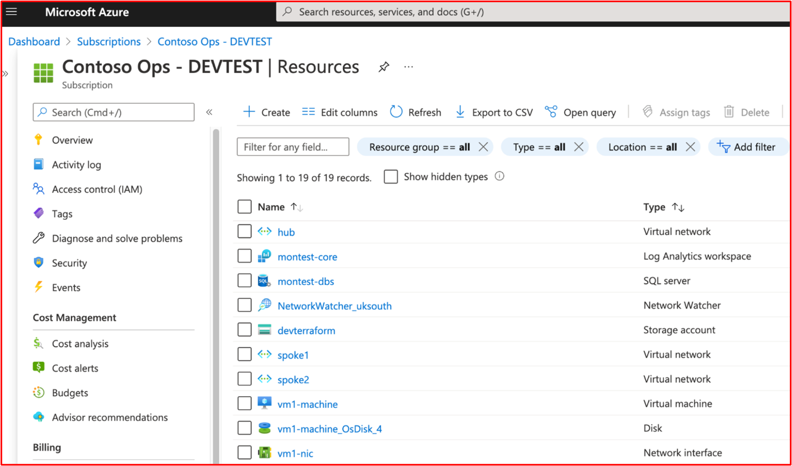
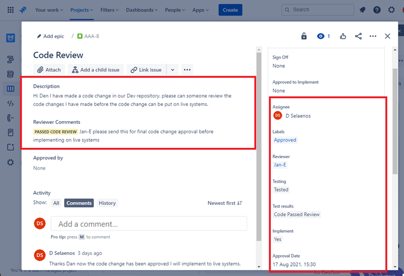
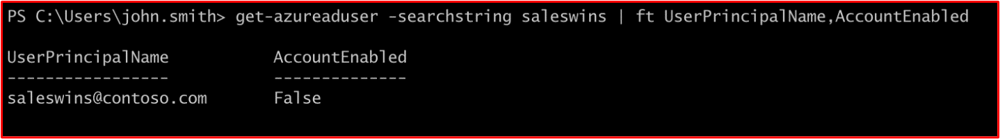
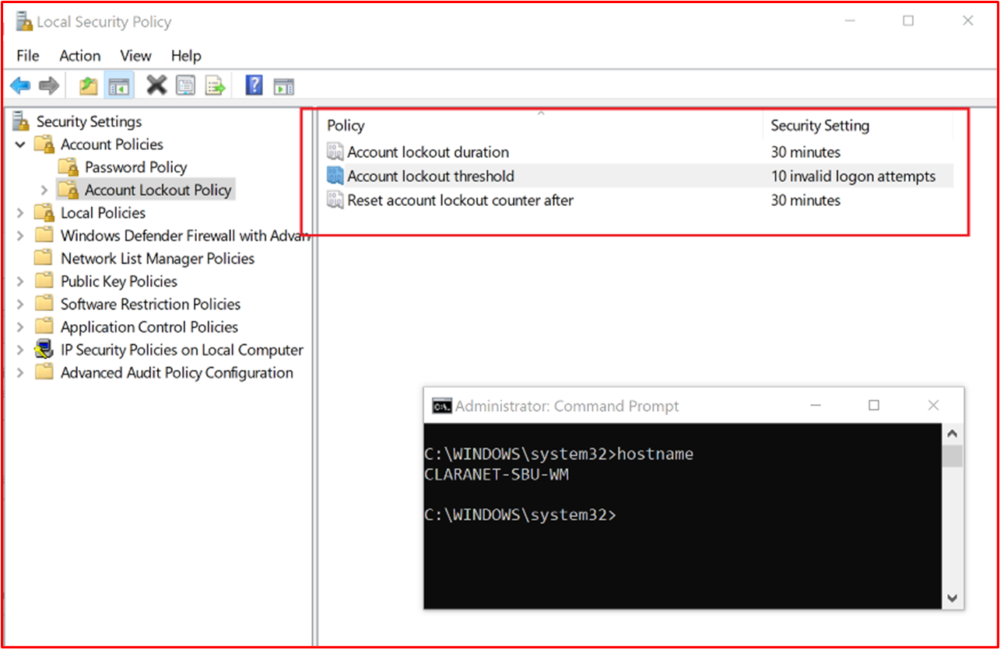

# Microsoft 365 certificação – Guia de evidência de exemplo

## Visão Geral

Este guia foi criado para fornecer aos ISVs exemplos do tipo de evidência e do nível detalhado necessário para cada um dos controles Microsoft 365 certificação. Todos os exemplos compartilhados neste documento não representam a única evidência que pode ser usada para demonstrar que os controles estão sendo atendidos, mas atuam apenas como uma diretriz para o tipo de evidência necessária. 

Observação: as interfaces reais, as capturas de tela e a documentação usadas para atender aos requisitos variam dependendo do uso do produto, da configuração do sistema e dos processos internos. Além disso, observe que onde a documentação de política ou procedimento é necessária, o ISV será necessário para enviar os documentos REAIS e não capturas de tela, como talvez mostrado em alguns dos exemplos. 

Há duas seções na certificação que exigem envios:
1. [**O Envio Inicial do Documento:**](../docs/initialdocumentsubguide.md) um pequeno conjunto de documentos de alto nível necessários para definir o escopo da avaliação.
1. **O Envio de Evidência:** o conjunto completo de evidências necessário para cada controle no escopo para sua avaliação de certificação. 

## Structure 

Este documento é mapeado diretamente para controles que serão apresentados durante a certificação no Partner Center. As diretrizes fornecidas neste documento são detalhadas da seguinte maneira:
- Domínio de segurança: os três domínios de segurança em que todos os controles estão agrupados: Segurança do Aplicativo, Segurança Operacional e Segurança de Dados e Privacidade.
- Controle(s): = Descrição da Atividade de Avaliação - Esses controles e número associado (não)são obtidos diretamente da lista de verificação de Microsoft 365 certificação.  
- Intenção: = a intenção do motivo pelo qual o controle de segurança está incluído no programa e o risco específico que ele tem como objetivo atenuar.  A esperança é que essas informações forneçam aos ISVs o raciocínio por trás do controle para entender melhor os tipos de evidência que precisam ser coletados e quais ISV devem prestar atenção e ter consciência e compreensão na produção de suas evidências.
- Diretrizes de evidência de exemplo: = Dado para ajudar a orientar as Tarefas de Coleta de Evidências na planilha da Lista de Verificação de Certificação do Microsoft 365, isso permite que os ISV vejam claramente exemplos do tipo de evidência que pode ser usado pelo Analista de Certificação que o usará para fazer uma determinação confiante de que um controle está em vigor e mantido– não é de forma exaustiva por natureza.
- Exemplo de evidência: = Esta seção fornece exemplos de capturas de tela e imagens de evidências potenciais capturadas em cada um dos controles dentro da planilha da Lista de Verificação de Certificação do Microsoft 365, especificamente para os domínios de segurança operacional e segurança de dados e segurança de privacidade (guias dentro da planilha). Observe que qualquer informação com setas e caixas vermelhas nos exemplos é para ajudar você a entender melhor os requisitos necessários para atender a qualquer controle.

## Domínio de Segurança: Segurança do Aplicativo

**Controle 1 – Controle 16**:

Os controles de domínio do Application Security podem ser verificados com um relatório de teste de penetração emitido nos últimos 12 meses, mostrando que seu aplicativo não tem vulnerabilidades pendentes. O único envio necessário é um relatório limpo de uma empresa independente respeitável. 

## Domínio de Segurança: Segurança Operacional/Desenvolvimento Seguro

O domínio de segurança "Segurança operacional/desenvolvimento seguro" foi projetado para garantir que os ISVs implementem um conjunto forte de técnicas de mitigação de segurança contra uma infinidade de ameaças enfrentadas por atores de ameaças.  Isso foi projetado para proteger o ambiente operacional e os processos de desenvolvimento de software para criar ambientes seguros.

#### Proteção contra malware – Antivírus

[Controle nº 1](#control-1): forneça a documentação da política que rege práticas e procedimentos antivírus.

- Intenção: a intenção desse controle é avaliar o entendimento de um ISV sobre os problemas que eles enfrentam ao considerar a ameaça de vírus de computador. Ao estabelecer e usar as práticas recomendadas do setor no desenvolvimento de uma política e processos antivírus, um ISV fornece um recurso adaptado à capacidade de sua organização de atenuar os riscos enfrentados por malware, listando as práticas recomendadas na detecção e eliminação de vírus e fornece evidências de que a política documentada fornece diretrizes de segurança sugeridas para a organização e seus funcionários. Ao documentar uma política e um procedimento de como o ISV implanta dependências antimalware, isso garante a distribuição e a manutenção consistentes dessa tecnologia na redução do risco de malware para o ambiente.

- Diretrizes de evidência de exemplo: forneça uma cópia de sua política antivírus/Antimalware detalhando os processos e procedimentos implementados em sua infraestrutura para promover as práticas recomendadas de Antivírus/Malware.
Evidência de exemplo

- Evidência de exemplo:

**Nota:** Esta captura de tela mostra um documento de política/processo, a expectativa é que os ISVs compartilhem a documentação real de política/procedimento de suporte e não simplesmente forneçam uma captura de tela.

[Controle nº 2](#control-2): forneça evidências de demonstração de que o software antivírus está em execução em todos os componentes do sistema amostrados.

- Intenção: é importante ter proteções anti-vírus (AV) (ou antimalware) em execução em seu ambiente para proteger contra riscos de segurança cibernética que você pode ou não estar ciente, pois os ataques potencialmente prejudiciais estão aumentando, tanto na sofisticação quanto nos números. Ter a AV implantada em todos os componentes do sistema que dão suporte ao seu uso ajudará a atenuar alguns dos riscos de antimalware que estão sendo introduzidos no ambiente. É necessário apenas um único ponto de extremidade para ser desprotegido para potencialmente fornecer um vetor de ataque para que um ator de ameaça obtenha uma posição no ambiente. Portanto, a AV deve ser usada como uma das várias camadas de defesa para proteger contra esse tipo de ameaça.

- Diretrizes de evidência de exemplo: para provar que uma instância ativa da AV está em execução no ambiente avaliado. Forneça uma captura de tela  para cada dispositivo no exemplo que dá suporte ao uso de antivírus que mostra o processo antivírus em execução, o software antivírus está ativo ou, se você tiver um console de gerenciamento centralizado para antivírus, poderá demonstrar isso desse console de gerenciamento. Se estiver usando o console de gerenciamento, certifique-se de evidência em uma captura de tela de que os dispositivos amostrados estão conectados e funcionando.

- Exemplo de evidência 1: a captura de tela abaixo foi obtida do Central de Segurança do Azure; ele mostra que uma extensão antimalware foi implantada na VM &quot;chamada MSPGPRODAZUR01&quot;.

- Exemplo de evidência 2

A captura de tela abaixo foi obtida de um Windows 10, &quot;mostrando que a proteção em tempo real&quot; está ativada para o nome do host &quot;CLARANET-SBU-WM&quot;.

[Controle nº 3](#control-3): forneça evidências demonstradas de que as assinaturas antivírus estão atualizadas em todos os ambientes (dentro de 1 dia).

- Intenção: centenas de milhares de novos malwares e PUA (aplicativos potencialmente indesejados) são identificados todos os dias. Para fornecer proteção adequada contra malware recém-lançado, as assinaturas av precisam ser atualizadas regularmente para contabilização de malware recém-lançado.

- Esse controle existe para garantir que o ISV tenha levado em consideração a segurança do ambiente e o efeito que a AV desatualizada pode ter sobre a segurança.

- Diretrizes de evidência de exemplo: forneça arquivos de log antivírus de cada dispositivo amostrado, mostrando que as atualizações são aplicadas diariamente.

- Exemplo de evidência: a captura de tela a seguir mostra o Microsoft Defender atualizando pelo menos diariamente mostrando &#39;Evento 2000, Windows Defender&#39; qual é a atualização. O nome do host é mostrado, mostrando que isso foi obtido do sistema no escopo &quot;CLARANET-SBU-WM&quot;.

**Nota:** A evidência fornecida precisaria incluir uma exportação dos logs para mostrar atualizações diárias em um período maior. Alguns produtos antivírus gerarão arquivos de log de atualização para que esses arquivos sejam fornecidos ou exportem os logs de Visualizador de Eventos.

[Controle nº 4](#control-4): forneça evidências demonstradas de que o antivírus está configurado para executar a verificação ao acessar ou a verificação periódica em todos os componentes do sistema amostrados.

**Nota:** Se a verificação ao acessar não estiver habilitada, um mínimo de verificação diária e alerting_ **deve** _be habilitado.

- Intenção: a intenção desse controle é garantir que o malware seja rapidamente identificado para minimizar o efeito que isso pode ter no ambiente. Onde a verificação ao acessar é realizada e combinada com o bloqueio automático de malware, isso ajudará a parar as infecções de malware conhecidas pelo software antivírus. Quando a verificação ao acessar&#39;é desejável devido aos riscos de falsos positivos que causam interrupções de serviço, é necessário implementar mecanismos adequados de verificação e alerta diariamente (ou mais) para garantir uma resposta em tempo hábil a infecções de malware para minimizar os danos.

- Diretrizes de evidência de exemplo: forneça uma captura  de tela para cada dispositivo no exemplo que dá suporte a antivírus, mostrando que o antivírus está em execução no dispositivo e está configurado para verificação ao acessar (verificação em tempo real), **OU** forneça uma captura de tela mostrando que a verificação periódica está habilitada para verificação diária, alertas configurados e a data da última verificação para cada  dispositivo no exemplo.

- Exemplo de evidência: a captura de tela a seguir mostra que a proteção em tempo real está habilitada para o host CLARANET-SBU-WM&quot;&quot;.

[Controle nº 5](#control-5): forneça evidências demonstradas de que o antivírus está configurado para bloquear automaticamente malware ou quarentena e alertar em todos os componentes do sistema amostrados.

- Intenção: a sofisticação do malware está evoluindo o tempo todo junto com os diferentes graus de devastação que eles podem trazer. A intenção desse controle é impedir a execução de malware e, portanto, impedi-lo de executar sua carga potencialmente devastadora ou se o bloqueio automático não for uma opção, limitando a quantidade de tempo que o malware pode causar estragos alertando e respondendo imediatamente à possível infecção por malware.

- Diretrizes de evidência de exemplo: forneça uma captura  de tela para cada dispositivo no exemplo que dá suporte a antivírus, mostrando que o antivírus está em execução no computador e está configurado para bloquear automaticamente malware, alerta ou quarentena e alerta.

- Exemplo de evidência 1: a captura de tela a seguir mostra que o host &quot;CLARANET-SBU-WM&quot; está configurado com proteção em tempo real para Microsoft Defender Antivírus. Como diz a configuração, isso localiza e impede que o malware seja instalado ou executado no dispositivo.

[Controle nº 6](#control-6): forneça evidências demonstraíveis de que os aplicativos são aprovados antes de serem implantados.

- Intenção: com o controle de aplicativo, a organização aprovará cada aplicativo/processo que tem permissão para ser executado no sistema operacional. A intenção desse controle é garantir que um processo de aprovação esteja em vigor para autorizar quais aplicativos/processos podem ser executados.

- Diretrizes de evidência de exemplo: evidências podem ser fornecidas mostrando que o processo de aprovação está sendo seguido. Isso pode ser fornecido por meio de documentos assinados, acompanhamento em sistemas de controle de alterações ou usando algo como Azure DevOps ou JIRA para acompanhar essas solicitações e autorização.

- Exemplo de evidência: a captura de tela a seguir demonstra uma aprovação pelo gerenciamento que cada aplicativo permitido para executar dentro do ambiente segue um processo de aprovação. Esse é um processo baseado em papel na Contoso, no entanto, outros mecanismos podem ser usados.

[Controle nº 7](#control-7): forneça evidências demonstraíveis de que existe e mantém uma lista completa de aplicativos aprovados com justificativa comercial.

- Intenção: é importante que as organizações mantenham uma lista de todos os aplicativos que foram aprovados, juntamente com informações sobre por que o aplicativo/processo foi aprovado. Isso ajudará a garantir que a configuração permaneça atual e possa ser revisada em relação a uma linha de base para garantir que aplicativos/processos não autorizados não estejam configurados.

- Diretrizes de evidência de exemplo: forneça a lista documentada de aplicativos/processos aprovados junto com a justificativa comercial.

- Exemplo de evidência: a captura de tela a seguir lista os aplicativos aprovados com justificativa comercial.

**Nota:** Esta captura de tela mostra um documento, a expectativa é que os ISVs compartilhem o documento de suporte real e não simplesmente forneçam uma captura de tela.

[Controle nº 8](#control-8): forneça a documentação de suporte que detalha que o software de controle de aplicativo está configurado para atender a mecanismos específicos de controle de aplicativo.

- Intenção: a configuração da tecnologia de controle de aplicativo deve ser documentada junto com um processo de como manter a tecnologia, ou seja, adicionar e excluir aplicativos/processos. Como parte desta documentação, o tipo de mecanismo usado deve ser detalhado para cada aplicativo/processo. Isso alimentará o próximo controle para garantir que a tecnologia esteja configurada como documentada.

- Diretrizes de evidência de exemplo: forneça a documentação de suporte que detalha como o controle de aplicativo foi configurado e como cada aplicativo/processo foi configurado dentro da tecnologia.

- Exemplo de evidência: a captura de tela a seguir lista o mecanismo de controle usado para implementar o controle de aplicativo. Você pode ver abaixo que um aplicativo está usando controles de certificado e os outros usando o caminho do arquivo.

**Nota:** Esta captura de tela mostra um documento, a expectativa é que os ISVs compartilhem o documento de suporte real e não simplesmente forneçam uma captura de tela.

[Controle nº 9](#control-9): forneça evidências demonstraíveis de que o controle de aplicativo está configurado como documentado de todos os componentes do sistema amostrados.

- Intenção: a intenção disso é validar se o controle de aplicativo está configurado no exemplo de acordo com a documentação.

- Diretrizes de evidência de exemplo: forneça uma captura  de tela para cada dispositivo no exemplo para mostrar que ele tem controles de aplicativo configurados e ativados. Isso deve mostrar os nomes dos computadores, os grupos aos quais eles pertencem e as políticas de controle de aplicativo aplicadas a esses grupos e computadores.

- Exemplo de evidência: a captura de tela a seguir mostra um Política de Grupo com políticas de restrição de software habilitadas.

Esta próxima captura de tela mostra a configuração em linha com o controle acima.

Esta próxima captura de tela mostra o Ambiente do M365 e os Computadores incluídos dentro do escopo que está sendo aplicado a este objeto GPO &#39;Domain Computer Configurações&#39;.

Esta captura de tela final mostra o servidor no escopo &quot;DBServer1&quot; dentro da UO na captura de tela acima.

### Gerenciamento de Patch – Classificação de Risco

A identificação rápida e a correção de vulnerabilidades de segurança ajudam a minimizar os riscos de um ator de ameaça comprometer o ambiente ou o aplicativo. O gerenciamento de patch é dividido em duas seções: classificação de risco e aplicação de patch. Esses três controles abrangem a identificação de vulnerabilidades de segurança e as classifica de acordo com o risco que representam.

Esse grupo de controle de segurança está no escopo para ambientes de hospedagem de PaaS (Plataforma como Serviço), pois as bibliotecas de software de terceiros e a base de código do aplicativo/suplemento devem ser corrigidas com base na classificação de risco.

[Controle nº 10](#control-10): forneça a documentação da política que rege como novas vulnerabilidades de segurança são identificadas e atribuídas a uma pontuação de risco.

- Intenção: a intenção desse controle é ter documentação de suporte para garantir que as vulnerabilidades de segurança sejam identificadas rapidamente para reduzir a janela de oportunidade que os atores de ameaças têm para explorar essas vulnerabilidades. Um mecanismo robusto precisa estar em vigor para identificar vulnerabilidades que abrangem todos os componentes do sistema em uso pelas organizações; por exemplo, sistemas operacionais (Windows Server, Ubuntu etc.), aplicativos (Tomcat, MS Exchange, SolarWinds etc.), dependências de código (AngularJS, jQuery etc.). As organizações precisam não apenas garantir a identificação em tempo hábil de vulnerabilidades dentro do acervo, mas também classificar as vulnerabilidades adequadamente para garantir que a correção seja executada dentro de um período de tempo adequado com base no risco que a vulnerabilidade apresenta.

**Nota** Mesmo que você esteja executando em um ambiente puramente plataforma como serviço, você ainda tem a responsabilidade de identificar vulnerabilidades em sua base de código: ou seja, bibliotecas de terceiros.

- Diretrizes de evidência de exemplo: forneça a documentação de suporte (não capturas de tela)

- Exemplo de evidência: esta captura de tela mostra um trecho de uma política de classificação de risco.

**Nota:** Esta captura de tela mostra um documento de política/processo, a expectativa é que os ISVs compartilhem a documentação real de política/procedimento de suporte e não simplesmente forneçam um screenshot._

[Controle nº 11](#control-11): forneça evidências de como novas vulnerabilidades de segurança são identificadas.

- Intenção: a intenção desse controle é garantir que o processo esteja sendo seguido e&#39;robusto o suficiente para identificar novas vulnerabilidades de segurança em todo o ambiente. Isso pode não ser apenas os Sistemas Operacionais; ele pode incluir aplicativos em execução dentro do ambiente e quaisquer dependências de código.

- Diretrizes de evidência de exemplo: a evidência pode ser fornecida por meio da exibição de assinaturas para listas de endereçamento, revisão manual de fontes de segurança para vulnerabilidades recém-lançadas (seria necessário ser rastreada adequadamente com carimbos de data/hora das atividades, ou seja, com JIRA ou Azure DevOps), ferramentas que localizam softwares desatualizados (por exemplo, podem ser Snyk ao procurar bibliotecas de software desatualizadas ou podem ser Nessus usando Nessus  verificações autenticadas que identificam softwares desatualizados.).

**Nota** Se estiver usando o Nessus, isso precisará ser executado regularmente para identificar vulnerabilidades rapidamente. Recomendamos pelo menos semanalmente.

- Exemplo de evidência: esta captura de tela demonstra que um grupo de endereçamento está sendo usado para ser notificado sobre vulnerabilidades de segurança.

[Controle nº 12](#control-12): forneça evidências demonstrando que todas as vulnerabilidades recebem uma classificação de risco depois de identificada.

- Intenção: a aplicação de patch precisa ser baseada em risco, mais arriscada a vulnerabilidade, mais rápido ela precisa ser corrigida. A classificação de risco de vulnerabilidades identificadas é uma parte integrante desse processo. A intenção desse controle é garantir que haja um processo documentado de classificação de risco que está sendo seguido para garantir que todas as vulnerabilidades identificadas sejam classificadas adequadamente com base no risco. As organizações geralmente utilizam a classificação CVSS (Common Vulnerability Scoring System) fornecida por fornecedores ou pesquisadores de segurança. É recomendável que, se a organização depender do CVSS, um mecanismo de reavaliação seja incluído dentro do processo para permitir que a organização altere a classificação com base em uma avaliação de risco interna. Às vezes, a vulnerabilidade pode não ser um aplicativo devido à maneira como o aplicativo foi implantado dentro do ambiente. Por exemplo, uma vulnerabilidade java pode ser lançada, o que afeta uma biblioteca específica que não é usada pela organização.

- Diretrizes de evidência de exemplo: forneça evidências por meio de captura de tela ou outros meios, por exemplo, DevOps/Jira, que demonstra que as vulnerabilidades estão passando pelo processo de classificação de risco e recebem uma classificação de risco apropriada pela organização.

- Exemplo de evidência: esta captura de tela mostra a classificação de risco que ocorre na coluna D e a nova classificação nas colunas F e G, caso a organização execute uma avaliação de risco e determine que o risco pode ser rebaixado. A evidência de avaliações de risco de re-classificação precisaria ser fornecida como evidência de suporte

### Gerenciamento de patch – aplicação de patch

Os controles abaixo são para o elemento de aplicação de patch para o Gerenciamento de Patch. Para manter um ambiente operacional seguro, os aplicativos/complementos e os sistemas de suporte devem ser corrigidos adequadamente. Um período de tempo adequado entre identificação (ou versão pública) e a aplicação de patch precisa ser gerenciado para reduzir a janela de oportunidade para que uma vulnerabilidade seja explorada por um ator de ameaça. A Microsoft 365 certificação não estipula uma janela de &#39;de aplicação&#39;, no entanto, os Analistas de Certificação rejeitarão períodos de tempo que não são razoáveis.

Esse grupo de controle de segurança está no escopo para ambientes de hospedagem de PaaS (Plataforma como Serviço), pois as bibliotecas de software de terceiros e a base de código do aplicativo/suplemento devem ser corrigidas com base na classificação de risco.

[Controle nº 13](#control-13): forneça documentação de política para a aplicação de patch de componentes do sistema no escopo que incluam um período de tempo de aplicação de patch mínimo adequado para vulnerabilidades críticas, de alto e médio risco; e desativação de sistemas operacionais e softwares sem suporte.

- Intenção: o gerenciamento de patch é exigido por muitas estruturas de conformidade de segurança, ou seja, PCI-DSS, ISO 27001, NIST (SP) 800-53. A importância do bom gerenciamento de patch não pode ser excessivamente enfatizada, pois pode corrigir problemas de segurança e funcionalidade em software, firmware e atenuar vulnerabilidades, o que ajuda na redução de oportunidades de exploração. A intenção desse controle é minimizar a janela de oportunidade que um ator de ameaça tem para explorar vulnerabilidades que podem existir dentro do ambiente no escopo.

- Diretrizes de evidência de exemplo: forneça uma cópia de todas as políticas e procedimentos que detalham o processo de gerenciamento de patch. Isso deve incluir uma seção em uma janela de aplicação de patch mínima e que sistemas operacionais e softwares sem suporte não devem ser usados no ambiente.

- Exemplo de evidência: abaixo está um documento de política de exemplo.

**Nota:** Esta captura de tela mostra um documento de política/processo, a expectativa é que os ISVs compartilhem a documentação real de política/procedimento de suporte e não simplesmente forneçam um screenshot._

[Controle nº 14](#control-14): forneça evidências demonstraíveis de que todos os componentes do sistema amostrados estão sendo corrigidos.

**Nota:** Inclua qualquer biblioteca de software/de terceiros.

- Intenção: corrigir vulnerabilidades garante que os módulos diferentes que fazem parte da infraestrutura de tecnologia da informação (hardware, software e serviços) sejam mantidos atualizados e livres de vulnerabilidades conhecidas. A aplicação de patch precisa ser executada o mais rápido possível para minimizar o potencial de um incidente de segurança entre a liberação de detalhes de vulnerabilidade e a aplicação de patch. Isso é ainda mais crítico quando a exploração de vulnerabilidades conhecidas por estar em execução.

- Diretrizes de evidência de exemplo: forneça uma captura  de tela para cada dispositivo no exemplo e os componentes de software de suporte mostrando que os patches são instalados de acordo com o processo de aplicação de patch documentado.

- Exemplo de evidência: &quot;a captura de tela a seguir mostra que o componente CLARANET-SBU-WM&quot; do sistema de escopo está executando Windows atualizações em linha com a política de aplicação de patch.

**Nota:** A aplicação de patch de todos os componentes do sistema no escopo precisa ser evidência. Isso inclui coisas como: Atualizações do sistema operacional, atualizações de aplicativo/componente (i.e__.,_ _Apache Tomcat, OpenSSL etc.), dependências de software (por exemplo, JQuery, AngularJS etc.), etc._

[Controle nº 15](#control-15): forneça evidências demonstradas de que quaisquer sistemas operacionais e componentes de software sem suporte não são usados no ambiente.

- Intenção: o software que não está sendo mantido pelos fornecedores sofrerá, horas extras, de vulnerabilidades conhecidas que não foram corrigidas. Portanto, o uso de sistemas operacionais e componentes de software sem suporte não deve ser usado em ambientes de produção.

- Diretrizes de evidência de exemplo: forneça uma captura  de tela para cada dispositivo no exemplo mostrando a versão do sistema operacional em execução (incluindo o nome&#39;servidor na captura de tela). Além disso, forneça evidências de que os componentes de software em execução no ambiente estão executando versões com suporte. Isso pode ser feito fornecendo a saída de relatórios de verificação de vulnerabilidade interna (fornecendo verificação autenticada incluída) e/ou a saída de ferramentas que verificam bibliotecas de terceiros, como [Snyk](https://snyk.io/), [Trivy](https://github.com/aquasecurity/trivy) ou [NpM Audit](https://docs.npmjs.com/cli/v7/commands/npm-audit). Se estiver em execução somente em PaaS, somente a aplicação de patch de biblioteca de terceiros precisará ser coberta pelos grupos de controle de aplicação de patch.

- Evidência de exemplo: a evidência a seguir mostra que o componente do sistema no escopo THOR está executando um software com suporte do fornecedor, pois o Nessus&#39;sinalizou nenhum problema.

**Nota:** O relatório completo deve ser compartilhado com os Analistas de Certificação.

- Exemplo de evidência 2

Esta captura de tela mostra que &quot;o componente do sistema no escopo CLARANET-SBU-WM&quot; está em execução em uma versão Windows compatível.

- Exemplo de evidência 3

A captura de tela a seguir é da saída [trivy](https://github.com/aquasecurity/trivy) , que o relatório&#39;lista nenhum aplicativo sem suporte.

**Nota:** O relatório completo deve ser compartilhado com os Analistas de Certificação.

### Verificação de vulnerabilidade

Ao introduzir avaliações de vulnerabilidade regulares, as organizações podem detectar fraquezas e insições em seus ambientes, o que pode fornecer um ponto de entrada para um ator mal-intencionado comprometer o ambiente. A verificação de vulnerabilidades pode ajudar a identificar patches ausentes ou configurações incorretas no ambiente. Ao realizar regularmente essas verificações, uma organização pode fornecer a correção apropriada para minimizar o risco de um comprometimento devido a problemas que normalmente são detectados por essas ferramentas de verificação de vulnerabilidade.

[Controle nº 16](#control-16): forneça os relatórios trimestrais de verificação de vulnerabilidade de aplicativo Web e infraestrutura. A verificação precisa ser realizada em relação a todo o volume público (endereços IP e URLs) e intervalos de IP internos.

**Nota:** Isso **DEVE** incluir o escopo completo do ambiente.

- Intenção: a verificação de vulnerabilidade procura possíveis pontos fracos em um sistema de computador, redes e aplicativos Web de organizações para identificar buracos que podem levar a violações de segurança e à exposição de dados confidenciais. A verificação de vulnerabilidade geralmente é exigida por padrões do setor e regulamentos governamentais, por exemplo, o PCI DSS (Payment Card Industry Data Security Standard).

- &quot; Um relatório da Métrica de Segurança intitulado [Guia de Métricas de Segurança 2020 para Conformidade com PCI DSS](https://info.securitymetrics.com/pci-guide-2020)&quot; afirma que o &#39;, em média, levou 166 dias a partir do momento em que uma organização foi vista com vulnerabilidades para um invasor comprometer o sistema. Depois de comprometidos, os invasores tiveram acesso a dados confidenciais por uma média de 127 dias&#39; portanto, esse controle tem como objetivo identificar possíveis vulnerabilidades de segurança dentro do ambiente no escopo.

- Diretrizes de evidência de exemplo: forneça os relatórios de verificação completos para cada trimestre&#39;verificações de vulnerabilidade que foram realizadas nos últimos 12 meses. Os relatórios devem indicar claramente os destinos para validar se o volume público completo está incluído e, quando aplicável, cada sub-rede interna. Forneça **todos os** relatórios de verificação para **CADA** trimestre.

- Exemplo de evidência: evidência de exemplo seria fornecer os relatórios de verificação da ferramenta de verificação que está sendo usada. Cada trimestre&#39;relatórios de verificação devem ser fornecidos para revisão. A verificação precisa incluir todos os componentes do sistema de ambientes; cada sub-rede interna e cada endereço IP público/URL que está disponível para o ambiente.

[Controle nº 17](#control-17): forneça evidências demonstraíveis de que a correção de vulnerabilidades identificadas durante a verificação de vulnerabilidades é corrigida de acordo com o período de tempo de aplicação de patch documentado.

- Intenção: a falha na identificação, no gerenciamento e na correção de vulnerabilidades e configurações incorretas rapidamente pode aumentar o risco&#39;organização de um comprometimento que leva a possíveis violações de dados. A identificação e a correção corretas de problemas são vistas como importantes para uma organização&#39;a postura geral de segurança e o ambiente que está em conformidade com as práticas recomendadas de várias estruturas de segurança para; exemplo, ISO 27001 e PCI DSS.

- Diretrizes de evidência de exemplo: forneça artefatos adequados (ou seja, capturas de tela) mostrando que uma amostra de vulnerabilidades descobertas da verificação de vulnerabilidades é corrigida de acordo com as janelas de aplicação de patch já fornecidas no Controle 13 acima.

- Exemplo de evidência: a captura de tela a seguir mostra uma verificação do Nessus do ambiente no escopo (um único computador neste exemplo chamado THOR&quot;) mostrando vulnerabilidades em 2 de agosto &quot;de 2021.

A captura de tela a seguir mostra que os problemas foram resolvidos, 2 dias depois, que está dentro da janela de aplicação de patch definida na política de aplicação de patch.

**Nota:** Para esse controle, os Analistas de Certificação precisam ver relatórios de verificação de vulnerabilidade e correção para cada trimestre nos últimos doze meses.

### Firewalls

Os firewalls geralmente fornecem um limite de segurança entre ambientes confiáveis (rede interna), não confiáveis (Internet) e semi-confiáveis (DMZ). Geralmente, eles serão a primeira linha de defesa dentro de uma estratégia de segurança de defesa detalhada das organizações, projetada para controlar os fluxos de tráfego para serviços de entrada e saída e bloquear o tráfego indesejado. Esses dispositivos devem ser rigidamente controlados para garantir que operem com eficiência e estejam livres de configurações incorretas que poderiam colocar o ambiente em risco.

[Controle nº 18](#control-18): forneça a documentação da política que rege as práticas e os procedimentos de gerenciamento de firewall.

- Intenção: os firewalls são uma importante primeira linha de defesa em uma estratégia de segurança em camadas (defesa em profundidade), protegendo ambientes contra zonas de rede menos confiáveis. Os firewalls normalmente controlarão os fluxos de tráfego com base em endereços IP e protocolos/portas, mais firewalls avançados de recursos também podem fornecer defesas adicionais da camada de aplicativo inspecionando o tráfego do aplicativo para proteger contra uso indevido, vulnerabilidades e ameaças com base nos aplicativos &quot;&quot; que estão sendo acessados. Essas proteções são tão boas quanto a configuração do firewall, portanto, políticas de firewall fortes e procedimentos de suporte precisam estar em vigor para garantir que estejam configurados para fornecer proteção adequada de ativos internos. Por exemplo, um firewall com uma regra para permitir TODO o tráfego de QUALQUER origem para o destino ANY está apenas agindo como um roteador.

- Diretrizes de evidência de exemplo: forneça sua documentação completa de suporte à política/procedimento de firewall. Este documento deve abranger todos os pontos abaixo e quaisquer práticas recomendadas adicionais aplicáveis ao seu ambiente.

- Exemplo de evidência: abaixo está um exemplo do tipo de documento de política de firewall que exigimos (esta é uma demonstração e pode não estar completa).

[Controle nº 19](#control-19): forneça evidências demonstraveis de que todas as credenciais administrativas padrão são alteradas antes da instalação em ambientes de produção.

- Intenção: as organizações precisam estar atualizações das credenciais administrativas padrão fornecidas pelo fornecedor que são configuradas durante a configuração do dispositivo ou software. As credenciais padrão geralmente estão disponíveis publicamente pelos fornecedores e podem fornecer a um ator de ameaça externa a oportunidade de comprometer um ambiente. Por exemplo, uma pesquisa simples na Internet para as credenciais padrão do iDrac (Controlador de Acesso Remoto Dell Integrado) realçará _root::calvin_ como o nome de usuário e a senha padrão. Isso dará a alguém acesso remoto ao gerenciamento de servidor remoto. A intenção desse controle é garantir que os ambientes não sejam suscetíveis a ataques por meio de credenciais de fornecedor padrão que não foram alteradas durante a proteção do dispositivo/aplicativo.

- Diretrizes de evidência de exemplo

- Isso pode ser evidenciado em uma sessão de compartilhamento de tela em que o Analista de Certificação pode tentar se autenticar nos dispositivos no escopo usando credenciais padrão.

- Evidência de exemplo

A captura de tela abaixo mostra o que o Analista de Certificação verá de um nome de usuário/senha inválido de um Firewall watchGuard.

Controle [20](#control-20): forneça evidências de que os firewalls estão instalados no limite do ambiente no escopo e instalados entre a rede de perímetro (também conhecida como DMZ, zona desmilitarizada e sub-rede filtrada) e redes confiáveis internas.

- Intenção: os firewalls fornecem a capacidade de controlar o tráfego entre diferentes zonas de rede de diferentes níveis de segurança. Como todos os ambientes estão conectados à Internet, os firewalls precisam ser instalados no limite, ou seja, entre a Internet e o ambiente no escopo. Além disso, os firewalls precisam ser instalados entre as redes de DMZ (Zona Desmilitarizada) menos confiáveis e redes confiáveis internas. As DMZs normalmente são usadas para atender o tráfego da Internet e, portanto, é um destino de ataque. Ao implementar uma DMZ e usar um firewall para controlar os fluxos de tráfego, um comprometimento da DMZ&#39;necessariamente significa um comprometimento das redes confiáveis internas e dos dados corporativos/do cliente. O registro em log e os alertas adequados devem estar em vigor para ajudar as organizações a identificar rapidamente um comprometimento para minimizar a oportunidade do ator de ameaças comprometer ainda mais as redes confiáveis internas. A intenção desse controle é garantir que haja um controle adequado entre redes confiáveis e menos confiáveis.

- Diretrizes de evidência de exemplo: a evidência deve ser fornecida por meio de arquivos de configuração de firewall ou capturas de tela que demonstram que uma DMZ está em vigor. Isso deve corresponder aos diagramas de arquitetura fornecidos que demonstram as diferentes redes que dão suporte ao ambiente. Uma captura de tela das interfaces de rede no firewall, juntamente com o diagrama de rede já fornecido como parte do Envio Inicial do Documento, deve fornecer essa evidência.

- Exemplo de evidência: abaixo está uma captura de tela de um firewall watchGuard demonstrando duas DMZs, uma é para os serviços de entrada (chamado DMZ), a outra está servindo o jumpbox (Bastian Host).

[Controle 21](#control-21): forneça evidências demonstraveis de que todo o acesso público termina na DMZ (zona desmilitarizada).

- Intenção: os recursos publicamente acessíveis estão abertos a uma infinidade de ataques. Como já discutido acima, a intenção de uma DMZ é segmentar redes menos confiáveis de redes internas confiáveis que podem conter dados confidenciais. Uma DMZ é considerada menos confiável, pois há um risco muito grande de hosts que são publicamente acessíveis de serem comprometidos por atores de ameaças externos. O acesso público sempre deve terminar nessas redes menos confiáveis que são segmentadas adequadamente pelo firewall para ajudar a proteger dados e recursos internos. A intenção desse controle é garantir que todo o acesso público seja encerrado dentro dessas DMZs menos confiáveis, como se os recursos nas redes internas confiáveis fossem voltados para o público, um comprometimento desses recursos fornece a um ator de ameaça uma base na rede em que os dados confidenciais estão sendo mantidos.

- Diretrizes de evidência de exemplo

- As evidências fornecidas para isso podem ser configurações de firewall que mostram as regras de entrada e onde essas regras estão sendo encerradas, seja roteando endereços IP públicos para os recursos ou fornecendo a NAT (Conversão de Endereços de Rede) do tráfego de entrada.

- Evidência de exemplo

Na captura de tela abaixo, há três regras de entrada, cada uma mostrando o NAT para as sub-redes 10.0.3.x e 10.0.4.x, que são as sub-redes DMZ

[Controle 22](#control-22): forneça evidências de demonstração de que todo o tráfego permitido pelo firewall passa por um processo de aprovação.

- Intenção: como os firewalls são uma barreira defensiva entre o tráfego não confiável e os recursos internos e entre redes de diferentes níveis de confiança, os firewalls precisam ser configurados com segurança e garantir que apenas o tráfego necessário para operações de negócios esteja habilitado. Ao permitir um fluxo de tráfego desnecessário ou um fluxo de tráfego que seja muito permissivo, isso pode introduzir pontos fracos dentro da defesa no limite dessas várias zonas de rede. Ao estabelecer um processo de aprovação robusto para todas as alterações de firewall, o risco de introduzir uma regra que introduz um risco significativo para o ambiente é reduzido. O Relatório de Investigação de Violação de Dados da Verizon&#39;[2020](https://enterprise.verizon.com/en-gb/resources/reports/dbir/) destaca que o Erro&#39;s&quot;, que inclui configurações incorretas&quot;, é o único tipo de ação que está aumentando consistentemente ano a ano.

- Diretrizes de evidência de exemplo: as evidências podem estar na forma de documentação que mostra uma solicitação de alteração de firewall sendo autorizada, que pode estar a minutos de uma reunião cab (alterar Supervisor board) ou por um sistema de controle de alterações que controla todas as alterações.

- Exemplo de evidência: a captura de tela a seguir mostra uma alteração de regra de firewall sendo solicitada e autorizada usando um processo baseado em papel. Isso pode ser feito por meio de algo como DevOps ou Jira, por exemplo.

[Controle 23](#control-23): forneça evidências de demonstração de que a base de regras de firewall está configurada para remover o tráfego não definido explicitamente.

- Intenção: a maioria dos firewalls processará as regras em uma abordagem de cima para baixo para tentar encontrar uma regra correspondente. Se uma regra corresponder, a ação dessa regra será aplicada e todo o processamento adicional das regras será interrompido. Se nenhuma regra correspondente for encontrada, por padrão, o tráfego será negado. A intenção desse controle é, se o firewall não usar&#39;padrão para descartar o tráfego se nenhuma regra correspondente for encontrada, a &quot;&quot; base de regras deverá incluir uma regra Negar Tudo no final de todas as listas **de firewall.** Isso é para garantir que o firewall&#39;padrão em um estado de permissão padrão ao processar as regras, permitindo assim que o tráfego que&#39;tenha sido definido explicitamente.

- Diretrizes de evidência de exemplo: as evidências podem ser fornecidas por meio da configuração do firewall ou por capturas de tela mostrando todas as regras de firewall mostrando uma regra Negar Tudo no final ou se o&#39;firewall descartar o tráfego que não corresponde a uma regra por padrão, forneça uma captura de tela de todas as regras de firewall &quot;&quot; e um link para guias administrativos do fornecedor, destacando que, por padrão, o firewall descartará todo o tráfego não correspondido.

- Exemplo de evidência: abaixo está uma captura de tela da base de regras de firewall do WatchGuard que demonstra que nenhuma regra está configurada para permitir todo o tráfego. Não há nenhuma regra de negação no final porque o WatchGuard removerá o tráfego que&#39;corresponder por padrão.

O seguinte link da Central de Ajuda do WatchGuard; [https://www.watchguard.com/help/docs/help-center/en-US/Content/en-US/Fireware/policies/policies\_about\_c.html](https://www.watchguard.com/help/docs/help-center/en-US/Content/en-US/Fireware/policies/policies_about_c.html) inclui as seguintes informações:

[Controle 24](#control-24): forneça evidências de demonstração de que o firewall dá suporte apenas a criptografia forte em todas as interfaces administrativas que não são do console.

- Intenção: para atenuar ataques man-in-the-middle do tráfego administrativo, todas as interfaces administrativas que não são do console devem dar suporte apenas a criptografia forte. A principal intenção desse controle é proteger as credenciais administrativas, pois a conexão não console é configurada. Além disso, isso também pode ajudar a proteger contra interceptação na conexão, tentando reproduzir funções administrativas para reconfigurar o dispositivo ou como parte do reconhecimento.

- Diretrizes de evidência de exemplo: forneça a configuração do firewall, se a configuração fornecer a configuração de criptografia das interfaces administrativas que não são do console (nem todos os dispositivos incluirão isso como opções configuráveis). Se isso não&#39;dentro da configuração, você poderá emitir comandos para o dispositivo para exibir o que está configurado para essas conexões. Alguns fornecedores podem publicar essas informações em artigos, portanto, isso também pode ser uma maneira de evidenciar essas informações. Por fim, talvez seja necessário executar ferramentas para gerar qual criptografia tem suporte.

- Exemplo de evidência: a captura de tela abaixo mostra a saída do [SSLScan](https://github.com/rbsec/sslscan) em relação à interface de administrador da Web do firewall watchGuard na porta TCP 8080. Isso mostra o TLS 1.2 ou superior com uma criptografia mínima de AES-128bit.

**Observação**: os firewalls watchGuard também dão suporte a funções administrativas usando SSH (porta TCP 4118) e WatchGuard System Manager (portas TCP 4105 &amp; 4117). A evidência dessas interfaces administrativas não console também precisaria ser fornecida.

[Controle 25](#control-25): forneça evidências demonstradas de que você está executando revisões de regra de firewall pelo menos a cada 6 meses.

- Intenção: ao longo do tempo, há um risco de que a configuração flua nos componentes do sistema com o ambiente no escopo. Isso geralmente pode introduzir inconfigurações ou configurações incorretas que podem aumentar o risco de comprometimento com o ambiente. O creep de configuração pode ser introduzido por vários motivos, como alterações temporárias para auxiliar na solução de problemas, alterações temporárias para alterações funcionais ad hoc, para introduzir correções rápidas para problemas que às vezes podem ser muito permissivos devido às pressões de introduzir uma correção rápida. Por exemplo, você pode introduzir uma regra de firewall temporária Permitir &quot;que Todos&quot; superem um problema urgente. A intenção desse controle é dupla, primeiro para identificar onde há configurações incorretas que podem introduzir inserções e, em segundo lugar, ajudar a identificar regras de firewall que não são mais necessárias e, portanto, podem ser removidas, ou seja, se um serviço tiver sido desativado, mas a regra de firewall tiver sido deixada para trás.

- Diretrizes de evidência de exemplo: as evidências precisam ser capazes de demonstrar que as reuniões de revisão estão ocorrendo. Isso pode ser feito compartilhando minutos de reunião da revisão do firewall e qualquer evidência de controle de alteração adicional que mostre todas as ações executadas na revisão. Verifique se as datas estão presentes&#39;precisamos ver um mínimo de duas dessas reuniões (ou seja, a cada seis meses)

- Exemplo de evidência: a captura de tela a seguir mostra a evidência de uma revisão de firewall que ocorre em janeiro de 2021.

A captura de tela a seguir mostra a evidência de uma revisão de firewall que ocorre em julho de 2021.

### Firewalls – WAFs

É opcional implantar um Firewall de Aplicativo Web (WAF) na solução. Se um WAF for usado, isso contará como créditos extras para a matriz de pontuação dentro da &#39;segurança operacional&#39; domínio de segurança. Os WAFs podem inspecionar o tráfego da Web para filtrar e monitorar o tráfego da Web entre a Internet e os aplicativos Web publicados para identificar ataques específicos do aplicativo Web. Os aplicativos Web podem sofrer muitos ataques específicos de aplicativos Web, como Injeção de SQL (SQLi), XSS (Cross Site Scripting), CSRF/XSRF (Solicitação Entre Sites/ XSRF), etc. e OS WAFs foram projetados para proteger contra esses tipos de cargas mal-intencionadas para ajudar a proteger aplicativos Web contra ataques e comprometimento potencial.

[Controle 26](#control-26): forneça evidências demonstradas de que o WAF (Firewall de Aplicativo Web) está configurado para monitorar, alertar e bloquear ativamente o tráfego mal-intencionado.

- Intenção: esse controle está em vigor para confirmar se o WAF está em vigor para todas as conexões da Web de entrada e que ele está configurado para bloquear ou alertar sobre o tráfego mal-intencionado. Para fornecer uma camada adicional de defesa para o tráfego da Web, os WAFs precisam ser configurados para todas as conexões da Web de entrada; caso contrário, os atores de ameaças externas podem ignorar os WAFs projetados para fornecer essa camada adicional de proteção. Se o WA&#39;F não estiver configurado para bloquear ativamente o tráfego mal-intencionado, o WAF precisará ser capaz de fornecer um alerta imediato para a equipe que pode reagir rapidamente ao tráfego mal-intencionado potencial para ajudar a manter a segurança do ambiente e parar os ataques.

- Diretrizes de evidência de exemplo: forneça a saída de configuração do WAF que realça as conexões da Web de entrada que estão sendo atendidas e que a configuração bloqueia ativamente o tráfego mal-intencionado ou está monitorando e alertando. Como alternativa, capturas de tela das configurações específicas podem ser compartilhadas para demonstrar que uma organização está a atender a esse controle.

- Exemplo de evidência: as capturas de tela a seguir mostram que Gateway de Aplicativo do Azure política waf de produção da Contoso está habilitada e que ela está configurada para o modo&#39; de Prevenção do &#39;, o que removerá ativamente o tráfego mal-intencionado.

A captura de tela abaixo mostra a configuração de IP de front-end

**Nota:** As evidências devem demonstrar todos os IPs públicos usados pelo ambiente para garantir que todos os pontos de entrada sejam abordados, e é por isso que essa captura de tela também está incluída.

A captura de tela abaixo mostra as conexões da Web de entrada usando esse WAF.

A captura de tela a seguir mostra o ContosoAppGWCoreRules\_\_ mostrando que isso é para o api.contoso.com serviço.

[Controle 27](#control-27): forneça evidências de demonstração de que o WAF dá suporte ao descarregamento de SSL.

- Intenção: a capacidade do WAF de ser configurado para dar suporte ao descarregamento de SSL é importante; caso contrário, o WAF não poderá inspecionar o tráfego HTTPS. Como esses ambientes precisam dar suporte ao tráfego HTTPS, essa é uma função crítica para o WAF para garantir que cargas mal-intencionadas no tráfego HTTPS possam ser identificadas e interrompidas.

- Diretrizes de evidência de exemplo: forneça evidências de configuração por meio de uma exportação de configuração ou capturas de tela que mostram que o Descarregamento de SSL tem suporte e está configurado.

- Exemplo de evidência: no Gateway de Aplicativo do Azure, a configuração de um descarregamento SSL habilitado para ouvinte SSL, consulte a Visão geral da terminação [TLS e TLS](/azure/application-gateway/ssl-overview) de ponta a ponta com Gateway de Aplicativo microsoft docs. A captura de tela a seguir mostra isso configurado para o Gateway de Aplicativo do Azure contoso Production.

[Controle 28](#control-28): "Forneça evidências demonstraíveis de que o WAF está protegido contra algumas ou todas as seguintes classes de vulnerabilidades de acordo com o conjunto de regras principal do OWASP (3.0 ou 3.1):
- problemas de protocolo e codificação,
- injeção de cabeçalho, solicitação de tráfico e divisão de resposta,
- ataques de passagem de arquivo e caminho,
- ataques de RFI (inclusão de arquivo remoto),
- ataques de execução remota de código,
- Ataques de injeção de PHP,
- ataques de script entre sites,
- Ataques de injeção de SQL,
- ataques de fixação de sessão.

- Intenção: os WAFs precisam ser configurados para identificar cargas de ataque para classes comuns de vulnerabilidades. Esse controle pretende garantir que a detecção adequada de classes de vulnerabilidade seja coberta aproveitando o conjunto de regras principal do OWASP.

- Diretrizes de evidência de exemplo: forneça evidências de configuração por meio de uma exportação de configuração ou capturas de tela demonstram que a maioria das classes de vulnerabilidade identificadas acima estão sendo cobertas pela verificação.

- Exemplo de evidência: a captura de tela abaixo mostra que Gateway de Aplicativo do Azure política waf de produção da Contoso está configurada para verificar o conjunto de regras principal do OWASP versão 3.2.

### Alterar Controle

Um processo de controle de alterações estabelecido e compreendido é essencial para garantir que todas as alterações passam por um processo estruturado que é repetível. Ao garantir que todas as alterações passam por um processo estruturado, as organizações podem garantir que as alterações sejam gerenciadas efetivamente, examinadas por pares e testadas adequadamente antes de serem assinadas. Isso não só ajuda a minimizar o risco de interrupções do sistema, mas também ajuda a minimizar o risco de possíveis incidentes de segurança por meio de alterações inadequadas que estão sendo introduzidas.

[Controle 29](#control-29): forneça a documentação da política que rege os processos de controle de alterações.

- Intenção: para manter um ambiente seguro e um aplicativo seguro, é necessário estabelecer um processo robusto de controle de alterações para garantir que todas as alterações de infraestrutura e código sejam executadas com forte supervisão e processos definidos. Isso garante que as alterações sejam documentadas, as implicações de segurança sejam consideradas, o pensamento entrou em qual impacto de segurança a alteração terá, etc. A intenção é garantir que o processo de controle de alterações esteja documentado para garantir que uma abordagem segura e consistente seja tomada para todas as alterações no ambiente e nas práticas de desenvolvimento de aplicativos.

- Diretrizes de evidência de exemplo: as políticas/procedimentos de controle de alterações documentados devem ser compartilhados com os Analistas de Certificação.

- Exemplo de evidência: abaixo mostra o início de um exemplo de política de gerenciamento de alterações. Forneça suas políticas e procedimentos completos como parte da avaliação.

**Nota:** Esta captura de tela mostra um documento de política/processo, a expectativa é que os ISVs compartilhem a documentação real de política/procedimento de suporte e não simplesmente forneçam uma captura de tela.

[Controle 30](#control-30): Forneça evidências demonstraíveis de que ambientes de desenvolvimento e teste impõem a separação de tarefas do ambiente de produção.

- Intenção: a maioria&#39;ambientes de desenvolvimento/teste não estão configurados com o mesmo vigor que os ambientes de produção e, portanto, são menos seguros. Além disso, os testes não devem ser executados no ambiente de produção, pois isso pode introduzir problemas de segurança ou pode ser prejudicial à entrega de serviços para os clientes. Ao manter ambientes separados que impõem uma separação de tarefas, as organizações podem garantir que as alterações estejam sendo aplicadas aos ambientes corretos, reduzindo o risco de erros implementando alterações em ambientes de produção quando se destina ao ambiente de desenvolvimento/teste.

- Diretrizes de evidência de exemplo: capturas de tela podem ser fornecidas que demonstram diferentes ambientes sendo usados para ambientes de desenvolvimento/teste e ambientes de produção. Normalmente, você teria pessoas/equipes diferentes com acesso a cada ambiente ou, quando isso não for possível, os ambientes utilizariam diferentes serviços de autorização para garantir que os usuários não possam fazer logon incorretamente no ambiente errado para aplicar alterações.

- Exemplo de evidência: a captura de tela a seguir mostra uma assinatura do Azure para o&#39;de teste da Contoso.

Esta próxima captura de tela mostra uma assinatura separada do Azure para o&#39;&#39;production&#39; ambiente.

[Controle 31](#control-31): forneça evidências demonstraíveis de que os dados de produção confidenciais não são usados nos ambientes de desenvolvimento ou teste.

- Intenção: conforme já discutido acima, as organizações não implementarão medidas de segurança de um ambiente de desenvolvimento/teste com o mesmo vigor que o ambiente de produção. Portanto, utilizando dados de produção confidenciais nesses ambientes de desenvolvimento/teste, você está aumentando o risco de um comprometimento e deve evitar o uso de dados dinâmicos/confidenciais nesses ambientes de desenvolvimento/teste.

**Nota:** Você pode usar dados dinâmicos em ambientes de desenvolvimento/teste, desde que o desenvolvimento/teste seja incluído dentro do escopo da avaliação para que a segurança possa ser avaliada em relação aos controles Microsoft 365 certificação.

- Diretrizes de evidência de exemplo: a evidência pode ser fornecida por meio do compartilhamento de capturas de tela da saída da mesma consulta SQL em um banco de dados de produção (reexempção de informações confidenciais) e do banco de dados de desenvolvimento/teste. A saída dos mesmos comandos deve produzir conjuntos de dados diferentes. Onde os arquivos estão sendo armazenados, a exibição do conteúdo das pastas em ambos os ambientes também deve demonstrar conjuntos de dados diferentes.

- Exemplo de evidência: a captura de tela a seguir mostra os três principais registros (para envio de evidências, forneça os 20 primeiros) do Banco de Dados de Produção.

A próxima captura de tela mostra a mesma consulta do Banco de Dados de Desenvolvimento, mostrando registros diferentes.

Isso demonstra que os conjuntos de dados são diferentes.

[Controle 32](#control-32): Forneça evidências demonstradas de que as solicitações de alteração documentadas contêm impacto da alteração, detalhes dos procedimentos de back-out e dos testes a serem executados.

- Intenção: a intenção desse controle é garantir que o pensamento tenha ido para a alteração que está sendo solicitada. O impacto que a alteração tem na segurança do sistema/ambiente precisa ser considerado e claramente documentado, todos os procedimentos de back-out precisam ser documentos para ajudar na recuperação caso algo saia errado e, por fim, detalhes do teste necessário para validar que a alteração foi bem-sucedida também precisam ser pensados e documentados.

- Diretrizes de evidência de exemplo: a evidência pode ser fornecida exportando uma amostra de solicitações de alteração, fornecendo solicitações de alteração em papel ou fornecendo capturas de tela das solicitações de alteração mostrando esses três detalhes mantidos dentro da solicitação de alteração.

- Exemplo de evidência: a imagem abaixo mostra uma nova XSS (Vulnerabilidade de Script Entre Sites) sendo atribuída e um documento para solicitação de alteração.

Os tíquetes abaixo mostram as informações que foram definidas ou adicionadas ao tíquete em sua jornada para serem resolvidas.

 

Os dois tíquetes abaixo mostram o impacto da alteração no sistema e os procedimentos de saída que podem ser necessários em caso de problema. Você pode ver o impacto das alterações e os procedimentos de back-out passaram por um processo de aprovação e foram aprovados para teste.

À esquerda da tela, você pode ver que o teste das alterações foi aprovado. À direita, você verá que as alterações foram aprovadas e testadas.

Ao longo do processo, observe que a pessoa que está fazendo o trabalho, a pessoa que se reporta a ele e a pessoa que aprova o trabalho a ser feito são pessoas diferentes.

O tíquete acima mostra que as alterações foram aprovadas para implementação no ambiente de produção. A caixa à direita mostra que o teste funcionou e foi bem-sucedido e que as alterações agora foram implementadas no Prod Environment.

[Controle 33](#control-33): Forneça evidências demonstraíveis de que as solicitações de alteração passam por um processo de autorização e aprovação.

- Intenção: o processo deve ser implementado, o que proíbe que as alterações sejam realizadas sem autorização e autorização adequadas. A alteração precisa ser autorizada antes de ser implementada e a alteração precisa ser assinada após a conclusão. Isso garante que as solicitações de alteração tenham sido revisadas corretamente e que alguém com autoridade tenha assinado a alteração.

- Diretrizes de evidência de exemplo: a evidência pode ser fornecida exportando uma amostra de solicitações de alteração, fornecendo solicitações de alteração em papel ou fornecendo capturas de tela das solicitações de alteração mostrando que a alteração foi autorizada, antes da implementação, e que a alteração foi assinada após a conclusão.

- Exemplo de evidência: a captura de tela abaixo mostra um exemplo de tíquete Jira mostrando que a alteração precisa ser autorizada antes de ser implementada e aprovada por alguém que não seja o desenvolvedor/solicitante. Você pode ver que as alterações aqui são aprovadas por alguém com autoridade. À direita, foi assinado pelo DP uma vez concluído.

No tíquete abaixo, você pode ver que a alteração foi assinada após a conclusão e mostra o trabalho concluído e fechado.

### Desenvolvimento/implantação de software seguro

As organizações envolvidas em atividades de desenvolvimento de software geralmente enfrentam prioridades concorrentes entre as pressões de segurança e TTM (tempo de mercado), no entanto, implementar atividades relacionadas à segurança em todo o ciclo de vida de desenvolvimento de software (SDLC) pode não apenas economizar dinheiro, mas também pode economizar tempo. Quando a segurança é deixada como um resultado posterior, os problemas geralmente são identificados apenas durante a fase de teste do (DSLC), que geralmente pode ser mais demorado e caro de corrigir. A intenção desta seção de segurança é garantir que práticas seguras de desenvolvimento de software sejam seguidas para reduzir o risco de falhas de codificação serem introduzidas no software desenvolvido. Além disso, esta seção procura incluir alguns controles para ajudar na implantação segura de software.

[Controle 34](#control-34): Forneça políticas e procedimentos que dão suporte ao desenvolvimento e à implantação de software seguro, incluindo diretrizes de práticas recomendadas de codificação segura contra classes de vulnerabilidade comuns, como OWASP Top 10 ou SANS Top 25 CWE.

- Intenção: as organizações precisam fazer tudo em seu poder para garantir que o software seja desenvolvido com segurança e livre de vulnerabilidades. Em um melhor esforço para conseguir isso, um robusto SDLC (ciclo de vida de desenvolvimento de software seguro) e práticas recomendadas de codificação segura devem ser estabelecidos para promover técnicas de codificação seguras e desenvolvimento seguro em todo o processo de desenvolvimento de software. A intenção é reduzir o número e a gravidade das vulnerabilidades no software.

- Diretrizes de evidência de exemplo: forneça a documentação de suporte e/ou SDLC documentada que demonstra que um ciclo de vida de desenvolvimento seguro está em uso e que as diretrizes são fornecidas para todos os desenvolvedores promoverem a melhor prática de codificação segura. Dê uma olhada no [OWASP no SDLC](https://owasp.org/www-project-integration-standards/writeups/owasp_in_sdlc/) e no SAMM (Modelo de Maturidade do [Software Assurance) do OWASP](https://owaspsamm.org/model/) .

- Exemplo de evidência: a seguir, uma extração do Procedimento de Desenvolvimento de Software Seguro da Contoso&#39;, que demonstra práticas seguras de desenvolvimento e codificação.

**Nota:** Essas capturas de tela mostram o documento de desenvolvimento de software seguro. A expectativa é que os ISVs compartilhem a documentação de suporte real e não simplesmente forneçam uma captura de tela.

[Controle 35](#control-35): forneça evidências demonstrativas de que as alterações de código passam por um processo de revisão e autorização por um segundo revistor.

- Intenção: a intenção com esse controle é executar uma revisão de código por outro desenvolvedor para ajudar a identificar quaisquer erros de codificação que poderiam introduzir uma vulnerabilidade no software. A autorização deve ser estabelecida para garantir que as revisões de código sejam realizadas, que o teste seja feito etc. antes da implantação. A etapa de autorização pode validar se os processos corretos foram seguidos, o que sublinha o SDLC definido acima.

- Diretrizes de evidência de exemplo: forneça evidências de que o código passa por uma revisão de par e deve ser autorizado antes que possa ser aplicado ao ambiente de produção. Essa evidência pode ser por meio de uma exportação de tíquetes de alteração, demonstrando que as revisões de código foram realizadas e as alterações autorizadas, ou pode ser por meio de software de revisões de código, como Crucible ([https://www.atlassian.com/software/crucible](https://www.atlassian.com/software/crucible)).

- Evidência de exemplo

Abaixo está um tíquete que mostra que as alterações de código passam por um processo de revisão e autorização por alguém diferente do desenvolvedor original. Ele mostra que uma revisão de código foi solicitada pelo destinatário e será atribuída a outra pessoa para a revisão de código.

A imagem abaixo mostra que a revisão de código foi atribuída a alguém diferente do desenvolvedor original, conforme mostrado pela seção realçada no lado direito da imagem abaixo. No lado esquerdo, você pode ver que o código foi revisado e recebeu um status &#39;REVISÃO DE CÓDIGO PASSADO&#39; pelo revistor de código.

O tíquete agora deve obter aprovação de um gerente antes que as alterações possam ser colocadas em sistemas de produção dinâmicos.

 A imagem acima mostra que o código revisado recebeu aprovação para ser implementado nos sistemas de produção ao vivo.

 Depois que as alterações de código tiverem sido feitas, o trabalho final será desativado, conforme mostrado na imagem acima.

Observe que em todo o processo há três pessoas envolvidas, o desenvolvedor original do código, o revisador de código e um gerente para dar aprovação e aprovação. Para atender aos critérios desse controle, seria uma expectativa que seus tíquetes seguirão esse processo. De no mínimo três pessoas envolvidas no processo de controle de alterações para suas revisões de código.

[Controle 36](#control-36): Forneça evidências demonstraíveis de que os desenvolvedores passam por treinamento de desenvolvimento de software seguro anualmente.

- Intenção: existem melhores práticas e técnicas de codificação para todas as linguagens de programação para garantir que o código seja desenvolvido com segurança. Há cursos de treinamento externos projetados para ensinar aos desenvolvedores os diferentes tipos de classes de vulnerabilidades de software e as técnicas de codificação que podem ser usadas para parar de introduzir essas vulnerabilidades no software. A intenção desse controle é ensinar essas técnicas a todos os desenvolvedores e garantir que essas técnicas não sejam esquecidas ou que técnicas mais recentes sejam aprendidas realizando isso anualmente.

- Diretrizes de evidência de exemplo: forneça evidências por meio de certificados, se executados por uma empresa de treinamento externa, ou fornecendo capturas de tela dos diários de treinamento ou outros artefatos que demonstram que os desenvolvedores participaram do treinamento. Se esse treinamento for realizado por meio de recursos internos, forneça evidências do material de treinamento também.

- Exemplo de evidência: abaixo está o email solicitando que a equipe do DevOps seja inscredida no Treinamento Anual dos Dez Primeiros Treinamentos do OWASP

Veja abaixo que o treinamento foi solicitado com justificativa e aprovação de negócios. Isso é seguido por capturas de tela obtidas do treinamento e um registro de conclusão mostrando que a pessoa concluiu o treinamento anual.

[Controle 37](#control-37): forneça evidências demonstraíveis de que os repositórios de código são protegidos com MFA (autenticação multifator).

- Intenção: se um ator de ameaça puder acessar e modificar um software&#39;base de código, ele poderá introduzir vulnerabilidades, backdoors ou código mal-intencionado na base de código e, portanto, no aplicativo. Já houve várias instâncias disso, com provavelmente o mais divulgado sendo o ataque NotPetya Ransomware, que foi relatado infectado por meio de uma atualização comprometida do software fiscal ucraniano chamado M.E.Doc (consulte What [is NotPetya](https://www.itpro.co.uk/malware/34381/what-is-notpetya)).

- Diretrizes de evidência de exemplo: forneça evidências por meio de capturas de tela do repositório de código que **TODOS os** usuários têm a MFA habilitada.

- Exemplo de evidência: a captura de tela a seguir mostra que a MFA está habilitada em todos os 8 usuários do GitLab.

[Controle 38](#control-38): forneça evidências demonstraíveis de que os controles de acesso estão em vigor para proteger repositórios de código.

- Intenção: à esquerda do controle anterior, os controles de acesso devem ser implementados para limitar o acesso somente a usuários individuais que estão trabalhando em projetos específicos. Ao limitar o acesso, você está limitando o risco de alterações não autorizadas serem executadas e, assim, introduzindo alterações de código inseguras. Uma abordagem com privilégios mínimos deve ser tomada para proteger o repositório de código.

- Diretrizes de evidência de exemplo: forneça evidências por meio de capturas de tela do repositório de código que o acesso é restrito aos indivíduos necessários, incluindo privilégios diferentes.

- Exemplo de evidência: a captura de tela a seguir mostra os membros &quot;do projeto Customers&quot; no GitLab, que é o Portal&quot; do Cliente da Contoso&quot;. Como pode ser visto na captura de tela, os usuários têm funções &quot;diferentes&quot; para limitar o acesso ao projeto.

### Gerenciamento de contas

As práticas de gerenciamento de conta segura são importantes, pois as contas de usuário formam a base de permitir o acesso a sistemas de informações, ambientes do sistema e dados. As contas de usuário precisam ser protegidas corretamente como um comprometimento das credenciais do&#39;do usuário podem fornecer não apenas uma base para o ambiente e o acesso a dados confidenciais, mas também podem fornecer controle administrativo sobre todo o ambiente ou sistemas de chaves se as credenciais do&#39;do usuário tiverem privilégios administrativos.

[Controle 39](#control-39): forneça a documentação da política que rege as práticas e os procedimentos de gerenciamento de conta.

- Intenção: as contas de usuário continuam sendo direcionadas por atores de ameaças e geralmente serão a fonte de um comprometimento de dados. Ao configurar contas excessivamente permissivas, as organizações não apenas aumentarão o pool de contas&#39; privilegiadas do &#39;que podem ser aproveitadas por um ator de ameaça para executar uma violação de dados, mas também poderão aumentar o risco de exploração bem-sucedida de uma vulnerabilidade que exigiria privilégios específicos para ter êxito.

-  BeyondTrust &quot;produz um Relatório de Vulnerabilidades da Microsoft&quot; a cada ano que analisa as vulnerabilidades de segurança da Microsoft para o ano anterior e detalha porcentagens dessas vulnerabilidades que dependem da conta de usuário que tem direitos de administrador. Em uma postagem recente no blog &quot; Novo Relatório de Vulnerabilidades da Microsoft revela um aumento de [48% &amp;](https://www.beyondtrust.com/blog/entry/microsoft-vulnerabilities-report)&quot;em vulnerabilidades como elas poderiam ser atenuadas com privilégios mínimos, 90% das vulnerabilidades críticas no Internet Explorer, 85% das vulnerabilidades críticas no Microsoft Edge e 100% das vulnerabilidades críticas no Microsoft Outlook teriam sido atenuadas removendo direitos de administrador. Para dar suporte ao gerenciamento seguro de contas, as organizações precisam garantir que políticas e procedimentos de suporte que promovam as práticas recomendadas de segurança estejam em vigor e seguidos para atenuar essas ameaças.

- Diretrizes de evidência de exemplo: forneça as políticas documentadas e os documentos de procedimento que abrangem as práticas de gerenciamento de conta. No mínimo, os tópicos abordados devem se alinhar aos controles dentro do Microsoft 365 Certificação.

- Exemplo de evidência: a captura de tela a seguir mostra um exemplo de Política de Gerenciamento de Conta para Contoso.

**Nota:** Esta captura de tela mostra um documento de política/processo, a expectativa é que os ISVs compartilhem a documentação real de política/procedimento de suporte e não simplesmente forneçam uma captura de tela.

[Controle 40](#control-40): forneça evidências demonstradas de que as credenciais padrão estão desabilitadas, removidas ou alteradas entre os componentes do sistema amostrados.

- Intenção: embora isso esteja se tornando menos popular, ainda há instâncias em que os atores de ameaças podem aproveitar as credenciais de usuário padrão e bem documentadas para comprometer os componentes do sistema de produção. Um exemplo popular disso é com o Dell iDRAC (Controlador de Acesso Remoto Integrado da Dell). Esse sistema pode ser usado para gerenciar remotamente um Dell Server, que pode ser aproveitado por um ator de ameaça para obter controle sobre o sistema operacional&#39;Server. A credencial padrão de root::calvin é documentada e geralmente pode ser aproveitada por atores de ameaças para obter acesso aos sistemas usados pelas organizações. A intenção desse controle é garantir que essas credenciais padrão sejam desabilitadas ou removidas

- Diretrizes de evidência de exemplo: há várias maneiras de coletar evidências para dar suporte a esse controle. Capturas de tela de usuários configurados em todos os componentes do sistema podem ajudar, ou seja, capturas de tela dos arquivos Linux /etc/shadow e /etc/passwd ajudarão a demonstrar se as contas foram desabilitadas. Observe que o arquivo /etc/shadow seria necessário para demonstrar que as contas estão realmente desabilitadas observando que o hash de senha começa com um caractere inválido, como &#39;!&#39; indicando que a senha não é utilizável. O conselho seria desabilitar apenas alguns caracteres da senha e reabilitar o restante. Outras opções seriam para sessões de compartilhamento de tela em que o avaliador conseguiu experimentar manualmente as credenciais padrão, por exemplo, na discussão acima sobre o Dell iDRAC, o avaliador precisa tentar se autenticar em todas as interfaces dell iDRAC usando as credenciais padrão.

- Exemplo de evidência: a captura de tela a seguir mostra as contas de usuário &quot;configuradas para o componente do sistema no escopo CLARANET-SBU-WM&quot;. Mostra várias contas padrão; Administrador, DefaultAccount e Convidado, no entanto, as capturas de tela a seguir mostram que essas contas estão desabilitadas.

Esta próxima captura de tela mostra que a conta de Administrador está desabilitada &quot;no componente claranet-SBU-WM do sistema no escopo&quot;.

Esta próxima captura de tela mostra que a conta convidado está desabilitada &quot;no componente claranet-SBU-WM do sistema no escopo&quot;.

Esta próxima captura de tela mostra que DefaultAccount está &quot;desabilitado no componente do sistema no escopo CLARANET-SBU-WM&quot;.

[Controle 41](#control-41): forneça evidências demonstraíveis de que a criação, modificação e exclusão da conta passa por um processo de aprovação estabelecido.

- Intenção: a intenção é ter um processo estabelecido para garantir que todas as atividades de gerenciamento de conta sejam aprovadas, garantindo que os privilégios de conta estejam mantendo os princípios de privilégios mínimos e que as atividades de gerenciamento de conta possam ser revisadas e controladas corretamente.

- Diretrizes de evidência de exemplo: a evidência normalmente estaria na forma de tíquetes de solicitação de alteração, solicitações de ITSM (Gerenciamento de Serviços de TI) ou papelada mostrando solicitações de contas a serem criadas, modificadas ou excluídas passaram por um processo de aprovação.

- Exemplo de evidência: as imagens abaixo mostram a criação de conta para um novo iniciador para a equipe do DevOps que precisa ter configuração de RBAC com base nas permissões de ambiente de produção sem acesso ao ambiente de desenvolvimento e acesso padrão sem privilégios a todo o resto.

A criação da conta passou pelo processo de aprovação e pelo processo de aprovação depois que a conta foi criada e o tíquete foi fechado.

[Controle 42](#control-42): forneça evidências demonstraíveis de que um processo está em vigor para desabilitar ou excluir contas não usadas dentro de 3 meses.

- Intenção: as contas inativas às vezes podem ser comprometidas porque são alvos de ataques de força bruta que podem não ser sinalizados, pois o usuário não está tentando fazer logon nas contas ou por meio de uma violação de banco de dados de senha em que a senha do usuário&#39;foi reutilizada e está disponível em um despejo de nome de usuário/senha na Internet. As contas não utilizadas devem ser desabilitadas/removidas para reduzir a superfície de ataque que um ator de ameaça precisa realizar atividades de comprometimento de conta. Essas contas podem ser devido a um processo de licença não realizada corretamente, um membro da equipe que está em doença de longo prazo ou um membro da equipe que está em licença maternidade/paternidade. Ao implementar um processo trimestral para identificar essas contas, as organizações podem minimizar a superfície de ataque.

- Diretrizes de evidência de exemplo: a evidência deve ser duas vezes. Em primeiro lugar, uma captura de tela ou exportação de arquivo mostrando o &quot;último logon&quot; de todas as contas de usuário dentro do ambiente no escopo. Isso pode ser contas locais, bem como contas em um serviço de diretório centralizado, como o AAD (Azure Active Directory). Isso demonstrará que nenhuma conta com mais de 3 meses está habilitada. Em segundo lugar, evidência do processo de revisão trimestral que pode ser uma evidência documental da tarefa que está sendo concluída no ADO (Azure DevOps) ou tíquetes JIRA, ou por meio de registros em papel que devem ser assinados.

- Exemplo de evidência: esta primeira captura de tela mostra a saída do script que é executado trimestralmente para exibir o último atributo de logon para usuários no AAD.

Como pode ser visto na captura de tela acima, dois usuários estão mostrando que não estão conectados há algum tempo. As duas capturas de tela a seguir mostram que esses dois usuários estão desabilitados.

[Controle 43](#control-43): forneça evidências demonstradas de que uma política de senha forte ou outras mitigações adequadas para proteger as credenciais do usuário estão em vigor.  O seguinte deve ser usado como uma diretriz mínima:
- Comprimento mínimo da senha de 8 caracteres
- Limite de bloqueio de conta de no máximo 10 tentativas
- Histórico de senhas de, no mínimo, 5 senhas
- Imposição do uso de senha forte

- Intenção: como já discutido, as credenciais do usuário geralmente são alvo de ataques por atores de ameaças que tentam obter acesso a uma organização&#39;ambiente. A intenção de uma política de senha forte é tentar forçar os usuários a escolher senhas fortes para reduzir as chances de os atores de ameaças serem capazes de força bruta. A intenção de adicionar as mitigações ou outras mitigações adequadas é reconhecer que as organizações podem implementar outras medidas de segurança para ajudar a proteger as credenciais do usuário com base em desenvolvimentos &quot; do setor, como a Publicação Especial [NIST 800-63B](https://pages.nist.gov/800-63-3/sp800-63b.html)&quot;.&quot;&quot;

- Diretrizes de evidência de exemplo: evidências para demonstrar uma política de senha forte podem estar na forma de uma captura de tela de uma organização Política de Grupo políticas de conta de política de segurança local &quot;&quot; &quot;&quot; ou objeto à política de senha e políticas de conta à política de bloqueio de conta. A evidência depende das tecnologias que estão sendo usadas; Ou seja, para Linux, pode ser o arquivo de configuração /etc/pam.d/common-password, para o BitBucket&quot;&quot;, a seção Políticas de Autenticação no Portal de Administração ([https://support.atlassian.com/security-and-access-policies/docs/manage-your-password-policy/](https://support.atlassian.com/security-and-access-policies/docs/manage-your-password-policy/)), etc.

- Exemplo de evidência: a evidência abaixo &quot;mostra a política de senha configurada na Política de Segurança Local&quot; &quot;do componente do sistema no escopo CLARANET-SBU-WM&quot;.

A captura de tela abaixo mostra as configurações de Bloqueio de Conta para um Firewall watchGuard.

Veja abaixo um exemplo de um comprimento mínimo de frase secreta para o Firewall watchGaurd.

[Controle 44](#control-44): forneça evidências demonstradas de que contas de usuário exclusivas são emitidas para todos os usuários.

- Intenção: a intenção desse controle é a responsabilidade. Ao emitir usuários com suas próprias contas de usuário exclusivas, os usuários serão contabilizáveis por suas ações, pois a atividade do usuário pode ser rastreada para um usuário individual.

- Diretrizes de evidência de exemplo: a evidência seria por meio de capturas de tela mostrando contas de usuário configuradas em todos os componentes do sistema no escopo que podem incluir servidores, repositórios de código, plataformas de gerenciamento de nuvem, Active Directory, Firewalls etc.

- Exemplo de evidência: a captura de tela a seguir mostra as contas de usuário &quot;configuradas para o componente do sistema no escopo CLARANET-SBU-WM&quot;.

Esta próxima captura de tela mostra que a conta de Administrador está desabilitada &quot;no componente claranet-SBU-WM do sistema no escopo&quot;.

Esta próxima captura de tela mostra que a conta convidado está desabilitada &quot;no componente claranet-SBU-WM do sistema no escopo&quot;.

Esta próxima captura de tela mostra que DefaultAccount está &quot;desabilitado no componente do sistema no escopo CLARANET-SBU-WM&quot;.

[Controle 45](#control-45): forneça evidências demonstradas de que os princípios de privilégios mínimos estão sendo seguidos dentro do ambiente.

- Intenção: os usuários só devem ser fornecidos com os privilégios necessários para cumprir sua função de trabalho. Isso é para limitar o risco de um usuário acessar intencional ou incorretamente os dados que ele&#39;ou executar um ato mal-intencionado. Seguindo esse princípio, ele também reduz a superfície de ataque potencial (ou seja, contas privilegiadas) que pode ser direcionada por um ator de ameaça mal-intencionada.

- Diretrizes de evidência de exemplo: a maioria das organizações utilizará grupos para atribuir privilégios com base em equipes dentro da organização. As evidências podem ser capturas de tela mostrando os vários grupos privilegiados e apenas as contas de usuário das equipes que exigem esses privilégios. Normalmente, isso seria feito com políticas/processos de suporte que definem cada grupo definido com os privilégios necessários e justificativa comercial e uma hierarquia de membros da equipe para validar que a associação ao grupo está configurada corretamente.

- Por exemplo: no Azure, o grupo Proprietários deve ser muito limitado, portanto, isso deve ser documentado e deve ter um número limitado de pessoas atribuídas a esse grupo. Outro exemplo pode ser um número limitado de funcionários com a capacidade de fazer alterações de código, um grupo pode ser configurado com esse privilégio com os membros da equipe considerados que precisam dessa permissão configurada. Isso deve ser documentado para que o analista de certificação possa fazer referência cruzada ao documento com os grupos configurados etc.

- Exemplo de evidência: a captura de tela a seguir mostra que o ambiente está configurado com grupos atribuídos de acordo com a função de trabalho.

A captura de tela a seguir mostra que os usuários são alocados a grupos com base em sua função de trabalho.

[Controle 46](#control-46): forneça evidências demonstraíveis de que um processo está em vigor para proteger ou proteger contas de serviço e que o processo está sendo seguido.

- Intenção: as contas de serviço geralmente serão direcionadas por atores de ameaça porque geralmente são configuradas com privilégios elevados. Essas contas podem não seguir as políticas de senha padrão porque a expiração de senhas de conta de serviço geralmente interrompe a funcionalidade. Portanto, eles podem ser configurados com senhas fracas ou senhas reutilizadas dentro da organização. Outro problema potencial, especialmente em um ambiente Windows, pode ser que o sistema operacional armazene em cache o hash de senha. Isso pode ser um grande problema se: a conta de serviço está configurada em um serviço de diretório, pois essa conta pode ser usada para acesso em vários sistemas com o nível de privilégios configurado ou se a conta de serviço é local, a probabilidade é que a mesma conta/senha seja usada em vários sistemas dentro do ambiente. Os problemas acima podem levar um ator de ameaça a obter acesso a mais sistemas dentro do ambiente e pode levar a uma elevação adicional de privilégio e/ou movimento lateral. Portanto, a intenção é garantir que as contas de serviço sejam protegidas e protegidas corretamente para ajudar a protegê-las de serem assumidas por um ator de ameaça ou limitando o risco caso uma dessas contas de serviço seja comprometida.

- Diretrizes de evidência de exemplo: há muitos guias na Internet para ajudar a proteger as contas de serviço. As evidências podem estar na forma de capturas de tela que demonstram como a organização implementou a proteção segura da conta. Alguns exemplos (a expectativa é que várias técnicas sejam usadas) incluem:
- Restringindo as contas a um conjunto de computadores no Active Directory,
- Definir a conta para que o logon&#39;seja permitido,
- Definindo uma senha extremamente complexa,
- Para o Active Directory, habilitar &quot;a Conta é confidencial e não pode ser delegado.&quot; Essas técnicas são discutidas no artigo a seguir &quot;[Segmentação e Active Directory Compartilhado para um Ambiente de Dados de Titular do Cartão](https://pciramblings.com/2019/12/13/segmentation-and-shared-active-directory-of-a-cardholder-data-environment/)&quot;.

- Exemplo de evidência: há várias maneiras de proteger uma conta de serviço, que dependerão de cada ambiente individual. Os mecanismos adequados para seu ambiente, que são usados, seriam documentados no documento de política/procedimento de Gerenciamento de Conta anteriormente, o que ajudará a examinar essa evidência. Abaixo estão alguns dos mecanismos que podem ser empregados:

A captura de tela a seguir mostra &#39;conta &quot;\_é confidencial e a opção conectar-se&#39; opção é selecionada na conta de serviço Prod SQL Service Account&quot;.

Esta próxima captura de tela mostra que &quot;\_a conta de serviço Prod SQL Service Account&quot; está bloqueada no SQL Server e só pode fazer logon nesse servidor.

Esta próxima captura de tela mostra que a conta de serviço &quot;\_Prod SQL Service Account&quot; só tem permissão para fazer logon como um serviço.

[Controle 47](#control-47): forneça evidências demonstrativas de que a MFA está configurada para todas as conexões de acesso remoto e todas as interfaces administrativas que não são do console.

Termos definidos como:
- **Acesso Remoto** – Normalmente, isso se refere a tecnologias usadas para acessar o ambiente de suporte. Por exemplo, VPN IPSec de Acesso Remoto, VPN SSL ou Jumpbox/Bastian Host.
- **Interfaces administrativas não console** – normalmente, isso se refere a conexões administrativas de rede com componentes do sistema. Isso pode ser feito pela Área de Trabalho Remota, pelo SSH ou por uma interface da Web.

- Intenção: a intenção desse controle é fornecer mitigações contra a imposição bruta de contas e contas privilegiadas com acesso seguro ao ambiente. Ao fornecer a MFA (autenticação multifator), uma senha comprometida ainda deve ser protegida contra um logon bem-sucedido, pois o mecanismo de MFA ainda deve ser protegido. Isso ajuda a garantir que todo o acesso e as ações administrativas sejam realizadas apenas por membros autorizados e confiáveis da equipe.

- Diretrizes de evidência de exemplo: a evidência precisa mostrar que a MFA está habilitada em todas as tecnologias que se ajustam às categorias acima. Isso pode ser por meio de uma captura de tela mostrando que a MFA está habilitada no nível do sistema. Por nível de sistema, precisamos de evidências de que ele está habilitado para todos os usuários e não apenas um exemplo de uma conta com a MFA habilitada. Quando a tecnologia é respaldada para uma solução de MFA, precisamos das evidências para demonstrar que ela está habilitada e em uso. O que se quer dizer com isso é; em que a tecnologia é configurada para a Autenticação radius, que aponta para um provedor de MFA, você também precisa evidência de que o Servidor Radius para o qual ele está apontando é uma solução de MFA e que as contas estão configuradas para a utilizar.

- Exemplo de evidência 1: as capturas de tela a seguir mostram os realms de autenticação configurados no Pulse Secure, que é usado para acesso remoto ao ambiente. A autenticação é respaldada pelo Serviço SaaS do Duo para suporte de MFA.

Esta captura de tela &quot;demonstra que um servidor de autenticação adicional está habilitado, que está apontando para Duo-LDAP&quot; para o &#39;Duo – Domínio de&#39; de autenticação padrão.

Esta captura de tela final mostra a configuração do servidor de autenticação Duo-LDAP que demonstra que isso está apontando para o serviço SaaS do Duo para MFA.

Exemplo de evidência 2: as capturas de tela a seguir mostram que todos os usuários do Azure têm a MFA habilitada.

**Nota:** Você precisará fornecer evidências para todas as conexões não console para demonstrar que a MFA está habilitada para elas. Portanto, por exemplo, se você RDP ou SSH para servidores ou outros componentes do sistema (ou seja, Firewalls).

[Controle 48](#control-48): forneça evidências demonstrativas de que a criptografia forte está configurada para todas as conexões de acesso remoto e todas as interfaces administrativas que não são do console, incluindo o acesso a quaisquer repositórios de código e interfaces de gerenciamento de nuvem.

Termos definidos como:
- **Repositórios de código** – a base de código do aplicativo precisa ser protegida contra modificações mal-intencionadas que poderiam introduzir malware no aplicativo. A MFA precisa ser configurada no repositório de código.
- **Interfaces de Gerenciamento** de Nuvem – em que parte ou todo o ambiente está hospedado no CSP (Provedor de Serviços de Nuvem), a interface administrativa para gerenciamento de nuvem está incluída aqui.

- Intenção: a intenção desse controle é garantir que todo o tráfego administrativo seja criptografado adequadamente para se proteger contra ataques man-in-the-middle.

- Diretrizes de evidência de exemplo: evidências podem ser fornecidas por capturas de tela mostrando configurações de criptografia para tecnologias de acesso remoto, interfaces RDP, SSH e Administrador da Web. Para interfaces de administrador da Web, o verificador do Qualys SSL Labs (se publicamente acessível, ou seja, interfaces de gerenciamento de nuvem, repositórios de código SaaS ou conexões VPN SSL) pode ser usado.

- Exemplo de evidência: a evidência abaixo mostra o nível de criptografia RDP &quot;no Webserver01&quot; sendo configurado com uma configuração de &#39;Alto Nível&quot;. Como mostra o texto de ajuda, isso está usando uma criptografia forte de 128 bits (que é o nível mais alto para o Microsoft Windows RDP.

A evidência abaixo também mostra que a segurança de transporte RDP está configurada para usar o TLS 1.0 &quot;no Webserver01&quot; (que é o mais alto para o Windows Server).

[Controle 49](#control-49): forneça evidências demonstradas de que a MFA é usada para proteger o portal de administração que você usa para gerenciar e manter todos os registros DNS (serviço de nome de domínio público).

- Intenção: se um ator de ameaça mal-intencionada puder obter acesso a registros DNS públicos, há um risco de que ele possa modificar as URLs usadas pelo aplicativo ou onde o arquivo de manifesto está apontando para introduzir código mal-intencionado ou para direcionar o tráfego do usuário para um ponto de extremidade sob o controle de atores. Isso pode resultar em perda de dados do usuário ou em infecções por malware/ransomware na base de usuários do aplicativo.

- Diretrizes de evidência de exemplo: forneça evidências que demonstram que os portais administrativos do DNS público são protegidos pela MFA. Mesmo que o DNS público esteja hospedado em servidores dentro do ambiente no escopo (ou seja, controle e operado pela organização), ainda poderá haver um Portal de Administração em algum lugar onde o Nome de Domínio foi registrado e os Registros DNS foram &#39;Gerenciados&#39; para apontar os Servidores DNS para sua própria infraestrutura. Nesse caso, a MFA deverá ser habilitada na interface administrativa do registrador de domínios se os registros DNS de domínios puderem ser modificados. Uma captura de tela deve ser fornecida mostrando que a interface administrativa está habilitada para MFA no nível do sistema (ou seja, todas as contas privilegiadas).

- Exemplo de evidência: a captura de tela a seguir mostra contoso.com DNS é gerenciado Microsoft Azure para a Contoso Corporation.

**Nota:** Os endereços IP são endereços RFC 1918 privados e não são roteados publicamente. Isso é apenas para fins de demonstração.

As capturas de tela a seguir mostram que todos os usuários do Azure têm a MFA habilitada.

### Detecção e prevenção de intrusões (opcional)

Os IDPS (Sistemas de Detecção e Prevenção de Intrusões) no gateway podem fornecer uma camada adicional de proteção contra uma infinidade de ameaças internas e baseadas na Internet. Esses sistemas podem ajudar a impedir que essas ameaças sejam bem-sucedidas e podem fornecer recursos de alerta cruciais para alertar as organizações sobre tentativas de comprometimento dinâmico para permitir que as organizações implementem estratégias defensivas adicionais para proteger ainda mais o ambiente contra essas ameaças ativas.

**Esta seção é para crédito extra e, portanto, é opcional. Não é um requisito, no entanto, se você a concluir, sua avaliação mostrará uma visão mais completa do seu ambiente e os controles e padrões que você colocou em vigor.**

[Controle 50](#control-50): forneça evidências demonstradas de que o IDPS (Sistemas de Detecção e Prevenção de Intrusões) está implantado no perímetro dos ambientes no escopo.

- Intenção: embora algumas fontes descrevam ameaças internas como agora superando ameaças por atores externos de ameaças, as ameaças internas também incluem negligência, com o erro humano aumentando em percentual ano a ano. A intenção de instalar o IDPS no perímetro dos ambientes no escopo é que ameaças externas geralmente podem ser detectadas por meio de mecanismos de IDPS devido à natureza e às técnicas usadas por esses tipos de ameaças.

- Diretrizes de evidência de exemplo: a evidência deve ser fornecida, o que demonstra que o IDPS está instalado no perímetro, isso pode estar diretamente no Firewall se estiver executando um Firewall NextGen ou pode ser por sensores IDPS de implantação configurados em portas de comutador espelho para garantir que todo o tráfego seja visto pelos sensores implantados. Se os sensores IDPS estiverem sendo usados, talvez seja necessário fornecer evidências adicionais para demonstrar que os sensores são capazes de ver todos os fluxos de tráfego externos.

- Exemplo de evidência: a captura de tela abaixo mostra que a funcionalidade IDPS está habilitada no Firewall watchGuard.

A captura de tela adicional abaixo demonstra que o IDPS está habilitado em todas as regras dentro do Firewall watchGuard&#39;configuração.

[Controle 51](#control-51): forneça evidências demonstrativas de que as assinaturas IDPS são mantidas em dia (dentro de 24 horas).

- Intenção: há vários modos de operação para IDPS, o mais comum é usar assinaturas para identificar o tráfego de ataque. À medida que os ataques evoluem e vulnerabilidades mais recentes são identificadas, é importante que as assinaturas IDPS estejam atualizadas para fornecer proteção adequada. A intenção desse controle é garantir que o IDPS esteja sendo mantido.

- Diretrizes de evidência de exemplo: a evidência provavelmente será por meio de uma captura de tela mostrando que o IDPS está configurado para atualizar assinaturas pelo menos diariamente e mostrando a última atualização.

- Exemplo de evidência&#39;: embora essa captura de tela não mostre que as assinaturas IDPS foram atualizadas nas últimas 24 horas, _ela demonstra_ que a versão mais recente está instalada, que foi de uma semana atrás (evidência coletada no 18__th _maio)._ Isso, combinado com a captura de tela a seguir, mostra que as assinaturas estarão atualizadas dentro de um período de 24 horas.

[Controle 52](#control-52): forneça evidências demonstraíveis de que o IDPS está configurado para dar suporte à inspeção TLS de todo o tráfego da Web de entrada.

- Intenção: como o IDPS depende de assinaturas, ele precisa ser capaz de inspecionar todos os fluxos de tráfego para identificar o tráfego de ataque. O tráfego TLS é criptografado e, portanto, o IDPS não pode inspecionar corretamente o tráfego. Isso é essencial para o tráfego HTTPS, pois há uma infinidade de ameaças que são comuns aos serviços Web. A intenção desse controle é garantir que os fluxos de tráfego criptografados também possam ser inspecionados quanto ao IDPS.

- Diretrizes de evidência de exemplo: a evidência deve ser fornecida por meio de capturas de tela, demonstrando que o tráfego TLS criptografado também está sendo inspecionado pela solução IDPS.

- Exemplo de evidência: esta captura de tela mostra as regras HTTPS no Firewall

Esta próxima captura de tela mostra que o IDPS está habilitado nessas regras.

A captura de tela a &quot;seguir mostra que uma Ação de Proxy&quot; é aplicada à regra &#39;inboundBotTraffic\_\_&#39;, que é usada para ativar a inspeção de conteúdo.

A captura de tela a seguir mostra que a inspeção de conteúdo está habilitada.

[Controle 53](#control-53): forneça evidências demonstraíveis de que o IDPS está configurado para monitorar todos os fluxos de tráfego de entrada.

- Intenção: como já discutido, é importante que todos os fluxos de tráfego de entrada sejam monitorados pelo IDPS para identificar qualquer forma de tráfego de ataque.

- Diretrizes de evidência de exemplo: evidências por meio de capturas de tela devem ser fornecidas para demonstrar que todos os fluxos de tráfego de entrada são monitorados. Isso pode estar usando o firewall NextGen, mostrando que todas as regras de entrada estão habilitadas para IDPS ou pode ser por meio do uso de Sensores IDPS e demonstrando que todo o tráfego está configurado para alcançar o Sensor IDPS.

- Exemplo de evidência: esta captura de tela mostra que o IDPS está configurado em todas as regras do Firewall do WatchGuard&#39;(políticas).

[Controle 54](#control-54): forneça evidências demonstradas de que o IDPS está configurado para monitorar todos os fluxos de tráfego de saída.

- Intenção: como já discutido, é importante que todos os fluxos de tráfego de saída sejam monitorados pelo IDPS para identificar qualquer forma de tráfego de ataque. Alguns sistemas IDPS também podem identificar possíveis violações internas monitorando todo o tráfego de saída. Isso pode ser feito identificando o tráfego destinado aos pontos &#39;comando e controle&#39; ponto de extremidade.

- Diretrizes de evidência de exemplo: evidências por meio de capturas de tela devem ser fornecidas para demonstrar que todos os fluxos de tráfego de saída são monitorados. Isso pode estar usando o firewall NextGen, mostrando que todas as regras de saída estão habilitadas para IDPS ou pode ser por meio do uso de Sensores IDPS e demonstrando que todo o tráfego está configurado para alcançar o Sensor IDPS.

- Exemplo de evidência: esta captura de tela mostra que o IDPS está configurado em todas as regras do Firewall do WatchGuard&#39;(políticas).

- Exemplo de evidência 2: o Azure oferece IDPS por meio de aplicativos de terceiros. No exemplo abaixo, a captura de pacotes do Netwatcher foi usada para capturar pacotes e usada junto com o Suricata, que é uma ferramenta Open-Source IDS.

Combinando a captura de pacotes fornecida por Observador de Rede ferramentas de IDS de software livre, como Suricata, você pode executar a detecção de intrusão de rede para uma ampla variedade de ameaças. A imagem abaixo mostra a interface Suricata.

As assinaturas são usadas para disparar alertas e podem ser instaladas e atualizadas facilmente. A imagem abaixo mostra um instantâneo de algumas assinaturas.

A imagem abaixo mostra como você monitoraria a configuração de IDPS do software de terceiros Netwatcher e Suricata usando o SENTINEL SIEM/SOAR.

- Exemplo de evidência 3: a imagem abaixo mostra como adicionar uma assinatura de intrusão de substituição ou uma regra de bypass para detectio de intrusão usando a CLI

A imagem abaixo mostra como listar todas as configurações de detecção de intrusão usando a CLI

- Exemplo de evidência 4: o Azure começou recentemente a oferecer IDPS chamado Firewall do Azure Premium que permitirá a configuração de TLS, Inteligência contra Ameaças, IDPS por meio de políticas, no entanto, observe que você ainda precisará usar o Front Door ou o gateway de aplicativo para descarregamento de SSL do tráfego de entrada como Firewall do Azure Premium  não dá suporte a IDPS em conexões SSL de entrada.

No exemplo abaixo, as configurações premium padrão foram usadas para configuração de regras de política e inspeção de TLS, modo IDPS, Inteligência contra Ameaças foram todas habilitadas junto com a proteção da Vnet.

### Log de eventos de segurança

O log de eventos de segurança é uma parte integrante de uma organização&#39;programa de segurança. O registro adequado de eventos de segurança, juntamente com alertas ajustados e processos de revisão, ajudam as organizações a identificar violações ou tentativas de violações que podem ser usadas pela organização para aprimorar estratégias de segurança de segurança defensiva e de segurança. Além disso, o registro em log adequado será fundamental para uma capacidade de resposta a incidentes de organizações que pode se alimentar de outras atividades, como ser capaz de identificar com precisão o que e quem os dados do&#39;foram comprometidos, o período de comprometimento, fornecer relatórios de análise detalhados para agências governamentais etc.

[Controle 55](#control-55): forneça a documentação da política para práticas recomendadas e procedimentos que regem o log de eventos de segurança.

- Intenção: o log de eventos de segurança é uma função importante de qualquer organização&#39;programa de segurança. As políticas e os procedimentos devem estar em vigor para fornecer clareza e consistência para ajudar a garantir que as organizações implementem controles de registro em log de acordo com as práticas recomendadas do fornecedor e do setor. Isso ajudará a garantir que os logs relevantes e detalhados sejam consumidos, que não são apenas úteis para identificar eventos de segurança potenciais ou reais, mas também podem ajudar uma atividade de resposta a incidentes a identificar a extensão de uma violação de segurança.

- Diretrizes de evidência de exemplo: forneça às organizações documentos de política e procedimento que abrangem a melhor prática de registro em log de eventos de segurança.

- Exemplo de evidência: abaixo está uma extração da política/procedimento de registro em log.

**Nota:** Esta captura de tela mostra um documento de política/processo, a expectativa é que os ISVs compartilhem a documentação real de política/procedimento de suporte e não simplesmente forneçam uma captura de tela.

[Controle 56](#control-56): forneça evidências demonstraíveis que mostram que o log de eventos de segurança está configurado em todos os componentes do sistema amostrados para registrar os seguintes eventos:
- Acesso do usuário aos componentes do sistema e ao aplicativo
- Todas as ações executadas por um usuário com privilégios elevados
- Tentativas de acesso lógico inválidas
- Criação ou modificação de conta com privilégios
- Violação de log de eventos
- Desabilitando ferramentas de segurança, como antimalware ou log de eventos
- Registro em log antimalware, como atualizações, detecção de malware e falhas de verificação
- Eventos IDPS e WAF, se configurados

- Intenção: para identificar tentativas e violações reais, é importante que os logs de eventos de segurança adequados estejam sendo coletados por todos os sistemas que compõem o ambiente. A intenção desse controle é garantir que os tipos corretos de eventos de segurança estejam sendo capturados, o que pode alimentar os processos de revisão e alerta para ajudar a identificar e responder a esses eventos.

- Diretrizes de evidência de exemplo: evidências por meio de capturas de tela ou definições de configuração devem ser fornecidas em todos os dispositivos amostrados e em todos os componentes do sistema de relevância para demonstrar como o registro em log é configurado para fornecer garantia de que esses tipos de eventos de segurança são capturados.

- Exemplo de evidência 1: a captura de tela a seguir mostra as definições de configuração de um dos dispositivos amostrados chamados &quot;VICTIM1-WINDOWS&quot;. As configurações mostram várias configurações de auditoria habilitadas na Política de Segurança Local do &#39; Políticas Locais  Política de Auditoria&#39; configurações.

Esta próxima captura de tela mostra um evento em que um usuário desmarque um log de eventos de um dos dispositivos amostrados chamado &quot;VICTIM1-WINDOWS&quot;.

Esta captura de tela final mostra a mensagem de log exibida na solução de registro em log centralizada.

**Observação**: as capturas de tela são necessárias em todos os componentes do sistema amostrados **E** **DEVEM** evidenciar todos os eventos de segurança detalhados acima.

[Controle 57](#control-57): forneça evidências demonstraíveis de que os eventos de segurança registrados contêm as seguintes informações mínimas:
- User
- Tipo de evento
- Data e hora
- Indicadores de êxito ou falha
- Rótulo que identifica o sistema afetado

- Intenção: os eventos de segurança registrados precisam fornecer informações suficientes para ajudar a determinar se o tráfego de ataque foi bem-sucedido, quais informações foram acessadas, para qual nível, quem foi responsável, onde ele se originou etc.

- Diretrizes de evidência de exemplo: a evidência deve mostrar exemplos de logs de todos os componentes do sistema mostrando esses tipos de eventos de segurança. Os logs devem incluir todas as informações listadas acima.

- Exemplo de evidência: a captura de tela a seguir mostra as informações dos eventos de segurança dentro Windows Visualizador de Eventos do &quot;componente do sistema no escopo SEGSVR02&quot;.

**Observação**: as capturas de tela são necessárias em todos os componentes do sistema amostrados E **DEVEM** evidenciar todos os eventos de segurança detalhados no controle acima. É provável que as evidências coletadas para o controle acima também satisfaçam esse controle, fornecendo detalhes adequados das informações de registro em log fornecidas.

[Controle 58](#control-58): forneça evidências demonstraíveis de que todos os componentes do sistema amostrados são sincronizados com o tempo com os mesmos servidores primários e secundários.

- Intenção: um componente crítico do registro em log é garantir que os logs em todos os sistemas tenham relógios do sistema que estejam todos sincronizados. Isso é importante quando uma investigação é necessária para controlar um comprometimento e/ou uma violação de dados. Acompanhar os eventos por meio de vários sistemas poderá se tornar quase impossível se os logs tiverem diferentes graus de carimbos de data/hora, pois logs importantes poderão ser perdidos e será difícil rastrear.

- Diretrizes de evidência de exemplo: idealmente, uma topologia de sincronização de tempo deve ser mantida, o que mostra como o tempo é sincronizado em toda a propriedade. As evidências podem ser fornecidas por meio de capturas de tela das configurações de sincronização de tempo entre os componentes do sistema amostrados. Isso deve mostrar que toda a sincronização de tempo é para o mesmo servidor primário (ou se no local secundário).

- Exemplo de evidência: este diagrama mostra a topologia de sincronização de tempo em uso.

A próxima captura de tela mostra o WatchGuard configurado como um Servidor NTP e apontando para time.windows.com como ele&#39;fonte de tempo.

Esta captura de tela final mostra o componente do sistema no escopo, &quot;CLARANET-SBU-WM&quot; está configurado para NTP para apontar para o servidor primário, que é o Firewall watchGuard (10.0.1.1).

[Controle 59](#control-59): forneça evidências demonstraíveis quando sistemas voltados para o público estiverem em uso de que os logs de eventos de segurança estão sendo enviados para uma solução de registro em log centralizada que não está dentro da rede de perímetro.

- Intenção: a intenção com esse controle é garantir uma separação lógica ou física entre a DMZ e o ponto de extremidade de log. Com o DMZ sendo voltado para o público, isso é exposto a atores de ameaças externos e, portanto, em mais risco do que outros componentes dentro do ambiente. Se um componente DMZ for comprometido, a integridade dos dados de log precisará ser mantida para não apenas impedir que o ator de ameaça viole os logs para ocultar o comprometimento, mas também para auxiliar em qualquer trabalho de investigação forense que possa ser necessário. Ao fazer logon em sistemas fora da DMZ, os controles de segurança empregados para restringir o tráfego da DMZ para esses sistemas de segurança devem ajudar a protegê-los contra atividades mal-intencionadas e tentativas de adulteração.

- Diretrizes de evidência de exemplo: a evidência deve ser fornecida por meio de capturas de tela ou definições de configuração, demonstrando que os logs estão configurados para serem enviados imediatamente (ou próximos de imediatamente) para uma solução de registro em log centralizada que está fora da DMZ. Estamos procurando o envio quase imediato de logs porque quanto mais tempo levar para que os logs sejam enviados para a solução de registro em log centralizada, mais tempo um ator de tratamento teria que adulterar os logs locais antes de o envio ocorrer.

- Exemplo de evidência: os sistemas DMZ da Contoso utilizam NXLog para envio de arquivos de log. A &quot;captura de tela a seguir mostra o serviço &#39;nxlog&#39; em execução no jumpbox desktop-7S65PN&quot; DMZ, que é usado para gerenciar todos os servidores DMZ.

A captura de tela a seguir mostra uma extração do arquivo nxlog.conf, mostrando que o destino é um coletor de log interno dentro da Sub-rede do Aplicativo na 10.0.1.250, que é usada para enviar para AlienVault.

A SEGUINTE URL para NXLog ([https://nxlog.co/documentation/nxlog-user-guide/modes.html](https://nxlog.co/documentation/nxlog-user-guide/modes.html)) mostra que o envio de logs está em tempo real por meio da seguinte extração:

[Controle 60](#control-60): forneça evidências de demonstração para mostrar que a solução de registro em log centralizada está protegida contra violação não autorizada de dados de registro em log.

- Intenção: embora a separação lógica/física geralmente esteja em vigor entre os dispositivos de registro em log e a solução de registro em log centralizada, ainda há um risco de que alguém possa tentar adulterar os logs para ocultar suas atividades. A intenção desse controle é garantir que os mecanismos de autorização adequados estejam em vigor para limitar o número de usuários que podem executar ações administrativas em relação à solução de registro em log centralizada.

- Diretrizes de evidência de exemplo: a evidência geralmente seria por meio de capturas de tela mostrando a configuração de autorização e autenticação da solução de registro em log centralizada, demonstrando que os usuários são limitados àqueles que são necessários para sua função/função de trabalho.

- Exemplo de evidência: o SOC terceirizado da Contoso utiliza AlienVault como as ferramentas siem centralizadas. AlienVault foi comprado pela ATT&amp; em 2018 e agora passa pela USM anywhere. A página da Web a seguir ([https://cybersecurity.att.com/documentation/usm-anywhere/deployment-guide/admin/usm-anywhere-data-security.htm](https://cybersecurity.att.com/documentation/usm-anywhere/deployment-guide/admin/usm-anywhere-data-security.htm)) discute como a USM em qualquer lugar protege os dados contra violação não autorizada. O link a seguir ([https://cybersecurity.att.com/documentation/usm-appliance/raw-logs/raw-log-management.htm](https://cybersecurity.att.com/documentation/usm-appliance/raw-logs/raw-log-management.htm)) destaca como o produto USM Anywhere também garante a integridade dos logs arquivados.

**Nota:** Se o SIEM for interno, as evidências precisarão ser fornecidas para demonstrar que o acesso aos dados de log é restrito a um número selecionado de usuários com base em suas necessidades de trabalho e que a própria plataforma está protegida contra adulteração (a maioria das soluções criará isso na funcionalidade da solução de registro em log).

[Controle 61](#control-61): forneça evidências de que um mínimo de 30 dias de dados de log de eventos de segurança está disponível imediatamente, com 90 dias de logs de eventos de segurança sendo mantidos.

- Intenção: às vezes, há uma diferença de tempo entre um evento de comprometimento ou segurança e uma organização que o identifica. A intenção desse controle é garantir que a organização tenha acesso a dados históricos de eventos para ajudar com a resposta a incidentes e qualquer trabalho de investigação forense que possa ser necessário.

- Diretrizes de evidência de exemplo: a evidência geralmente será por meio de mostrar a solução de registro em log centralizada&#39;definições de configuração mostrando por quanto tempo os dados são mantidos. Os dados de log de eventos de segurança de 30 dias precisam estar imediatamente disponíveis na solução, no entanto, onde os dados são arquivados, isso precisa demonstrar que 90 dias estão disponíveis. Isso pode ser mostrando pastas de arquivo morto com datas de dados exportados.

- Exemplo de evidência 1: as capturas de tela a seguir mostram que 30 dias de logs estão disponíveis no AlienVault.

**Observação**: como este é um documento voltado para o público, o número de série do firewall foi redigido, no entanto, não&#39;seria recomendável que os ISVs deem suporte a capturas de tela redigidas, a menos que contenha Informações de Identificação Pessoal.

Esta próxima captura de tela mostra que os logs estão disponíveis mostrando uma extração de log de 5 meses atrás.

**Observação**: como este é um documento voltado para o público, os endereços IP públicos foram redigidos, no entanto, não&#39;seria recomendável que os ISVs deem suporte a capturas de tela redigidas, a menos que contenham Informações de Identificação Pessoal.

- Exemplo de evidência 2: a captura de tela a seguir mostra que os eventos de log são mantidos por 30 dias disponíveis ao vivo e 90 dias no armazenamento frio no Azure.

### Revisão (dados de log de eventos de segurança)

A revisão de logs de segurança é uma função importante para ajudar as organizações a identificar eventos de segurança que podem indicar uma violação de segurança ou atividades de reconhecimento que podem ser uma indicação de algo que está por vir. Isso pode ser feito por meio de um processo manual diariamente ou por meio do uso de uma solução SIEM (Gerenciamento de Eventos e Informações de Segurança) que ajuda analisando logs de auditoria, procurando correlações e anomalias que podem ser sinalizadas para uma inspeção manual.

[Controle 62](#control-62): forneça a documentação da política que rege as práticas e os procedimentos de revisão de logs.

- Intenção: um relatório da IBM &quot; intitulado Custo de uma violação de dados Relatório [2020](https://www.ibm.com/security/digital-assets/cost-data-breach-report/#/)&quot; destaca que o tempo médio para identificar e conter uma violação de dados pode levar 280 dias; isso é maior quando a violação é por um ator mal-intencionado que é relatado como 315 dias. Com o custo médio de uma violação de dados sendo relatada como em milhões de dólares, é essencial que esse ciclo de vida de violação de dados seja reduzido não apenas para minimizar a janela de exposição aos dados, mas também para reduzir o período de tempo que um ator de ameaça precisa para exfiltrar dados do ambiente. Ao reduzir essa janela, as organizações podem reduzir o custo geral de uma violação de dados.

- Ao implementar um processo robusto de revisão e alertas, as organizações estão muito mais bem preparadas para identificar violações muito mais cedo no ciclo de vida da violação de dados para minimizar seu impacto na organização. Além disso, um processo forte pode ajudar a identificar tentativas de violação, permitindo que as organizações reforcem os mecanismos de defesa de segurança para atenuar essa ameaça maior a fim de reduzir ainda mais as chances de um comprometimento da campanha de ataque.

- Diretrizes de evidência de exemplo: forneça às organizações documentos de política e procedimento documentados que abrangem a melhor prática de revisão de logs.

- Exemplo de evidência: abaixo está uma extração da política/procedimento de revisão de log.

**Nota:** Esta captura de tela mostra um documento de política/processo, a expectativa é que os ISVs compartilhem a documentação real de política/procedimento de suporte e não simplesmente forneçam uma captura de tela.

[Controle 63](#control-63): forneça evidências de demonstração de que os logs são revisados diariamente por ferramentas humanas ou automatizadas para identificar possíveis eventos de segurança.

- Intenção: a intenção desse controle é garantir que as revisões de log diárias estejam sendo executadas. Isso é importante para identificar quaisquer anomalias que não possam ser coletadas pelos scripts/consultas de alerta configurados para fornecer alertas de eventos de segurança.

- Diretrizes de evidência de exemplo: as evidências geralmente seriam fornecidas por captura de tela ou um compartilhamento de tela, demonstrando que as revisões de log estão sendo realizadas. Isso pode ser por meio de formulários que são concluídos todos os dias ou por meio de um tíquete JIRA ou DevOps com comentários relevantes sendo postados para mostrar que isso é realizado diariamente. Por exemplo, &quot;um tíquete de JIRA semanal pode ser criado no dia 26 de junho de 2021&quot; para revisão diária de logs, cada dia em que alguém posta os resultados da revisão diária de log. Se alguma anomalia for sinalizada, isso poderá ser documentado dentro desse mesmo tíquete para demonstrar o próximo controle em um único JIRA.

- Se as ferramentas automatizadas estiverem sendo usadas, a evidência de captura de tela poderá ser fornecida para demonstrar a automação configurada e fornecer evidências adicionais para mostrar que a automação está em execução e que alguém está examinando a saída automatizada.

- Exemplo de evidência: a Contoso utiliza um provedor SOC de terceiros, Claranet Cyber Security, para correlação de log e revisões. O AlienVault é usado pelo provedor SOC, que tem as funcionalidades de fornecer análise de log automatizada para logs anormais e eventos encadeados que podem realçar um possível evento de segurança. As três capturas de tela a seguir mostram regras de correlação no AlienVault.

Esta primeira captura de tela identifica onde um usuário foi adicionado ao grupo &#39;Administradores&#39; Domínio.

Esta próxima captura de tela identifica onde várias tentativas de logon com falha são seguidas por um logon bem-sucedido que pode realçar um ataque de força bruta bem-sucedido.

Esta captura de tela final identifica onde ocorreu uma alteração de política de senha definindo a política, para que as senhas&#39;não expirem.

Esta próxima captura de tela mostra que um tíquete é gerado automaticamente na ferramenta soc&#39;ServiceNow, disparando a regra acima.

[Controle 64](#control-64): forneça evidências de que possíveis eventos de segurança e anomalias são investigados e corrigidos.

- Intenção: a intenção é que todas as anomalias identificadas durante o processo diário de revisão de log sejam investigadas e a correção ou ação apropriada seja executada. Isso geralmente envolverá um processo de triagem para identificar se as anomalias exigem ação e, em seguida, talvez seja necessário invocar o processo de resposta a incidentes.

- Diretrizes de evidência de exemplo: a evidência deve ser fornecida por meio de captura de tela que demonstra que anomalias identificadas como parte da revisão de log diária são acompanhadas. Como já discutido acima, isso pode ser por meio de JIRA que mostram uma anomalia sendo sinalizada e, em seguida, detalhando quais atividades foram realizadas posteriormente. Isso pode solicitar que um tíquete JIRA específico seja gerado para acompanhar todas as atividades que estão sendo executadas ou pode ser apenas documentado dentro do tíquete de revisão de log diário. Se uma ação de resposta a incidentes for necessária, isso deverá ser documentado como parte do processo de resposta a incidentes e as evidências deverão ser fornecidas para demonstrar isso.

- Exemplo de evidência: o exemplo de captura de tela a seguir mostra um alerta de segurança sendo rastreado no ServiceNow pelo SOC (Detecção e Resposta Gerenciada) da Claranet Cyber Security.

Esta próxima captura de tela mostra a confirmação de que isso foi resolvido por David Fernandes @ Contoso por meio de uma atualização no portal do cliente do ServiceNow.

### Alertas de eventos de segurança

Os eventos de segurança críticos precisam ser investigados imediatamente para minimizar o impacto nos dados e no ambiente operacional. Os alertas ajudam a realçar imediatamente possíveis violações de segurança para a equipe a fim de garantir uma resposta em tempo hábil para que a organização possa conter o evento de segurança o mais rápido possível. Ao garantir que os alertas funcionem com eficiência, as organizações podem minimizar o impacto de uma violação de segurança, reduzindo assim a chance de uma violação grave que possa danificar a marca da organização e impor perdas financeiras por meio de multas e danos à reputação.

[Controle 65](#control-65): forneça a documentação da política que rege as práticas e os procedimentos de alerta de eventos de segurança.

- Intenção: os alertas devem ser usados para eventos de segurança importantes que exigem uma resposta imediata de uma organização, pois há o potencial de o evento ser indicativo de uma violação de ambiente e/ou de uma violação de dados. Um processo forte em torno do processo de alerta deve ser documentado para garantir que isso seja executado de maneira consistente e repetível. Isso ajudará a reduzir a linha do tempo do ciclo de vida &quot;da violação de&quot; dados.

- Diretrizes de evidência de exemplo: forneça às organizações documentos de política e procedimento que abrangem a prática recomendada de alertas de eventos de segurança.

- Exemplo de evidência: abaixo está uma extração da política/procedimento de alerta de evento de segurança. Forneça a política completa e os documentos de procedimento para dar suporte à sua avaliação.

**Nota:** Esta captura de tela mostra um documento de política/processo, a expectativa é que os ISVs compartilhem a documentação real de política/procedimento de suporte e não simplesmente forneçam uma captura de tela.

[Controle 66](#control-66): forneça evidências de demonstração de que os alertas são disparados para triagem imediata para os seguintes tipos de eventos de segurança:
- Criação ou modificações de conta com privilégios
- Eventos de vírus ou malware
- Violação de log de eventos
- Eventos IDPS ou WAF, se configurados

- Intenção: acima estão uma lista de alguns tipos de eventos de segurança que podem realçar um evento de segurança que pode apontar para uma violação de ambiente e/ou violação de dados.

- Diretrizes de evidência de exemplo: a evidência deve ser fornecida por meio de capturas de tela da  configuração de alerta e evidências dos alertas que estão sendo recebidos. As capturas de tela de configuração devem mostrar a lógica que está disparando os alertas e como os alertas são enviados. Os alertas podem ser enviados por SMS, email, Teams canais, canais do Slack etc....

- Exemplo de evidência: a Contoso utiliza um SOC de terceiros fornecido pela [Claranet Cyber Security](https://www.claranet.co.uk/services/cybersecurity/managed-detection-and-response). O exemplo a seguir mostra que os alertas dentro do AlienVault, utilizados pelo SOC, estão configurados para enviar um alerta para um membro da equipe soc, Dan Turner na Claranet Cyber Security.

Esta próxima captura de tela mostra um alerta sendo recebido por Dan.

[Controle 67](#control-67): forneça evidências de demonstração que mostram que a equipe está sempre disponível, todos os dias, para responder a alertas de segurança.

- Intenção: é importante que os alertas de segurança sejam triados assim que possível para limitar a exposição ao ambiente e/ou aos dados. A equipe deve estar sempre disponível para responder a alertas e fornecer um trabalho de investigação crítico se uma violação for identificada. Mais rápido esse processo é iniciado, mais rápido o incidente de segurança pode ser contido para proteger os dados ou para limitar o impacto da violação.

- Diretrizes de evidência de exemplo: a evidência deve ser fornecida, o que demonstra que os membros da equipe estão disponíveis 24 horas por dia para responder a alertas de segurança. Isso pode ser por meio de uma rota de chamada.

- Exemplo de evidência: a captura de tela a seguir mostra uma rota de chamada para dezembro de 2020 para a Contoso. A equipe de SOC da Claranet Cyber Security alertaria os membros da equipe de chamada da Contoso.

### Gerenciamento de Riscos de Segurança da Informação

O Gerenciamento de Riscos de Segurança da Informação é uma atividade importante que todas as organizações devem realizar pelo menos anualmente. As organizações devem entender suas ameaças e riscos para atenuar efetivamente essas ameaças. Sem o gerenciamento efetivo de riscos, as organizações podem implementar práticas recomendadas de segurança em áreas que elas percebem ser importantes e, portanto, investir recursos, tempo e dinheiro nessas áreas, quando outras ameaças são muito mais prováveis e, portanto, devem ser atenuadas. O gerenciamento efetivo de riscos ajudará as organizações a se concentrarem nos riscos que representam mais ameaças para os negócios. Isso deve ser realizado anualmente à medida que o cenário de segurança está mudando e, portanto, ameaças e riscos podem alterar horas extras. Um bom exemplo disso pode ser visto com a COVID-19, que viu um grande aumento de ataques de Phishing e a distribuição em massa (e rápida) do trabalho remoto para centenas ou milhares de trabalhadores.

[Controle 68](#control-68): forneça evidências demonstradas de que um processo formal de gerenciamento de risco de segurança da informação é estabelecido.

- Intenção: como discutimos acima, um processo robusto de gerenciamento de risco de segurança da informação é importante para ajudar as organizações a gerenciar riscos com eficiência. Isso ajudará as organizações a planejar mitigações efetivas contra ameaças ao ambiente.

**É importante que a avaliação de risco inclua o Risco de Segurança da Informação e não apenas os riscos &quot;comerciais&quot; gerais.**

- Diretrizes de evidência de exemplo: o processo formalmente documentado de gerenciamento de avaliação de risco deve ser fornecido.

- Exemplo de evidência: a evidência a seguir é uma captura de tela de parte da Contoso&#39;processo de avaliação de risco.

**Nota:** Esta captura de tela mostra um documento de política/processo, a expectativa é que os ISVs compartilhem a documentação real de política/procedimento de suporte e não simplesmente forneçam uma captura de tela.

[Controle 69](#control-69): Forneça evidências demonstraveis de que uma avaliação formal de risco ocorre anualmente, no mínimo.

- Intenção: as ameaças à segurança estão mudando constantemente com base nas alterações no ambiente, nas alterações nos serviços oferecidos, nas influências externas, na evolução do cenário de ameaças à segurança etc. As organizações precisam passar por esse processo pelo menos anualmente. É recomendável que esse processo também seja executado em alterações significativas, pois as ameaças podem ser alteradas.

- Diretrizes de evidência de exemplo: a evidência pode ser por meio de rastreamento de versão ou evidência datada. Devem ser fornecidas evidências que mostrem a saída da avaliação de risco de segurança da informação e **NÃO** datas no próprio processo de avaliação de risco de segurança da informação.

- Exemplo de evidência: esta captura de tela mostra uma reunião de avaliação de risco agendada para cada seis meses.

Essas duas capturas de tela mostram os minutos da reunião de duas reuniões de avaliação de risco.

[Controle 70](#control-70): forneça evidências demonstrativas de que a avaliação de risco de segurança da informação inclui ameaças, vulnerabilidades ou o equivalente.

- Intenção: as avaliações de risco de segurança de informações devem ser realizadas contra ameaças contra o ambiente e os dados e contra possíveis vulnerabilidades que possam estar presentes. Isso ajudará as organizações a identificar a infinidade de ameaças/vulnerabilidades que podem representar um risco significativo.

- Diretrizes de evidência de exemplo: a evidência deve ser fornecida por meio não apenas do processo de avaliação de risco de segurança da informação já fornecido, mas também da saída da avaliação de risco (por meio de um registro de risco/plano de tratamento de risco), que deve incluir riscos e vulnerabilidades.

- Exemplo de evidência: a captura de tela a seguir mostra o registro de risco que demonstra que ameaças e vulnerabilidades estão incluídas.

**Nota:** A documentação de avaliação de risco completo deve ser fornecida em vez de uma captura de tela.

[Controle 71](#control-71): forneça evidências demonstraveis de que a avaliação de risco de segurança da informação inclui impacto, matriz de risco de probabilidade ou o equivalente.

- Intenção: as avaliações de risco de segurança de informações devem documentar classificações de impacto e probabilidade. Essas matrizes geralmente serão usadas para ajudar a identificar um valor de risco que pode ser usado pela organização para priorizar o tratamento de risco para ajudar a reduzir o valor do risco.

- Diretrizes de evidência de exemplo: as evidências devem ser fornecidas por meio não apenas do processo de avaliação de risco de segurança da informação já fornecido, mas também da saída da avaliação de risco (por meio de um registro de risco/plano de tratamento de risco), que deve incluir classificações de impacto e probabilidade.

- Exemplo de evidência: a captura de tela a seguir mostra o registro de risco que demonstra o impacto e as probabilidades estão incluídas.

**Nota:** O risco total assessment_ _document__ation deve ser fornecido em vez de uma captura de tela.

[Controle 72](#control-72): Forneça evidências demonstraveis de que a avaliação de risco de segurança da informação inclui um registro de risco e um plano de tratamento.

- Intenção: as organizações precisam gerenciar riscos com eficiência. Isso precisa ser acompanhado corretamente para fornecer um registro de um dos quatro tratamentos de risco que estão sendo aplicados. Os tratamentos de risco são:

- **Evitar/Encerrar** : a empresa pode determinar que o custo de lidar com o risco é maior do que a receita gerada pelo serviço. Portanto, a empresa pode optar por parar de executar o serviço.
- **Transferência/** compartilhamento: a empresa pode optar por transferir o risco para terceiros movendo o processamento para terceiros.
- **Aceitar/Tolerar/Reter** : a empresa pode decidir que o risco é aceitável. Isso depende muito do apetite de risco das empresas e pode variar de acordo com a organização.
- **Tratar/atenuar/modificar** : a empresa decide implementar controles de mitigação para reduzir o risco a um nível aceitável.

- A intenção desse controle é obter a garantia de que a organização está executando a avaliação de risco e agindo de acordo com isso.

- Diretrizes de evidência de exemplo: o plano de tratamento de risco/registro de risco (ou algo equivalente) deve ser fornecido para demonstrar que o processo de avaliação de risco está sendo executado corretamente.

- Exemplo de evidência: abaixo está um registro de risco para a Contoso.

**Nota:** A documentação de avaliação de risco completo deve ser fornecida em vez de uma captura de tela.

A captura de tela a seguir demonstra um plano de tratamento de risco.

### Resposta a incidentes de segurança

Uma Resposta a Incidentes de Segurança é importante para todas as organizações, pois isso pode reduzir o tempo gasto por uma organização para conter um incidente de segurança e limitar o nível de exposição das organizações à exfiltração de dados. Ao desenvolver um plano de resposta a incidentes de segurança abrangente e detalhado, essa exposição pode ser significativamente reduzida do tempo de identificação para o tempo de contenção.

Um relatório da IBM &quot; intitulado Custo de uma violação de dados Relatório [2020](https://www.ibm.com/security/digital-assets/cost-data-breach-report/#/)&quot; destaca que, em média, o tempo necessário para conter uma violação foi de 73 dias. Além disso, o mesmo relatório identifica a maior economia de custos para organizações que sofreram uma violação, foi a preparação para a resposta a incidentes, fornecendo uma economia média de US$ 2.000.000.

As organizações devem seguir as práticas recomendadas de conformidade de segurança usando estruturas padrão do setor, como ISO 27001, NIST, SOC 2, PCI DSS etc.

[Controle 73](#control-73): forneça o IRP (plano de resposta a incidentes de segurança).

- Intenção: como já discutido, a intenção desse controle é exigir um plano de resposta a incidentes documentado formalmente. Isso ajudará a gerenciar uma resposta a incidentes de segurança mais eficiente, o que pode limitar a exposição à perda de dados das organizações e reduzir os custos do comprometimento.

- Diretrizes de evidência de exemplo: forneça a versão completa do plano/procedimento de resposta a incidentes. Isso deve incluir um processo de comunicação documentado que é abordado no próximo controle.

- Exemplo de evidência: a captura de tela abaixo mostra o início&#39;plano de resposta a incidentes da Contoso. Como parte do envio de evidências, você deve fornecer todo o plano de resposta a incidentes.

**Nota:** Esta captura de tela mostra um documento de política/processo, a expectativa é que os ISVs compartilhem a documentação real de política/procedimento de suporte e não simplesmente forneçam uma captura de tela.

Controle [74](#control-74): Forneça evidências demonstraveis de que o IRP de segurança inclui um processo de comunicação documentado para garantir a notificação em tempo hábil aos principais stakeholders, como marcas de pagamento e adquirentes, órgãos regulatórios, autoridades de supervisão, diretores e clientes.

- Intenção: as organizações podem ter obrigações de notificação de violação com base no país/países em que operam (por exemplo, o Regulamento Geral sobre a Proteção de Dados; GDPR) ou com base na funcionalidade que está sendo oferecida (por exemplo, PCI DSS se os dados de pagamento são tratados). A falha da notificação em tempo hábil pode levar a sérios ramificações, portanto, para garantir que as obrigações de notificação sejam atendidas, os planos de resposta a incidentes devem incluir um processo de comunicação, incluindo comunicação com todos os stakeholders, processos de comunicação de mídia e quem pode e não pode falar com a mídia.

- Diretrizes de evidência de exemplo: forneça a versão completa do plano/procedimento de resposta a incidentes que deve incluir uma seção que abrange o processo de comunicação.

- Exemplo de evidência: a captura de tela a seguir mostra uma extração do plano de resposta a incidentes mostrando o processo de comunicação.

[Controle 75](#control-75): forneça evidências de demonstração de que todos os membros da equipe de resposta a incidentes concluiram o treinamento anual ou um exercício superior de tabela.

- Intenção: como já discutido anteriormente, quanto mais tempo uma organização demorar para conter um comprometimento, maior será o risco de exfiltração de dados, potencialmente resultando em um volume maior de dados exfiltrados e maior o custo geral do comprometimento. É importante que as equipes de&#39;de resposta a incidentes estejam preparadas para responder a incidentes de segurança em tempo hábil. Ao realizar treinamento regular e realizar exercícios de mesa, isso equipa a equipe para lidar com incidentes de segurança de forma rápida e eficiente.

- A recomendação é realizar o treinamento interno de resposta a incidentes para a equipe de  resposta a incidentes e realizar exercícios de tabela regulares, que devem ser vinculados à avaliação de risco de segurança da informação para identificar os incidentes de segurança mais prováveis de ocorrer. Dessa forma, a equipe saberá quais etapas devem ser tomadas para conter e investigar rapidamente os incidentes de segurança mais prováveis.

- Diretrizes de evidência de exemplo: a evidência deve ser fornecida, o que demonstra que o treinamento foi realizado por meio do compartilhamento do conteúdo de treinamento e registros mostrando quem participou (que deve incluir toda a equipe de resposta a incidentes). Como alternativa, ou também, registros que mostram que um exercício de tabela foi executado. Tudo isso deve ter sido concluído dentro de um período de 12 meses a partir de quando a evidência é enviada.

- Exemplo de evidência: a Contoso endossou um exercício de tabela de resposta a incidentes usando uma empresa de segurança externa chamada Claranet Cyber Security. Veja abaixo uma amostra do relatório gerado como parte da consultoria.

**Nota:** O relatório completo precisaria ser compartilhado. Este exercício também pode ser realizado internamente, pois não Microsoft 365 requisito para que isso seja realizado por uma empresa de terceiros.

[Controle 76](#control-76): forneça evidências demonstrativas para mostrar que o IRP de segurança é atualizado com base nas lições aprendidas ou nas alterações organizacionais.

- Intenção: ao longo do tempo, o IRP (plano de resposta a incidentes) deve evoluir com base em alterações organizacionais ou com base nas lições aprendidas ao aplicar o IRP. As alterações no ambiente operacional podem exigir alterações no IRP, pois as ameaças podem mudar ou os requisitos regulatórios podem ser alterados. Além disso, à medida que exercícios de tabela e respostas a incidentes de segurança reais são executados, isso geralmente pode identificar áreas do IRP que podem ser aprimoradas. Isso precisa ser incorporado ao plano e a intenção desse controle é garantir que esse processo seja incluído no IRP.

- Diretrizes de evidência de exemplo: isso geralmente será evidenciado examinando os resultados de incidentes de segurança ou exercícios de tabela em que as lições aprendidas foram identificadas e resultaram em uma atualização para o IRP. O IRP deve manter um log de alterações, que também deve fazer referência às alterações implementadas com base nas lições aprendidas ou nas alterações organizacionais.

- Exemplo de evidência: as capturas de tela a seguir são do IRP fornecido, que inclui uma seção sobre como atualizar o IRP com base nas lições aprendidas e/ou nas alterações da organização.

O log de alterações do IRP mostra uma atualização que está sendo feita na parte de trás do exercício tabletop realizado em julho de 2021.

## Domínio de segurança: segurança e privacidade de tratamento de dados

Esse domínio de segurança é incluído para garantir que todos os dados consumidos do M365 estão adequadamente protegidos em trânsito e em repouso. Esse domínio também garante que as preocupações de privacidade dos consumidores (titulares dos dados) sejam atendidas pelo ISV, de acordo com o Regulamento Geral sobre a Proteção de Dados (GDPR), que se preocupa com a privacidade dos cidadãos da UE.

### Dados em trânsito

Devido aos requisitos de conectividade de aplicativos/suplementos desenvolvidos pelo M365, a comunicação ocorrerá em redes públicas, ou seja, pela Internet. Por esse motivo, os dados em trânsito precisam ser protegidos adequadamente. Esta seção aborda a proteção das comunicações de dados pela Internet.

[Controle 1](#control-1b): forneça evidências demonstraíveis de que a configuração do TLS atende ou excede os requisitos de criptografia dentro dos requisitos de configuração do perfil [TLS](../docs/certification-submission-guide.md#appendix-a).

- Intenção: a intenção desse controle é garantir que os dados do M365 que estão sendo consumidos pela sua organização sejam transmitidos com segurança. A Configuração de Perfil TLS define requisitos específicos do TLS para ajudar a garantir que o tráfego seja seguro contra ataques man-in-the-middle.

- Diretrizes de evidência de exemplo: a maneira mais fácil de evidência disso é executar a ferramenta de teste do [Qualys SSL Server](https://www.ssllabs.com/ssltest/) em todos os ouvintes da Web, incluindo qualquer um que seja executado em portas não padrão.

- Lembre-se de marcar a &quot;opção Não mostrar os resultados nos quadros&quot; , o que impede que a URL seja adicionada ao site.

- Você também pode fornecer evidências para demonstrar as verificações individuais dentro dos Requisitos de Configuração de Perfil do TLS. As definições de configuração podem ser usadas, juntamente com scripts e ferramentas de software para ajudar a fornecer evidências de algumas das configurações específicas, ou seja, a Compactação TLS está desabilitada.

- Exemplo de evidência: a captura de tela abaixo mostra os resultados do [www.clara.net:443](http://www.clara.net:443/) da Web.

**Observação**: os analistas de certificação examinarão a saída completa para confirmar se todos os requisitos dos requisitos de configuração do perfil TLS foram atendidos (forneça capturas de tela da saída de verificação completa). Depending_ _em_ _what evidências foram fornecidas, os analistas podem executar sua própria verificação qualys.

- Exemplo de evidência 2: a captura de tela a seguir mostra que o TLS 1.2 está configurado no armazenamento.

**Nota:** Somente essa captura de tela não seria capaz de atender a esse requisito.

- Exemplo de evidência 3: as capturas de tela a seguir mostram que o TLS V1.3 só está habilitado no servidor.

Este exemplo usa as Chaves do Registro para desabilitar ou habilitar um protocolo ajustando os valores da seguinte maneira:

Binário: 0 – off 1 – ativado

Hexadecimal: 0x00000000 - off 0xffffffff - on

**Observação** : - Não use essa metodologia se você não a entender, pois nós (Microsoft) não somos responsáveis por você usar ou seguir este exemplo ou quaisquer efeitos que seu uso possa ter em seus sistemas. Ele está aqui para apenas ilustrar outra maneira de mostrar se o TLS está habilitado ou desabilitado.

**Observação**: essas capturas de tela sozinhas não seriam capazes de atender a esse requisito.

[Controle 2](#control-2b): forneça evidências demonstradas de que a compactação TLS está desabilitada em todos os serviços voltados para o público que lidam com solicitações da Web.

- Intenção: há uma vulnerabilidade específica do TLS, CRIME ([CVE-2012-4929](https://nvd.nist.gov/vuln/detail/CVE-2012-4929)), que afeta a Compactação TLS. Por esse motivo, as recomendações do setor são desativar essa funcionalidade.

- Diretrizes de evidência de exemplo: isso pode ser evidência por meio da ferramenta Qualys SSL Labs.

- Exemplo de evidência: a captura de tela a seguir mostra isso por meio da ferramenta Qualys SSL Labs.

[Controle 3](#control-3b): forneça evidências demonstraíveis de que a segurança de transporte estrita do TLS HTTP está habilitada e configurada para >= 15552000 em todos os sites.

- Intenção: O HSTS (Segurança de Transporte Estrito) HTTP é um mecanismo de segurança projetado para proteger sites contra ataques man-in-the-middle forçando conexões TLS por meio de um campo de cabeçalho de resposta HTTPS &quot;chamado Strict-Transport-Security&quot;.

- Diretrizes de evidência de exemplo: isso pode ser evidência por meio da ferramenta Qualys SSL Labs ou de outras ferramentas e suplementos do navegador da Web.

- Exemplo de evidência: a captura de tela a seguir mostra isso por meio de um suplemento de navegador da Web chamado &#39;Http Header Spy&#39; para o [site www.microsoft.com](https://www.microsoft.com/) web.

### Dados inativos

Quando os dados consumidos da plataforma Microsoft 365 são armazenados por ISVs, os dados precisam ser protegidos adequadamente. Esta seção aborda os requisitos de proteção dos dados armazenados em bancos de dados e repositórios de arquivos.

[Controle 4](#control-4b): forneça evidências demonstradas de que os dados em repouso são criptografados embutidos com os requisitos de perfil de criptografia, usando algoritmos de criptografia como AES, Blowfish, TDES e tamanhos de chave de criptografia de 128 bits e 256 bits.

- Intenção: alguns algoritmos de criptografia mais antigos são conhecidos por conter alguns pontos fracos de criptografia que aumentam as chances de um ator de ameaça ser capaz de descriptografar os dados sem conhecimento da chave. Por esse motivo, a intenção desse controle é garantir que apenas algoritmos de criptografia aceitos pelo setor sejam usados para proteger dados armazenados do M365.

- Diretrizes de evidência de exemplo: as evidências podem ser fornecidas por meio de capturas de tela, mostrando a criptografia que está sendo empregada para proteger dados M365 em bancos de dados e outros locais de armazenamento. A evidência deve demonstrar que a configuração de criptografia está em linha com os requisitos de configuração [de](../docs/certification-submission-guide.md#appendix-b) perfil de criptografia da certificação Microsoft 365 criptografia.

- Exemplo de evidência: a captura de tela a seguir mostra que a TDE (Transparent Data Encryption) está habilitada no Banco de Dados Contoso. A segunda captura de tela mostra a página de documentos da Microsoft &#39;[Transparent Data Encryption para Banco de Dados SQL, Instância Gerenciada de SQL e Azure Synapse Analytics](/azure/azure-sql/database/transparent-data-encryption-tde-overview?view=sql-server-ver15&amp;tabs=azure-portal)&#39; mostrando que a criptografia AES 256 é usada para a TDE do Azure.

- Exemplo de evidência 2: a captura de tela a seguir mostra o Azure Armazenamento configurado com criptografia para blobs e arquivos. A captura de tela a seguir mostra a &quot; criptografia do [Azure Armazenamento](/azure/storage/common/storage-service-encryption) página de documentos da Microsoft &quot; para dados em repouso, mostrando que o Azure Armazenamento usa AES-256 para criptografia.

[Controle 5](#control-5b): forneça evidências demonstraíveis de que a função de hash ou a autenticação de mensagem (HMAC-SHA1) é usada apenas para proteger dados em repouso embutidos com requisitos de perfil de criptografia.

- Intenção: assim como com algoritmos de criptografia, algumas funções de hash e algoritmos de autenticação de mensagem são baseadas em algoritmos com pontos fracos criptográficos. A intenção desse controle é garantir que os dados M365 sejam protegidos com funções de hash fortes se o hash estiver sendo usado como um mecanismo de proteção de dados. Se isso não for usado pelo ambiente e/ou aplicativo, será necessário fornecer evidências que possam confirmar isso.

- Diretrizes de evidência de exemplo: a evidência pode estar na forma de capturas de tela mostrando snippets de código em que a função de hash está funcionando.

- Exemplo de evidência: a Contoso utiliza a funcionalidade de hash em seu aplicativo. A captura de tela abaixo demonstra que SHA256 é utilizado como parte da função de hash.

[Controle 6](#control-6b): forneça um inventário de todos os dados armazenados, incluindo o local de armazenamento e a criptografia usada para proteger os dados.

- Intenção: para proteger corretamente os dados, as organizações precisam estar cientes de quais dados seu ambiente/sistemas estão consumindo e onde os dados estão sendo armazenados. Depois que isso for totalmente compreendido e documentado, as organizações poderão não apenas implementar a proteção de dados adequada, mas também consolidar onde os dados estão localizados para implementar a proteção com mais eficiência. Além disso, quando os dados são consolidados para o menor número possível de locais, é muito mais fácil implementar o RBAC adequado (controle de acesso baseado em função) para limitar o acesso ao menor número de funcionários necessário.

- Diretrizes de evidência de exemplo: a evidência deve ser fornecida por meio de um documento ou exportação de um sistema interno, ou seja, SharePoint ou Confluence, detalhando todos os dados consumidos, todos os locais de armazenamento e qual nível de criptografia é implementado.

- Exemplo de evidência: a captura de tela a seguir mostra um exemplo da aparência de um documento que mostra os tipos de dados.

### Retenção e descarte de dados

Onde os ISVs consomem e armazenam dados M365, isso correrá o risco de um comprometimento de dados caso um ator de ameaça comprometa o ambiente de ISV. Para minimizar esse risco, as organizações devem &quot;&quot; manter apenas os dados de que precisam para fornecer serviços e não dados que possam ser usados no futuro. Além disso, os dados só devem ser mantidos pelo tempo necessário para fornecer os serviços para os qual os dados foram capturados. A retenção de dados deve ser definida e ser comunicada com os usuários. Depois que os dados excederem o período de retenção definido, eles deverão ser excluídos com segurança para que os dados não possam ser reconstruídos ou recuperados.

[Controle 7](#control-7b): Forneça evidências demonstraíveis de que um período de retenção de dados aprovado e documentado é estabelecido formalmente.

- Intenção: uma política de retenção documentada e seguida é importante não apenas para atender a algumas obrigações legais, por exemplo, a legislação de privacidade de dados, como, mas não se limitando a, o RGPD (Regulamento Geral sobre a Proteção de Dados) e a Lei de Proteção de Dados (UK DPA 2018), mas também para limitar o risco de uma organização. Compreendendo os requisitos de dados das organizações e por quanto tempo os dados são necessários para que a empresa execute suas funções, as organizações podem garantir que os dados sejam descartados corretamente quando sua utilidade expirar. Ao reduzir os volumes de dados armazenados, as organizações estão reduzindo a quantidade de dados que seriam expostos caso ocorra um comprometimento de dados. Isso limitará o impacto geral.

- Muitas vezes, as organizações armazenarão dados simplesmente porque é bom ter apenas no caso, no entanto, se&#39;organização não precisar dos dados para executar seu serviço ou função de negócios, os dados não devem ser armazenados, pois isso está aumentando os riscos das organizações desnecessariamente.&#39;&quot;&quot;

- Diretrizes de evidência de exemplo: forneça a política de retenção de dados completa que detalha claramente por quanto tempo os dados (devem abranger todos os tipos de dados) devem ser mantidos para que a empresa possa executar suas funções de negócios.

- Exemplo de evidência: a captura de tela abaixo mostra a contoso&#39;política de retenção de dados.

**Nota:** Esta captura de tela mostra um documento de política/processo, a expectativa é que os ISVs compartilhem a documentação real de política/procedimento de suporte e não simplesmente forneçam uma captura de tela.

[Controle 8](#control-8b): forneça evidências demonstraíveis de que os dados retidos correspondem ao período de retenção definido.

- Intenção: a intenção desse controle é simplesmente validar se os períodos de retenção de dados definidos estão sendo atendidos. Como já discutido, as organizações podem ter uma obrigação legal de atender a isso, mas também manter os dados necessários e, enquanto for necessário, ajuda a reduzir o risco para a organização caso ocorra uma violação de dados.

- Diretrizes de evidência de exemplo: forneça evidências de captura de tela (ou por meio de um screenshare) mostrando que os dados armazenados (em todos os vários locais de dados, ou seja, bancos de dados, compartilhamentos de arquivos, arquivos etc.) não&#39;exceder a política de retenção de dados definida. Exemplos podem ser capturas de tela de registros de banco de dados com um campo de data, pesquisados na ordem de registro mais antiga e/ou locais de armazenamento de arquivos mostrando carimbos de data/hora dentro do período de retenção.

**Nota:** Todos os dados pessoais/confidenciais do cliente devem ser redigidos na captura de tela.

- Evidência de exemplo: a evidência a seguir mostra uma consulta SQL mostrando o conteúdo da tabela de banco de dados ordenada em ordem crescente no campo &#39;&#39; DATETRANSACTION\_ para mostrar os registros mais antigos dentro do banco de dados. Esses dados devem ter dois meses, o que&#39;exceder o período de retenção definido.

**Nota:** Esse é um banco de dados de teste, portanto,&#39;há muitos dados históricos dentro dele.

[Controle 9](#control-9b): forneça evidências demonstraíveis de que os processos estão em vigor para excluir dados com segurança após seu período de retenção.

- Intenção: a intenção desse controle é garantir que o mecanismo usado para excluir dados que excede o período de retenção esteja fazendo isso com segurança. Às vezes, os dados excluídos podem ser recuperados; portanto, o processo de exclusão precisa ser robusto o suficiente para garantir que os dados não possam ser recuperados depois de excluídos.

- Diretrizes de evidência de exemplo: se o processo de exclusão for feito programaticamente, forneça uma captura de tela do script que é usado para executar isso. Se ele&#39;executado em um agendamento, forneça uma captura de tela mostrando o agendamento. Por exemplo, um script para excluir arquivos em um compartilhamento de arquivos pode ser configurado como um trabalho CRON, captura de tela do trabalho CRON mostrando a agenda e o script que é executado e forneça o script mostrando o comando usado.

- Exemplo de evidência 1: este é um script simples que pode ser usado para excluir todos os registros de dados retidos com base na data -WHERE DateAdd é -30 dias, o que limpará todos os registros retidos com mais de 30 dias após a data de retenção de dados selecionada. Observe que precisamos do script, mas também da evidência do trabalho que está sendo executado e dos resultados.

- Exemplo de evidência 2: o exemplo abaixo foi obtido do Plano de Retenção de Dados da Contoso do Controle 7 – Isso mostra os procedimentos usados para destruição de dados.

**Nota:** Esta captura de tela mostra um documento de política/processo, a expectativa é que os ISVs compartilhem a documentação real de política/procedimento de suporte e não simplesmente forneçam uma captura de tela.

- Exemplo de evidência 3: neste exemplo, um Runbook foi criado e um agendamento correspondente no Azure para excluir com segurança os registros que têm uma data de término criada a partir dos 30 dias após a expiração da política de retenção de registro de dados. Esse trabalho está definido para ser executado todos os meses no último dia do mês.

A janela abaixo mostra que o Runbook foi editado para localizar registros e tem comandos de exclusão que não estão em exibição como o script. Observe que a URL completa e o nome de usuário devem estar em exibição para essas capturas de tela, e os&#39;ISV serão necessários para mostrar uma captura de tela antes da contagem de registros de exclusão e uma captura de tela após a contagem de registros de exclusão. Essas capturas de tela são apenas exemplos das diferentes maneiras pelas quais isso pode ser abordado.

### Gerenciamento de Acesso a Dados

O acesso a dados precisa limitar o mínimo de pessoas necessário para reduzir as chances de que os dados sejam comprometidos de forma mal-intencionada ou acidental. O acesso a dados e chaves de criptografia deve ser limitado a usuários com uma necessidade comercial legítima de acesso para cumprir sua função de trabalho. Isso deve estar bem documentado e um processo bem estabelecido para solicitar acesso deve ser implementado. O acesso a dados e chaves de criptografia deve seguir o princípio de privilégios mínimos.

[Controle 10](#control-10b):P uma lista de todos os indivíduos com acesso a dados ou chaves de criptografia, incluindo a justificativa comercial.

- Intenção: as organizações devem limitar o acesso a dados e chaves de criptografia ao menor número possível de funcionários. A intenção desse controle é garantir que o acesso de funcionários a dados e/ou chaves de criptografia seja restrito a funcionários com uma necessidade comercial clara para esse acesso.

- Diretrizes de evidência de exemplo: documentação ou capturas de tela de sistemas internos que documentam todos os funcionários com acesso a dados e/ou chaves de criptografia, juntamente com a justificativa comercial do motivo pelo qual esses indivíduos têm acesso devem ser fornecidos. Essa lista será usada pelo analista de certificação para amostrar os usuários para os próximos controles.

- Exemplo de evidência: o documento a seguir mostra a lista documentada de usuários com acesso a dados e a justificativa comercial.

[Controle 11](#control-11b): Forneça evidências demonstraíveis de que os indivíduos amostrados que têm acesso a dados ou chaves de criptografia foram formalmente aprovados, detalhando os privilégios necessários para sua função de trabalho.

- Intenção: o processo para conceder acesso a dados e/ou chaves de criptografia precisa incluir aprovação, garantindo que um&#39;individual seja necessário para sua função de trabalho. Isso garante que os funcionários sem um motivo original para o acesso&#39;recebam acesso desnecessário.

- Diretrizes de evidência de exemplo: normalmente, as evidências fornecidas para o controle anterior podem ajudar a dar suporte a esse controle. Se não houver&#39;uma aprovação formal na documentação fornecida, a evidência poderá consistir em uma solicitação de alteração que está sendo acionada e aprovada para o acesso em uma ferramenta como, Azure DevOps ou Jira.

- Exemplo de evidência: esse conjunto de imagens mostra tíquetes Jira criados e aprovados para a lista acima no Controle 10 para conceder ou negar acesso a dados confidenciais e/ou chaves de criptografia.

Esta imagem está demonstrando que uma solicitação foi criada no Jira para obter a aprovação diária do Sam para chaves de criptografia no ambiente de back-end de sistemas. Isso é feito como a próxima etapa para controlar 10 acima em que a autorização por escrito foi obtida.

Isso mostra que a solicitação para dar acesso diário a Sam foi aprovada por Jon Smith, uma pessoa da gerência que pode ser vista no controle 10. (Observe que a aprovação deve vir de alguém com autoridade suficiente para permitir a solicitação de alteração, não pode ser outro desenvolvedor).

O exemplo acima mostra um fluxo de trabalho no Jira para esse processo. Observe que nada pode ser adicionado como Concluído, a menos que tenha passado pelo processo de aprovação que é automatizado, portanto, não pode ser passado.

A Project acima está mostrando que a aprovação foi fornecida para o acesso do Sam Daily&#39;às chaves de criptografia. Abaixo da lista de pendências, o Sam Daily&#39;a aprovação da solicitação e a pessoa Atribuída para fazer o trabalho.

Para atender aos requisitos desse controle, você deve mostrar todas essas capturas de tela ou semelhantes com uma explicação para demonstrar que você atendeu ao requisito de controle.

- Exemplo de evidência 2: no exemplo abaixo, as permissões de acesso de administrador e controle total foram solicitadas para um usuário para o banco de dados de produção. A solicitação foi enviada para aprovação, como pode ser visto à direita da imagem e ela foi aprovada como você pode ver à esquerda.

Acima, você pode ver que o acesso foi aprovado e assinado conforme feito.

[Controle 12](#control-12b): forneça evidências demonstraíveis de que os indivíduos amostrados que têm acesso a dados ou chaves de criptografia têm apenas os privilégios incluídos na aprovação.

- Intenção: a intenção desse controle é confirmar se o acesso a dados e/ou chave de criptografia está configurado de acordo com o documento.

- Diretrizes de evidência de exemplo: a evidência pode ser fornecida por meio de captura de tela que mostra os dados e/ou privilégios de acesso de chave de criptografia concedidos aos indivíduos amostrados. As evidências devem abranger todos os locais de dados.

- Exemplo de evidência: esta captura de tela mostra as permissões concedidas &quot;ao usuário John Smith&quot; que seriam referenciadas cruzadamente em relação à solicitação de aprovação para esse mesmo usuário de acordo com as evidências do controle anterior.

[Controle 13](#control-13b): forneça uma lista de todos os terceiros com os qual os dados do cliente são compartilhados.

- Intenção: quando terceiros são usados para armazenamento ou processamento de dados M365, essas entidades podem representar um risco significativo. As organizações devem desenvolver um bom processo de auditoria e gerenciamento de terceiros para garantir que esses terceiros armazenem/processem dados com segurança e para garantir que eles atendam a quaisquer obrigações legais que possam ter, por exemplo, como um processador de dados no RGPD.

- As organizações devem manter uma lista de todos os terceiros com os quais compartilham dados com alguns ou todos os seguintes:

- o(s) serviço(s) está(s) sendo fornecido,
- quais dados são compartilhados,
- por que os dados são compartilhados,
- principais informações de contato (ou seja, contato principal, contato de notificação de violação, DPO etc.),
- renovação/expiração do contrato
- obrigações legais/de conformidade (ou seja, GDPR, HIPPA, PCI DSS, FedRamp etc.)

- Diretrizes de evidência de exemplo: forneça a documentação que detalha **TODOS os** terceiros com os quais os dados M365 são compartilhados.

**Nota:** Se terceiros não estão em uso, isso precisará ser confirmado por escrito (email) por um membro da equipe de liderança sênior.

- Exemplo de evidência 1

- Exemplo de evidência 2: esta captura de tela mostra um exemplo de email de um membro da equipe de liderança sênior confirmando que nenhum terceiro é usado para processar dados M365.

[Controle 14](#control-14b): forneça evidências demonstraíveis de que todos os terceiros que consomem dados do cliente têm contratos de compartilhamento em vigor.

- Intenção: quando os dados do M365 são compartilhados com terceiros, é importante que os dados estejam sendo tratados de forma adequada e segura. Os contratos de compartilhamento de dados devem estar em vigor para garantir que terceiros estejam processando dados somente conforme necessário e que entendam suas obrigações de segurança. A segurança de uma organização é tão forte quanto o link mais fraco. A intenção desse controle é garantir que terceiros não se tornem um link fraco das organizações.

- Diretrizes de evidência de exemplo: compartilhe os contratos de compartilhamento de dados que estão em vigor com terceiros.

- Exemplo de evidência: a captura de tela a seguir mostra um exemplo simplista de contrato de compartilhamento de dados.

**Nota:** O contrato completo deve ser compartilhado e não uma captura de tela.

### RGPD

A maioria das organizações processará dados que potencialmente são dados&#39;europeus (titulares de dados). Quando os dados do **titular de dados ANY** forem processados, as organizações precisarão atender ao RGPD (Regulamento Geral sobre a Proteção de Dados). Isso se aplica a controladores de dados (você está capturando diretamente esses dados) ou processadores de dados (você está processando esses dados em nome de um Controlador de Dados). Embora esta seção não&#39;abranger toda a regulamentação, ela aborda alguns dos principais elementos do RGPD para ajudar a obter alguma garantia de que a organização está levando o RGPD a sério.

[Controle 15](#control-15b): forneça um processo de SAR (solicitação de acesso de entidade) documentada e forneça evidências demonstrando que os titulares dos dados são capazes de gerar SARs.

- Intenção: o RGPD inclui obrigações específicas que devem ser atendidas pelas organizações que processam entidades de dados&#39; dados. A obrigação das organizações de gerenciar solicitações de acesso de entidade (SARs) está incluída no artigo 12º que, de acordo com o artigo 12.3, dá a um controlador de dados um mês de recebimento do SAR para responder à solicitação. Uma extensão é permitida por mais dois meses, quando necessário. Mesmo que sua organização esteja atuando como um Processador de Dados, isso ainda será necessário para ajudar seus clientes (o Controlador de Dados) a cumprir suas obrigações de SARs.

- Diretrizes de evidência de exemplo: forneça o processo documentado para lidar com SARs.

- Exemplo de evidência: o exemplo a seguir mostra um processo documentado para manipulação de SARs.

**Nota:** Esta captura de tela mostra um documento de política/processo, a expectativa é que os ISVs compartilhem a documentação real de política/procedimento de suporte e não simplesmente forneçam uma captura de tela.

[Controle 16](#control-16b): forneça evidências demonstraíveis de que você é capaz de identificar todos os locais dos dados dos titulares dos dados ao responder a uma SAR.

- Intenção: a intenção desse controle é garantir que a organização tenha um mecanismo robusto para identificar todos os titulares de dados&#39; dados. Isso pode ser um processo manual porque todo o armazenamento de dados está bem documentado ou outras ferramentas podem ser usadas para garantir que todos os dados estejam localizados como parte do processo de SARs.

- Diretrizes de evidência de exemplo: as evidências podem ser fornecidas por meio de uma lista de todos os locais de dados e um processo documentado para pesquisar dados em todos os locais de dados. Isso incluiria todos os comandos necessários para pesquisar dados, ou seja, se os locais SQL forem incluídos, as instruções SQL específicas serão detalhadas para garantir que os dados sejam encontrados corretamente.

- Exemplo de evidência: a captura de tela a seguir é um snippet do procedimento sar&#39;acima que mostra como os dados serão encontrados.

As quatro imagens abaixo mostram como os locais de dados do ISV onde foram consultados e, em seguida, o Armazenamento Explorer usado para fazer drill down para os arquivos ou blob que precisavam ser removidos do armazenamento para atender à solicitação SARs.

Essa consulta confirma as contas de armazenamento em uso. Você pode consultar e remover armazenamento, blobs e/ou arquivos usando o Resource Graph Explorer (Kusto) ou o PowerShell (veja abaixo).

A imagem acima mostra os dados encontrados dentro do contêiner de blob para o cliente que precisa ser removido e abaixo mostra a ação para excluir ou excluir temporariamente as informações no blob.

[Controle 17](#control-17b): Forneça um link para o aviso de privacidade que deve conter todos os elementos necessários da seguinte maneira:

- Detalhes das empresas (Nome, Endereço, etc.).
- Detalha os tipos de dados pessoais que estão sendo processados.
- Detalha a legalidade do processamento de dados pessoais.
- Detalha os direitos&#39;dados:
  - - Direito de ser informado,
  - - Direito de acesso pelo titular dos dados,
  - - Direito de apagar,
  - - Direito à restrição de processamento,
  - - Direito à portabilidade de dados,
  - - Direito ao objeto,
  - - Direitos em relação à tomada de decisão automatizada, incluindo criação de perfil.
- Detalha por quanto tempo os dados pessoais serão mantidos.

- Intenção: o artigo 13 do RGPD inclui informações específicas que devem ser fornecidas aos titulares dos dados no momento em que os dados pessoais são obtidos. A intenção desse controle é garantir que o aviso de privacidade de dados das organizações forneça aos titulares dos dados algumas das principais informações incluídas no artigo 13.

- Diretrizes de evidência de exemplo: isso geralmente seria fornecido fornecendo o aviso de privacidade de dados. Os analistas de certificação examinarão isso para garantir que todas as informações fornecidas dentro do controle estão incluídas no aviso de privacidade de dados.

- Evidência de exemplo

As imagens de um Aviso de Privacidade acima e adjacente mostram um exemplo de uma política de privacidade online com o Artigo 13 do RGPD incluído.

Abaixo está uma Política de Proteção de Dados que pode ser usada em conjunto com o aviso de privacidade mostrado anteriormente.

A imagem acima do Azure mostra como o Azure foi configurado para atender aos requisitos de conformidade do RGPD para dados armazenados em um ambiente de back-end. A política (que pode ser personalizada feita ou criada a partir do _Azure Blueprints_) permite que o ISV garanta que os dados do cliente&#39;sejam armazenados corretamente e que sejam acessíveis somente pelas métricas e alertas definidos para garantir a conformidade e mostrarão dados não compatíveis ou acesso de usuário no painel do Gerenciador de Conformidade.

Manuais

Manual da Equipe Azul de 2018: Edição de Resposta a Incidentes: um guia de campo condensado para o Respondente de Incidentes de Segurança Cibernética. 2ª Edição, Publisher: CreateSpace Independent Publishing Platform.

Referências

- Relatório de crimes cibernéticos de fraude de ação disponível em: [https://www.actionfraud.police.uk/](https://www.actionfraud.police.uk/) (Acessado em 21/08/2018).
- UE. (2021) Lista de verificação do RGPD para controladores de dados disponíveis em: [https://gdpr.eu/checklist/](https://gdpr.eu/checklist/) (Acessado em 21/01/2021).
- Microsoft. (2018) Log de Eventos (Windows Instalador) Disponível em: docs.microsoft.com/en-us/windows/win32/msi/event-logging (Acessado em: 23/12/20).
- Tecnologias positivas. (2020) Como abordar o desenvolvimento de software seguro disponível em: (Acessado em: [https://www.ptsecurity.com/ww-en/analytics/knowledge-base/how-to-approach-secure-software-development/](https://www.ptsecurity.com/ww-en/analytics/knowledge-base/how-to-approach-secure-software-development/)21/12/20).
- Regulamento (UE) 2016/679 do Parlamento Europeu e do Conselho de 27 de Abril de 2016 sobre a proteção de pessoas físicas no que diz respeito ao processamento de dados pessoais e sobre a livre movimentação desses dados, e revogação da Diretiva 95/46/EC (Regulamento Geral sobre a Proteção de Dados) (Texto com relevância do EEA) (2016) Disponível em: (Acessado em: [https://www.legislation.gov.uk/eur/2016/679/contents](https://www.legislation.gov.uk/eur/2016/679/contents) 01/11/2021).
- Métricas de segurança. (2020) Guia de métricas de segurança para conformidade com PCI DSS. Disponível em: [https://info.securitymetrics.com/pci-guide-2020](https://info.securitymetrics.com/pci-guide-2020)(Acessado em: 21/01/06).
- Williams J. OWASP Risk Ranking Disponível em: (Acessado em: [https://owasp.org/www-community/OWASP\_Risk\_Rating\_Methodology](https://owasp.org/www-community/OWASP_Risk_Rating_Methodology) 12/08/20).
- Qualys. (2014) Laboratórios SSL: Novas notas para confiança (T) e problemas de incompatibilidade (M) disponíveis em: (Acessado em: [https://blog.qualys.com/product-tech/2014/06/17/ssl-labs-new-grades-for-trust-t-and-mismatch-m-issues](https://blog.qualys.com/product-tech/2014/06/17/ssl-labs-new-grades-for-trust-t-and-mismatch-m-issues) 29/01/21).
- NIST SP800-61r2: Guia de Tratamento de Incidentes de Segurança do Computador Disponível em:[https://csrc.nist.gov/publications/detail/sp/800-61/rev-2/final](https://csrc.nist.gov/publications/detail/sp/800-61/rev-2/final) (Acessado em 21/01/24).

**Imagens obtidas de documentos da Microsoft**

- [https://www.sans.org/information-security-policy/](https://www.sans.org/information-security-policy/)(Acessado em 21/02/18).
- [https://docs.microsoft.com/cloud-app-security/anomaly-detection-policy](/cloud-app-security/anomaly-detection-policy)(Acessado em 21/02/16).
- [https://docs.microsoft.com/azure/azure-monitor/alerts/alerts-overview](/azure/azure-monitor/alerts/alerts-overview) (Acessado em 21/02/17).
- [https://docs.microsoft.com/cloud-app-security/anomaly-detection-policy](/cloud-app-security/anomaly-detection-policy) (Acessado em 22/02/21).
- [https://docs.microsoft.com/azure/security-center/security-center-managing-and-responding-alerts](/azure/security-center/security-center-managing-and-responding-alerts) (Acessado em 21/02/24).
- [https://docs.microsoft.com/azure/security-center/security-center-managing-and-responding-alerts](/azure/security-center/security-center-managing-and-responding-alerts) (Acessado em 21/02/24).
- [https://microsoft.github.io/AzureTipsAndTricks/blog/tip272.html](https://microsoft.github.io/AzureTipsAndTricks/blog/tip272.html)
- [https://docs.microsoft.com/azure/information-protection/what-is-information-protection](/azure/information-protection/what-is-information-protection)
- [https://docs.microsoft.com/azure/azure-sql/database/transparent-data-encryption-tde-overview?tabs=azure-portal](/azure/azure-sql/database/transparent-data-encryption-tde-overview?tabs=azure-portal)
- [https://docs.microsoft.com/azure/governance/policy/assign-policy-portal](/azure/governance/policy/assign-policy-portal)
- [https://docs.microsoft.com/azure/azure-sql/database/threat-detection-configure](/azure/azure-sql/database/threat-detection-configure)
