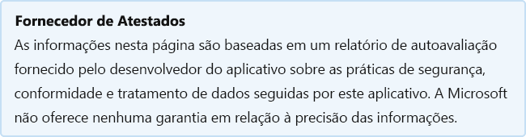

# Diagramas de lucidez para Excel

Última atualização pelo desenvolvedor em: 16 de dezembro de 2019

* <a href="https://appsource.microsoft.com/product/office/WA104380194" target="_blank">Exibir no AppSource</a>

::: zone pivot="general"

### Informações gerais

Informações fornecidas pela Lucid Software Inc para a Microsoft:

| **Information** | **Response** |
|:----------------|:-------------|
| Nome do aplicativo | Diagramas de lucidez para Excel |
| ID | WA104380194 |
| Office 365 clientes com suporte | Excel 2016 ou posterior no Mac, Excel 2013 ou posterior em Windows, Excel na Web |
| Nome da empresa de parceiro | Software Lúcido Inc |
| URL do site do parceiro | [https://www.lucidchart.com](https://www.lucidchart.com) |
| URL da Política de Privacidade | [https://www.lucidchart.com/pages/privacy](https://www.lucidchart.com/pages/privacy) |
| URL dos Termos de Uso | [https://www.lucidchart.com/pages/tos](https://www.lucidchart.com/pages/tos) |

 [!INCLUDE [Corrections or suggestions contact information](../includes/corrections-or-suggestions.md)]

::: zone-end

::: zone pivot="data"

### Como o aplicativo lida com dados

Essas informações foram fornecidas pela Lucid Software Inc sobre como esse aplicativo coleta e armazena dados organizacionais e o controle que sua organização terá sobre os dados coletados pelo aplicativo.

#### Acesso a dados usando o Microsoft Graph

Listar [todas as permissões Graph microsoft que](https://docs.microsoft.com/graph/permissions-reference) este aplicativo exige.

>| **Permissão**  | **Tipo de permissão (Delegado/Aplicativo)** | **Os dados são coletados? Justificativa para colecioná-lo?** | **Os dados são armazenados? Justificativa para armazenar isso?** | **ID do aplicativo do Azure AD** |
>|:----------------|:------------------------------------------------|:--------------------------------------------------------|:--------------------------------------------------|:--------------------|
>| email | delegado | Nome e endereço de email. | As permissões de email, openid e perfil permitem que o Lucidchart gere um token openid para um usuário e obter informações básicas suficientes sobre o usuário para registrar uma conta do Lucidchart para eles, se necessário. Para verificar os dados que vêm da Microsoft, fazemos uma solicitação para obter a chave pública com a assinatura da resposta. Nenhum outro dado é recebido ou enviado para a Microsoft como parte do nosso fluxo de SSO. |  |
>| openid | delegado | Nome e endereço de email. | As permissões de email, openid e perfil permitem que o Lucidchart gere um token openid para um usuário e obter informações básicas suficientes sobre o usuário para registrar uma conta do Lucidchart para eles, se necessário. Para verificar os dados que vêm da Microsoft, fazemos uma solicitação para obter a chave pública com a assinatura da resposta. Nenhum outro dado é recebido ou enviado para a Microsoft como parte do nosso fluxo de SSO. |  |
>| perfil | delegado | Nome e endereço de email. | As permissões de email, openid e perfil permitem que o Lucidchart gere um token openid para um usuário e obter informações básicas suficientes sobre o usuário para registrar uma conta do Lucidchart para eles, se necessário. Para verificar os dados que vêm da Microsoft, fazemos uma solicitação para obter a chave pública com a assinatura da resposta. Nenhum outro dado é recebido ou enviado para a Microsoft como parte do nosso fluxo de SSO. |  |

#### Acesso a dados usando outras APIs da Microsoft

Os aplicativos e os Microsoft 365 podem usar APIs adicionais da Microsoft que não Graph microsoft para coletar ou processar informações de identificação organizacional (OII). Listar as APIs da Microsoft que não Graph esse aplicativo usa.

>| **API** |  **O OII é coletado?** |  **Qual OII é Coletado?** | **Justificativa para coletar OII?** | **O OII está armazenado?** | **Justificativa para armazenar OII?** |
>|:--------|:-----------------------|:----------------------------|:--------------------------------------|:-------------------|:-----------------------------------|
>| API JavaScript para Office | Sim | Usamos o Office OneDrive javascript SDK de para abrir o OneDrive de arquivos usando OneDrive.open(). Não geramos tokens de acesso e não fazemos solicitações OneDrive APIs de nós mesmos; O OneDrive SDK do selador de arquivo faz isso para nós. Só vemos os nomes de arquivo escolhidos pelo usuário. |  | Se o usuário selecionar um arquivo usando o OneDrive de arquivo, armazenaremos o nome do arquivo. |  |

#### Não serviços Microsoft usado

Se o aplicativo transferir ou compartilhar dados organizacionais com o serviço não Microsoft, liste o serviço que não é da Microsoft que o aplicativo usa, quais dados serão transferidos e inclua uma justificativa para o motivo pelo qual o aplicativo precisa transferir essas informações.

>| **Todos os não serviços Microsoft OII são transferidos para** |  **Qual OII é transferido?** | **Justificativa para transferir o OII?** |
>|:-----------------------------------------------------|:------------------------------|:----------------------------------------|
>| Os dados do Lucidchart são armazenados no AWS. |  | Não usamos APIs da Microsoft. Usamos o openID para obter dados básicos do usuário para executar o SSO. Usamos a API do se picker de arquivos, mas isso não nos dá acesso aos arquivos do usuário que não os que nos enviam por meio do se picker. |

#### Dados de telemetria

Quaisquer informações de identificação organizacional (OII) ou informações de identificação do usuário final (EUII) aparecem na telemetria ou nos logs desse aplicativo? Se sim, descreva quais dados são armazenados e quais são as políticas de retenção e remoção?

>Registramos emails e endereços IP por motivos de segurança e suporte. Todo o acesso aos logs é &amp; gravado, na verdade, inalterável em um sistema de terceiros. O acesso aos logs requer MFA.

#### Controles organizacionais para dados armazenados pelo parceiro

Descrever como os administradores da organização podem controlar suas informações em sistemas parceiros? por exemplo, exclusão, retenção, auditoria, arquivamento, política de usuário final, etc.

>Os dados do Lucidchart são armazenados no AWS. Ele é criptografado em repouso e em trânsito. O Lucidchart usa as regras de privilégio mínimo e MFA.

#### Revisão humana de informações organizacionais

Os humanos estão envolvidos na revisão ou análise de dados OII (informações de identificação organizacional) coletados ou armazenados por esse aplicativo?

>Não

[!INCLUDE [Corrections or suggestions contact information](../includes/corrections-or-suggestions.md)]

::: zone-end

::: zone pivot="mcas"

As informações do [catálogo Microsoft Cloud App Security](https://www.microsoft.com/enterprise-mobility-security/cloud-app-security) são exibidas abaixo.

<iframe height='1020' title='Microsoft Cloud App Security Informações' src='https://appmcasinfoprod.azurewebsites.net/#/dashboard/12761' frameborder='no' style='width: 100%;'></iframe>

<a href="https://appmcasinfoprod.azurewebsites.net/#/dashboard/12761" target="_blank">Exibir em uma nova guia</a>

[!INCLUDE [Corrections or suggestions contact information](../includes/corrections-or-suggestions.md)]

::: zone-end

