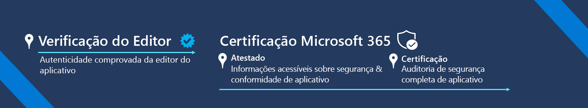

# Programa de Conformidade de Aplicativos do Microsoft 365

O Programa de Conformidade do Aplicativo do Microsoft 365 é uma abordagem de duas etapas para a segurança e conformidade do aplicativo e inclui a Verificação do Publisher e a Certificação do Microsoft 365. Cada camada se baseia na próxima, oferecendo um programa em camadas para dar aos usuários a confiança de que precisam para usar aplicativos no ecossistema do Microsoft 365.  

Nossa missão: dar aos clientes da Microsoft uma maneira de confiar completamente nos aplicativos que administram suas organizações.

## Verificação do Editor

A [Verificação do Editor](https://docs.microsoft.com/azure/active-directory/develop/publisher-verification-overview) ajuda administradores e usuários a entenderem a autenticidade dos desenvolvedores de aplicativos integrados à plataforma de identidade da Microsoft. Quando um aplicativo é marcado como verificado pelo editor, significa que o editor verificou sua identidade usando uma conta do Microsoft Partner Network que concluiu o processo de verificação e associou essa conta do MPN ao registro do aplicativo.
A Verificação do Editor se aplica aos aplicativos que atendem às seguintes condições:  
- Usando o OAuth 2.0 e o OpenID Connect para conectar os usuários e solicitar acesso aos dados usando service-side APIs, como o Microsoft Graph. 
- Registrado no Azure AD como multilocatário.  

> [!IMPORTANT]
> A Verificação do Editor não impede que um desenvolvedor de aplicativos inicie ou conclua o Atestado do Editor ou a Certificação Microsoft 365. Se não se aplicar ao aplicativo, a verificação pode ser ignorada e o atestado pode ser iniciado.

## Certificação Microsoft 365
A Certificação do Microsoft 365 tem duas fases: **Atestado** e **Certificação**.
1.  O **atestado** envolve a conclusão de um questionário sobre os atributos de segurança, tratamento de dados e conformidade de um aplicativo que são mais importantes para os clientes. Todas as informações são publicadas em um único lugar e em um formato consistente e fácil de ler. O objetivo é facilitar e acelerar o processo de adoção de aplicativos, garantindo aos clientes que os aplicativos usados nos seus locatários atendem aos seus padrões organizacionais.
1.  A **certificação** envolve uma auditoria completa de um aplicativo em relação a um conjunto de controles derivados de estruturas padrão líderes do setor. OS ISVs serão solicitados a fornecer evidências para demonstrar que estão atendendo a cada controle antes de receber uma certificação. O objetivo é dar aos clientes a garantia de que eles podem confiar que os aplicativos que receberam uma Certificação do Microsoft 365 têm práticas de segurança e conformidade fortes para proteger sua segurança de dados e privacidade.

A Certificação do Microsoft 365 aplica-se ao WebApps e a todos os aplicativos que se integram com os seguintes produtos da Microsoft:
-   Teams
-   Word
-   Excel
-   PowerPoint 
-   Outlook
- Microsoft Office SharePoint Online
- Project
- OneNote

### Introdução
- [Como concluir a Verificação do Publisher](https://docs.microsoft.com/en-us/azure/active-directory/develop/mark-app-as-publisher-verified)
- [Como concluir a certificação do Microsoft 365](https://docs.microsoft.com/en-us/microsoft-365-app-certification/docs/certification)

